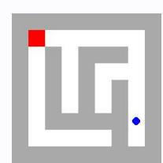
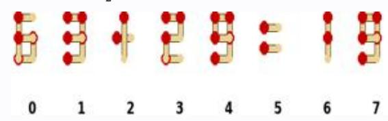
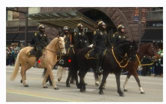
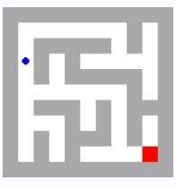
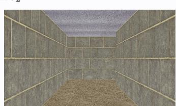

# **Observation** o2 **Feedback** f2

Environment feedback: Action executed successfully.

This is step 3. You are allowed to take 17 more steps.

# **Observation** o2 **Feedback** f2

Environment feedback: Illegal move.

This is step 3. You are allowed to take 27 more steps.

# **Observation** o2 **Feedback** f2

Environment feedback: Action executed successfully. This is step 3. You are allowed to take 97 more steps.

# **Observation** o2 **Feedback** f2

Environment feedback: Action executed successfully. This is step 3. You are allowed to take 97 more steps.

# **Observation** o2 **Feedback** f2

Environment feedback: Action executed successfully. This is step 3. You are allowed to take 97 more steps.

# **Observation** o2 **Feedback** f2

Environment feedback: Action executed successfully. This is step 3. You are allowed to take 97 more steps.

