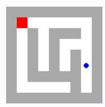
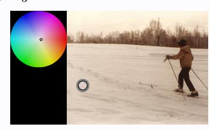
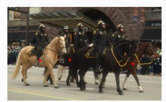
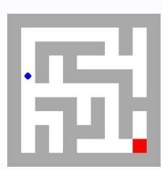

# **Observation** o3 **Feedback** f3

Environment feedback: Action executed successfully.

This is step 4. You are allowed to take 16 more steps.

# **Observation** o3 **Feedback** f3

Environment feedback: Illegal move.

This is step 4. You are allowed to take 26 more steps.

# **Observation** o3 **Feedback** f3

Environment feedback: Action executed successfully. This is step 4. You are allowed to take 96 more steps.

# **Observation** o3 **Feedback** f3

Environment feedback: Action executed successfully. This is step 4. You are allowed to take 96 more steps.

# **Observation** o3 **Feedback** f3

Environment feedback: Action executed successfully. This is step 4. You are allowed to take 96 more steps.

# **Observation** o3 **Feedback** f3

Environment feedback: Action executed successfully. This is step 4. You are allowed to take 96 more steps.

# **Observation** o3 **Feedback** f3

Environment feedback: Action executed successfully. This is step 4. You are allowed to take 96 more steps.

