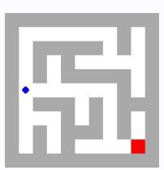

# **Observation** o4 **Feedback** f4

Environment feedback: Action executed successfully.

This is step 5. You are allowed to take 15 more steps.

# **Observation** o4 **Feedback** f4

Environment feedback: Illegal move.

This is step 5. You are allowed to take 25 more steps.

# **Observation** o4 **Feedback** f4

Environment feedback: Action executed successfully. This is step 5. You are allowed to take 95 more steps.

# **Observation** o4 **Feedback** f4

Environment feedback: Action executed successfully. This is step 5. You are allowed to take 95 more steps.

# **Observation** o4 **Feedback** f4

Environment feedback: Action executed successfully. This is step 5. You are allowed to take 95 more steps.

