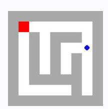
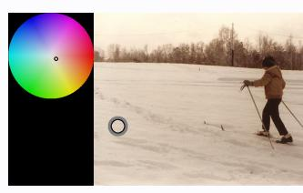
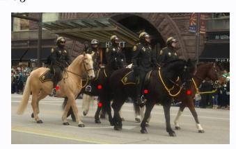
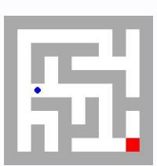
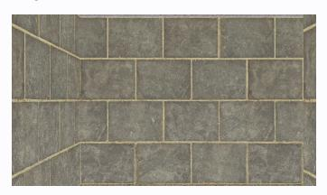

# **Observation** o5 **Feedback** f5

Environment feedback: Action executed successfully.

This is step 6. You are allowed to take 14 more steps.

# **Observation** o5 **Feedback** f5

Environment feedback: Illegal move.

This is step 6. You are allowed to take 24 more steps.

# **Observation** o5 **Feedback** f5

Environment feedback: Action executed successfully. This is step 6. You are allowed to take 94 more steps.

# **Observation** o5 **Feedback** f5

Environment feedback: Action executed successfully. This is step 6. You are allowed to take 94 more steps.

# **Observation** o5 **Feedback** f5

Environment feedback: Action executed successfully. This is step 6. You are allowed to take 94 more steps.

# **Observation** o5 **Feedback** f5

Environment feedback: Action executed successfully. This is step 6. You are allowed to take 94 more steps.

# **Observation** o5 **Feedback** f5

Environment feedback: Action executed successfully. This is step 6. You are allowed to take 94 more steps.

