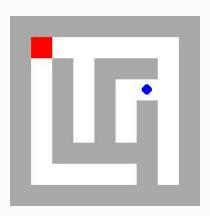
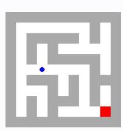
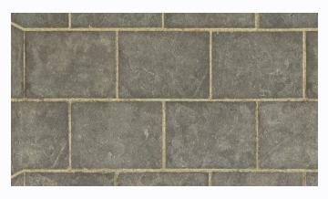

# **Observation** o6 **Feedback** f6

Environment feedback: Action executed successfully.

This is step 7. You are allowed to take 13 more steps.

# **Observation** o6 **Feedback** f6

Environment feedback: Illegal move.

This is step 7. You are allowed to take 23 more steps.

# **Observation** o6 **Feedback** f6

Environment feedback: Action executed successfully. This is step 7. You are allowed to take 93 more steps.

# **Observation** o6 **Feedback** f6

Environment feedback: Action executed successfully. This is step 7. You are allowed to take 93 more steps.

# **Observation** o6 **Feedback** f6

Environment feedback: Action executed successfully. This is step 7. You are allowed to take 93 more steps.

# **Observation** o6 **Feedback** f6

Environment feedback: Action executed successfully. This is step 7. You are allowed to take 93 more steps.

