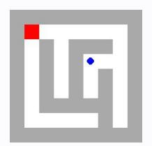
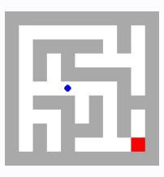
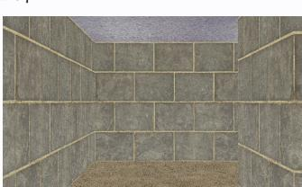

# **Observation** o7 **Feedback** f7

Environment feedback: Action executed successfully.

This is step 8. You are allowed to take 12 more steps.

# **Observation** o7 **Feedback** f7

Environment feedback: Nothing to undo.

This is step 8. You are allowed to take 22 more steps.

# **Observation** o7 **Feedback** f7

Environment feedback: Action executed successfully. This is step 8. You are allowed to take 92 more steps.

# **Observation** o7 **Feedback** f7

Environment feedback: Action executed successfully. This is step 8. You are allowed to take 92 more steps.

# **Observation** o7 **Feedback** f7

Environment feedback: Action executed successfully. This is step 8. You are allowed to take 92 more steps.

