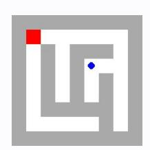
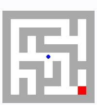
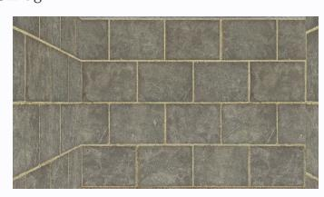

# **Observation** o8 **Feedback** f8

Environment feedback: Cannot move into a wall.

This is step 9. You are allowed to take 11 more steps.

# **Observation** o8 **Feedback** f8

Environment feedback: Illegal move.

This is step 9. You are allowed to take 21 more steps.

# **Observation** o8 **Feedback** f8

Environment feedback: Action executed successfully. This is step 9. You are allowed to take 91 more steps.

# **Observation** o8 **Feedback** f8

Environment feedback: Action executed successfully. This is step 9. You are allowed to take 91 more steps.

