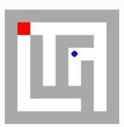
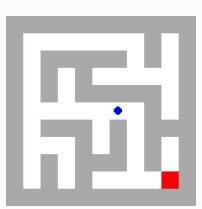

# **Observation** o9 **Feedback** f9

Environment feedback: Cannot move into a wall.

This is step 10. You are allowed to take 10 more steps.

# **Observation** o9 **Feedback** f9

Environment feedback: Illegal move.

This is step 10. You are allowed to take 20 more steps.

# **Observation** o9 **Feedback** f9

Environment feedback: Action executed successfully. This is step 10. You are allowed to take 90 more steps.

