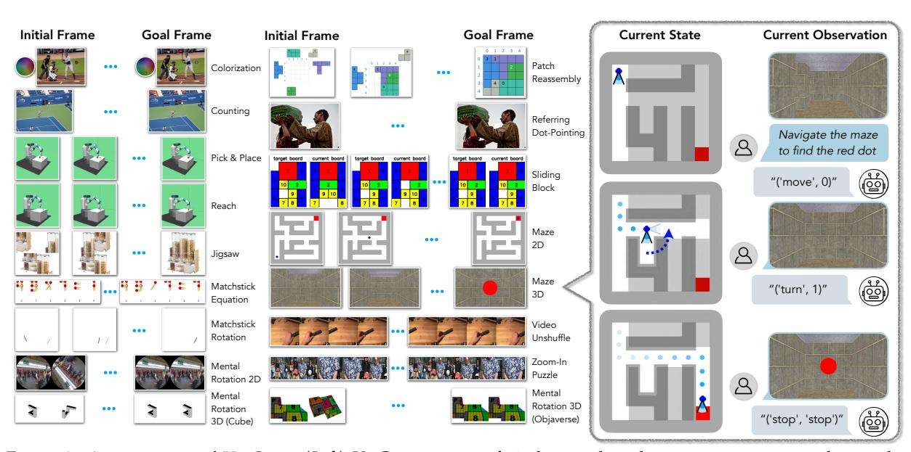

# **VisGym: Diverse, Customizable, Scalable Environments for Multimodal Agents**

**Zirui Wang**† , **Junyi Zhang**† , **Jiaxin Ge**† , **Long Lian**, **Letian Fu**, **Lisa Dunlap**, **Ken Goldberg**, **XuDong Wang**, **Ion Stoica**, **David M. Chan**, **Sewon Min**, **Joseph E. Gonzalez**

**UC Berkeley** †Equal contribution.

Modern Vision–Language Models (VLMs) remain poorly characterized in multi-step visual interactions, particularly in how they integrate perception, memory, and action over long horizons. We introduce VisGym, a gymnasium of 17 environments for evaluating and training VLMs. The suite spans symbolic puzzles, real-image understanding, navigation, and manipulation, and provides flexible controls over difficulty, input representation, planning horizon, and feedback. We also provide multi-step solvers that generate structured demonstrations, enabling supervised finetuning. Our evaluations show that all frontier models struggle in interactive settings, achieving low success rates in both the easy (46.6%) and hard (26.0%) configurations. Our experiments reveal notable limitations: models struggle to effectively leverage long context, performing worse with an unbounded history than with truncated windows. Furthermore, we find that several text-based symbolic tasks become substantially harder once rendered visually. However, explicit goal observations, textual feedback, and exploratory demonstrations in partially observable or unknown-dynamics settings for supervised finetuning yield consistent gains, highlighting concrete failure modes and pathways for improving multi-step visual decision-making. Code, data, and models can be found at: [VisGym.github.io.](https://visgym.github.io/)

**Correspondence:** [{zwcolin](mailto:zwcolin@eecs.berkeley.edu)[,junyizhang](mailto:junyizhang@eecs.berkeley.edu)[,gejiaxin}](mailto:gejiaxin@eecs.berkeley.edu)@eecs.berkeley.edu

Figure 1. **An overview of VisGym.** (*Left*) VisGym consists of 17 diverse, long-horizon environments designed to systematically evaluate, diagnose, and train VLMs on visually interactive tasks with different domains, levels of state observability, and types of observations. (*Right*) An example trajectory for the Maze 3D navigation task illustrates a partially observable environment consisting of non-structured synthetic renderings. Here, a VLM is prompted with (1) the task description (*simplified in the figure*) and (2) a set of available actions to use (*not shown in the figure for simplicity*). The agent must select each action conditioned on both its past actions and observation history for its decision-making.

Table 1. Comparison among frameworks for visually interactive decision-making. Struct. Obs. and Non-struct. Obs. indicate whether visual inputs can be parsed into structured text. POMDP denotes partial observability with hidden states. Multi-Domain covers diversity across domains (*e.g.*, robotics, computer use, games, puzzles). Scalable Episodes marks automatic, large-scale generation. SFT and Online RL show support for finetuning and reinforcement learning.

| Framework                             | # Tasks | Environments |                     |       |   |                      | Training |              |
|---------------------------------------|---------|--------------|---------------------|-------|---|----------------------|----------|--------------|
|                                       | 14010   | Struct. Obs. | Non-struct. Obs. | POMDP |   | Scalable Episodes | SFT      | Online RL |
| Evaluation-only                       |         |              |                     |       |   |                      |          |              |
| OSWorld (Xie et al., 2024)            | 369     | ✓            |                     | ✓     |   |                      |          |              |
| LIBERO (Liu et al., 2023)             | 130     |              | ✓                   | ✓     |   | ✓                    |          |              |
| VideoGameBench (Zhang et al., 2025)   | 23      | ✓            | ✓                   | ✓     |   |                      |          |              |
| LMGame-Bench (Hu et al., 2025)        | 6       | ✓            | ✓                   | ✓     |   |                      |          |              |
| Evaluation and Training               |         |              |                     |       |   |                      |          |              |
| VLABench (Zhang et al., 2025)         | 100     |              | ✓                   | ✓     |   | ✓                    | /        | ✓            |
| VLM-Gym (Chen et al., 2025)           | 4       | /            |                     |       |   | ✓                    | /        | ✓            |
| KORGym (Shi et al., 2025)             | 6       | ✓            |                     | ✓     |   | ✓                    |          | ✓            |
| Visual Agent Bench (Liu et al., 2024) | 5       | ✓            | ✓                   | ✓     | ✓ |                      | /        | ✓            |
| VAGEN (Wang et al., 2025)             | 5       | ✓            | ✓                   | ✓     | ✓ | ✓                    |          | ✓            |
| VisGym (Ours)                         | 17      | ✓            | ✓                   | ✓     | ✓ | ✓                    | ✓        | <b>✓</b>     |

