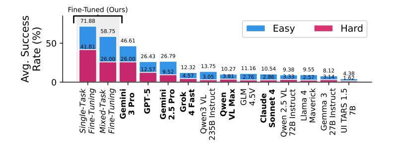
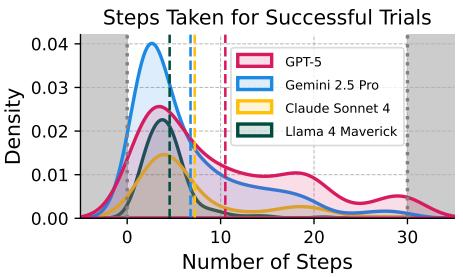

# 2. VisGym

VisGym contains 17 visually interactive environments. Each environment exposes initialization parameters that control task configuration and difficulty. We provide a high-level overview of the environments in Tab. 2 and detailed descriptions with visualizations in Sec. B. VisGym is built on top of the Gymnasium framework (Brockman et al., 2016; Towers et al., 2024), the same library underlying MuJoCo (Todorov et al., 2012) and Atari (Bellemare et al., 2013). Since vision–language agents can interpret images, read instructions, and produce free-form text, we extend Gymnasium with the following enhancements:

**Function-Conditioned Action Space.** Instead of the discrete or continuous action vectors used in standard Gymnasium environments, we represent actions as function calls with parameters (*e.g.*, ('swap', (1, 2)), ('rotate', (30.5, 20.4, 15.1))). This abstraction allows models to leverage their function-calling capabilities and compose strategies across domains.

**Function Instructions.** Each task defines a set of functions and their parameter spaces. To enable zero-shot rollouts, we provide a natural-language description of these functions and their argument constraints as part of the initial prompt before the model takes its first action. Instructions for each task are shown in Sec. B.

**Environment Feedback.** In addition to visual transitions, the environment provides textual feedback describing the effect of each action (*e.g.*, "invalid format," "out of bounds," "executed"). This helps models with weaker visual perception better ground their actions.

**Solver.** We implement heuristic multi-step solvers that complete each task using the available actions. The solver supports (1) multiple solving strategies and (2) optional stochasticity, enabling the generation of

Figure 2. Average task success rate for frontier models and our fine- Figure 3. Density curve of steps taken for tuned models. Proprietary models are in **bold** and our finetuned models **successful trajectories**. Colored dashed line are italicized.

marks each model's mean number of steps.

diverse demonstration trajectories for supervised fine-tuning. See Sec. A for the solver design of each task.

Together, these design choices yield a highly customizable interface. Each task can define its own action functions, instruction set, and solver, while the unified step function handles parsing, validation, execution, and feedback (Algorithm 1 in Sec. D). This modular structure makes it easy to add new tasks, vary action spaces, and generate visual and textual supervision for VLM agents.

