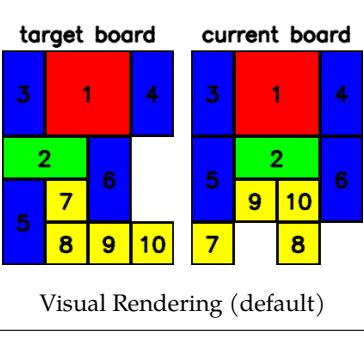
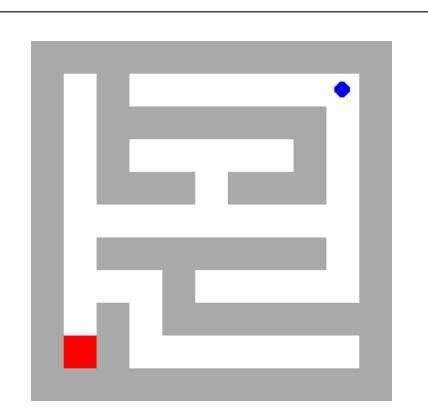
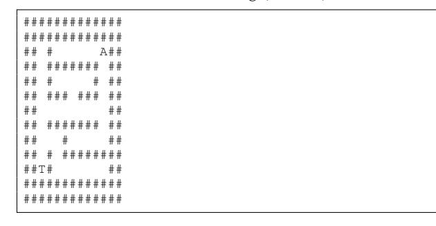
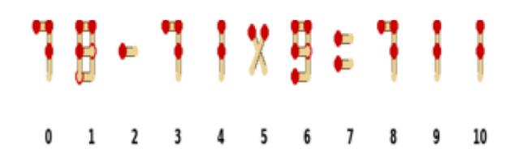
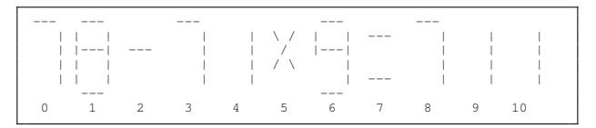
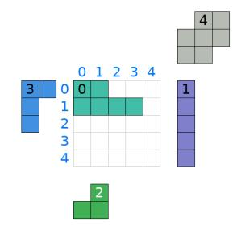
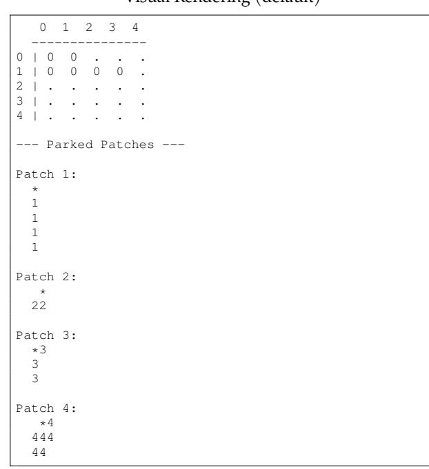

# <span id="page-20-3"></span>**C. ASCII-based Observation Visualization**

In this section, we present example episode variants rendered in text, as discussed in Sec. [4.2,](#page-5-4) for the Sliding Block, Maze 2D, Patch Reassembly, and Matchstick Equation environments in Fig. [13.](#page-21-0)

Note that the instructions are slightly adapted to fit the text-based format (*e.g.*, in the visual version of Patch Reassembly, we describe the *anchor* as "the cell that shows the patch's ID number," while in the text version we note that "the anchor cell for each parked patch is marked with a '\*' instead of its ID number").

In this section, we present the pseudocode for the step function (Algorithm [1\)](#page-20-1) used in VisGym (*i.e.,* Sec. [2\)](#page-2-2). The function initializes the reward and both termination flags, then parses the model's output string into an action name and payload. If parsing fails, it immediately returns an observation with "invalid format" as feedback.

If the parsed action name is supported and its payload is valid for the corresponding action space, the function calls Apply, which executes the action and returns the environment feedback. Otherwise, it ends early with "invalid action" as feedback.

Termination and truncation are determined inside Apply. If the action triggers termination (*e.g.*, stop), the function computes the final reward based on the environment state. Thus, the returned reward is always zero for non-terminal transitions and the final score upon termination.

Finally, the function returns the new observation, reward, termination, and truncation flags, and the feedback describing the action outcome.

<span id="page-20-2"></span>**D. VisGym Interface Algorithm 1** Generic Step Function (Sec. [D\)](#page-20-2). Symbols: ρ = reward, τ = terminated, υ = truncated, φ = feedback, α = action name, π = payload, ι = info.

```
function Step(a)
   ρ ← 0
   (τ, υ) ← (false, f alse)
   Parse a → (α, π)
   if invalid format then
       return
(obs(), 0, τ, υ, ι("invalid format"))
   if α ∈ A and π ∈ A[α] then
       (φ, τ, υ) ← Apply(α, π)
   else
       return
(obs(), 0, τ, υ, ι("invalid action"))
   if τ = true then
       ρ ← ComputeReward()
   return (obs(), ρ, τ, υ, ι(φ))
```

<span id="page-21-0"></span>

|             | Target Current |  |  |  |
|-------------|----------------|--|--|--|
|             |                |  |  |  |
| 3114   3114 |                |  |  |  |
| 3114   3114 |                |  |  |  |
| 226.   5226 |                |  |  |  |
| 576.   5906 |                |  |  |  |
| 5890   7.8. |                |  |  |  |
|             |                |  |  |  |

Text Representation (variant) **Sliding Block**



Visual Rendering (default)



Text Representation (variant) **Maze 2D**



Visual Rendering (default)



Text Representation (variant) **Matchstick Equation**



Visual Rendering (default)



Text Representation (variant)

**Patch Reassembly**

Figure 13. Visual and text representations across four environments

