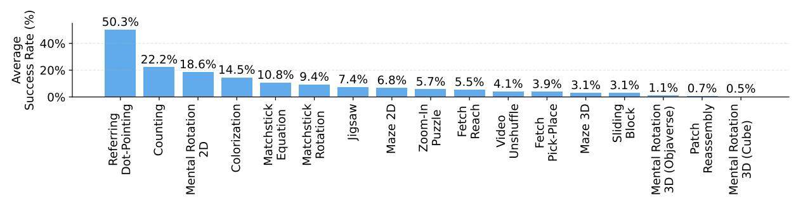
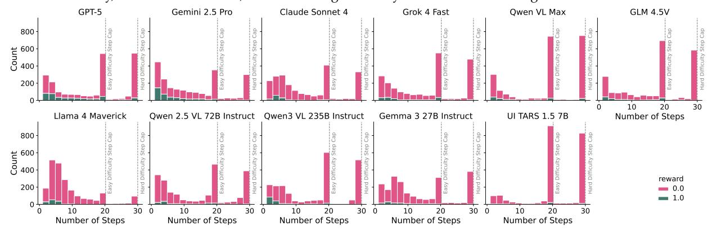
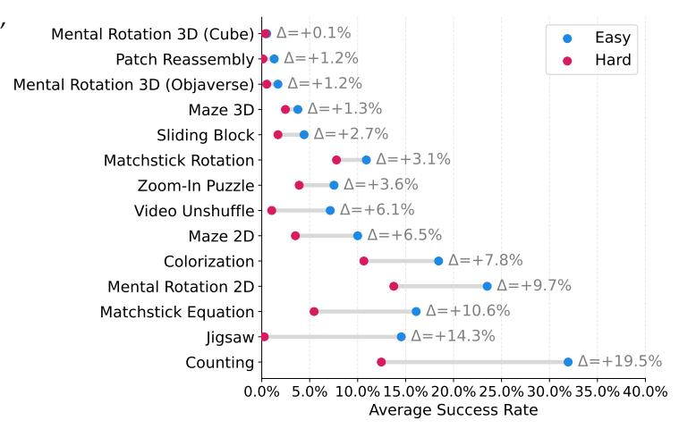
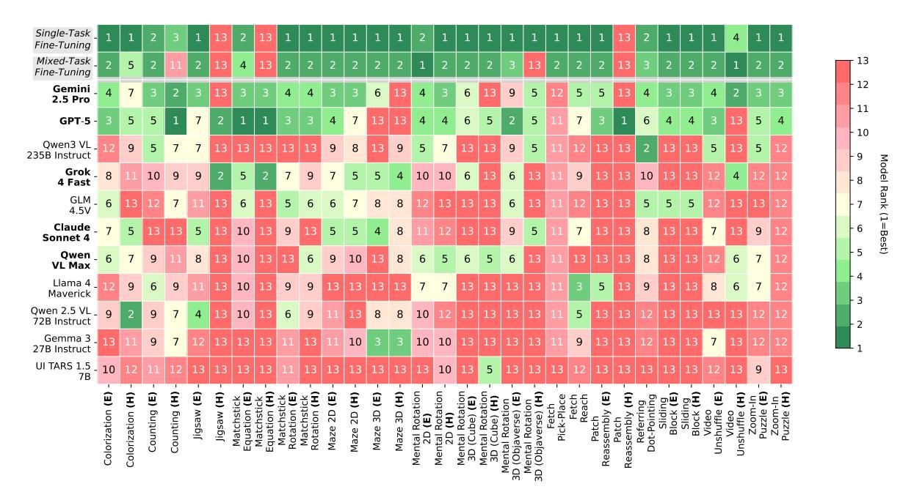

# G. Additional Performance Analysis

**Difficulty of Each Task.** In Fig. 17, we compute the average accuracy across models for each task and sort tasks from easiest to hardest based on these averages. In general, we found that Referring Dot-Pointing and Counting are the easiest, with models achieving over 20% accuracy on average, whereas Mental Rotation 3D (Cube), Patch Reassembly, and Mental Rotation 3D (Objaverse) are the hardest with an accuracy around 1%. Sliding Block, Maze 3D, Fetch Pick-Place, and Video Unshuffle also pose significant challenges for the models, with less than 5% on average. This suggests that tasks requiring memory and long-horizon planning,

Figure 17. Average success rate across frontier models on each task. The easiest tasks are Referring Dot-Pointing, and Counting, with over 20% accuracy on average across all models, while the hardest tasks are Mental Rotation 3D (Cube), Patch Reassembly, and Mental Rotation, with the average accuracy less than 2% on average.

Figure 18. The Number of Steps each Model Takes Over all Tasks. We calculate the number of steps over all trajectories for each model and visualize the correct trajectories (green) and the incorrect trajectories (red).

or strong 3D spatial understanding, remain the most difficult for current models.

**Number of Steps.** In Fig. 18, we calculate the number of steps taken on all trajectories for each model and calculate the number of correct trajectories (green) and the number of incorrect trajectories (red). There is a clear cutoff on steps 20 (maximum steps allowed for Easy setting) and 30 (maximum steps allowed for Hard setting), indicating that all models tend to reach the maximum number of steps. We also observed a "U-shaped" trend over the steps for all models, where they tend to either terminate early or continue until the final step.

Easy to Hard Performance Drop. In Fig. 19, we calculate the average accuracy in Easy and Hard, respectively, on all models, and then visualize the performance gap between easy and hard on each task. The biggest Easy to Hard performance drops occur on Counting and Jigsaw. For Counting, accuracy drops sharply as the number of objects increases. For Jigsaw, performance drops to near zero as the puzzle changes from 2x2 to 3x3, suggesting that this task can be further scaled to even more difficult n×n configurations. For some tasks (e.g., Patch Reassembly, Sliding Block, Video Unshuffle), the absolute gap is smaller, likely because Easy performance is already very low ( $\approx 0$ ). These

Figure 19. Easy  $\rightarrow$  Hard Performance Drop. For each task, we calculate the average accuracy on Easy and Hard, respectively, over all models, and then visualize the performance drop between Easy and Hard.

Figure 20. Model Rankings Per Task. We rank all the models on each task and show the ranking in the table.

tasks are also naturally scalable in terms

of difficulty. For example, increasing the number of patches for Patch Reassembly, the number of blocks for Sliding Block, or the number of frames for Video Unshuffle. As VLMs improve and begin to reliably solve the Easy settings, we expect to see larger easy-to-hard gaps on these tasks, and that our gym can be correspondingly scaled to provide harder task variants.

**Model Rankings.** In Fig. 20, we plot each model's ranking on every task. When multiple models tie on a task, we assign them the worse (higher) numerical rank. For example, if two models are tied for the best score, we label both as rank 2, so that ties do not overstate how clearly a model is separated from others. While these mostly align with the global leaderboard, they also reveal clear task-specific strengths and weaknesses. For example, on specialization, Qwen2.5 VL 72B Instruct performs well on Counting (rank 2), Gemma 3 27B Instruct performs well on Maze 3D (rank 3), and Qwen3 VL 235B Instruct performs well on Referring Dot-Pointing. On weakness, despite strong average performance, GPT-5 performs poorly on Video Unshuffle and Maze 3D, while Gemini 2.5 Pro performs poorly on Jigsaw (Hard) and Patch Reassembly.

