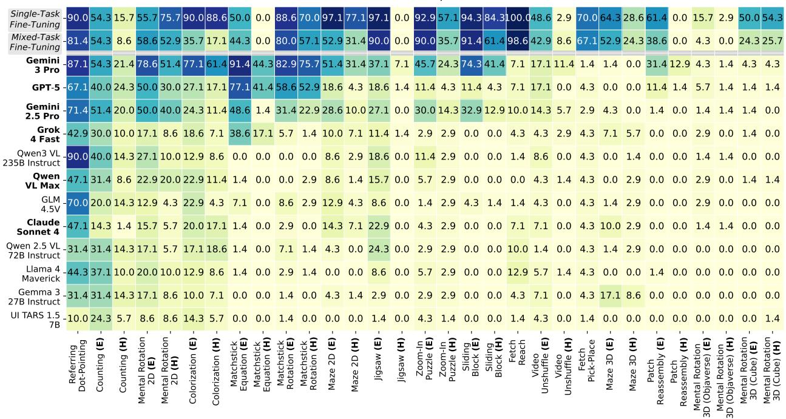

# 3.2. Result and Analysis

Frontier VLMs Fail on VisGym. We show the per-task success rate and the average task success rate of the frontier models in Figure 4 and Figure 2, respectively.

Even the best-performing frontier model, Gemini-3-Pro, achieves only 46.61% on VisGym (Easy) and 26.00% on VisGym (Hard), indicating that VisGym poses a significant challenge for existing models.

Figure 4. **Task success rate of frontier and finetuned models**. Proprietary models are shown in **bold**, and our finetuned models in *italics*. (E) and (H) denote easy and hard task settings. Darker cells indicate higher success rates. Models are ordered by average task performance (top = better), and tasks by average model performance, excluding our finetuned ones (right = harder).

**Model Specialization.** We compare the 3 strongest models1: Gemini 2.5 Pro, GPT-5, Qwen3-VL-235B Instruct. GPT-5 shows the best ability to handle long-context visual interactions. This is reflected in its stronger performance on matchstick rotation where the scale is unknown, its higher scores overall on the hard setting (Fig. 2), and its visibly longer tail in the number of steps taken to successfully solve tasks compared to the other models (Fig. 3). Gemini 2.5 Pro is good at low-level visual perception. This is reflected in its strongest performance on Jigsaw, Maze 2D, Zoom-In Puzzle, and Sliding Block, all of which demand tight spatial alignment, accurate correspondence of local patterns, and sensitivity to subtle visual cues. Qwen-3-VL is in particular capable of object localization (*e.g.*, strongest in Referring Dot-Pointing).

Examining the step count distribution (smoothed density curve) for successful trajectories across models (Fig. 3), we found that most models (*i.e.*, Gemini 2.5 Pro, Claude Sonnet 4, and Llama-4-Maverick) only peaked around 3-5 steps, followed by a sharp drop in successful trajectories when they spend more steps. This indicates limited capability in effectively handling long-context multi-step visual interactions.

**Common Failure Patterns.** We identify recurring failures using automated failure discovery methods (Dunlap et al., 2025; Lisa Dunlap et al., 2025), which employ a VLM annotator (GPT-4.1) to extract negative behaviors from each trajectory and cluster them into categories observed across datasets. This analysis reveals four failure types that appear consistently across multiple tasks (see Sec. F for details):

- (1) Restricted action space and action looping: models often rely on a single repeated operation or fixed-magnitude action, such as continually moving in the same direction in Fetch Pick & Place, using "swap" in Jigsaw instead of "reorder", or rotating by the same angle in Mental Rotation 3D and Match Rotation rather than converging to an optimal magnitude.
- (2) *State mismanagement:* models fail to maintain or update internal state across steps. They ignore textual or environmental feedback, revisit previously explored areas, or repeat illegal actions despite prior errors—for

&lt;sup>1Gemini 3 Pro is excluded from this detailed comparison, as it was released after this analysis concluded.

example, continuing to move into a wall after being told they have collided, or repeating invalid moves in the Match Equation, Sliding Block, and Toy Maze 2D tasks.

- (3) Early termination: the model terminates before the maximum steps despite not reaching the goal.
- (4) Failure to use visual or spatial information: models ignore the visual information provided, such as the target leaving the frame or the item being successfully aligned (e.g., Mental Rotation).

