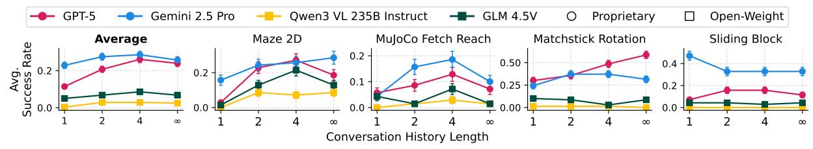

# **4.1. Turns to Keep in Conversation History**

Vision–language models are known to degrade with long visual context (Wang et al., 2025; Wu et al., 2024; Sharma et al., 2024). This creates a dilemma: while long histories provide more information about the environment (*e.g.*, 3D layouts, unknown dynamics), they also introduce redundant observations that may harm performance. We study this trade-off in Maze2D, Sliding Block, MuJoCo Fetch Reach, and Matchstick Rotation, where history provides useful signals such as textual feedback (*e.g.*, invalid actions) or correspondence between action magnitude and perceptual effect, but also introduces stale information.

Figure 5. Effect of truncating conversational context on model performance. The settings 1, 2, 4, and  $\infty$  correspond to retaining only the current turn, the current + previous turn, the current + previous 3 turns, and the full history, respectively. Error bars show the standard error of the mean.

As shown in Fig. 5, models benefit from including a limited number of previous turns up to roughly four, following a drop when given the full unbounded history. This indicates that expanding visual context helps multi-step visual decision-making only to a point, after which irrelevant or stale observations become detrimental. We also observe task-specific idiosyncrasies: Gemini 2.5 Pro scales well in Maze2D, GPT-5 scales well on Matchstick Rotation, while Sliding Block exhibits clear *reverse scaling* for Gemini 2.5 Pro. These highlight that the value of interaction history is both task-dependent.

