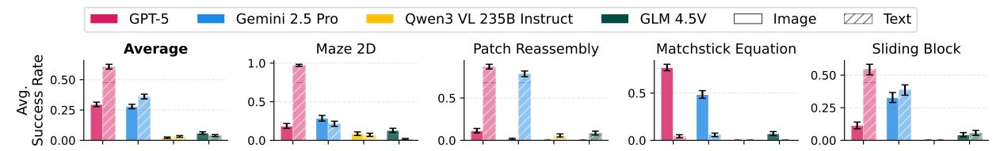

# 4.2. Representing Observation in Text

Inspired by prior work examining how different task representations affect agent performance (Hu et al., 2025; Shi et al., 2025; Ruoss et al., 2024), we select four symbolic tasks–Matchstick Equation, Maze 2D, Patch Reassembly, and Sliding Block–and implement alternate versions rendered entirely in ASCII (sample ASCII visualizations are provided in Sec. C). This allows tasks to be solved without any visual encoding module.

The results in Fig. 6 show that GPT-5 substantially improves in most tasks, often achieving  $3-4\times$  higher success rates than in the visual setting, suggesting that its main bottleneck lies in visual grounding rather than long-horizon reasoning. Gemini 2.5 Pro shows mixed behavior: two tasks do not exhibit significant performance change, one task improves, and one task degrades, indicating possible limitations in both

Figure 6. Effect of visualizing observations with ASCII (*text*). "Image" and "Text" denote the observation modalities. Error bars show the standard error of the mean.

perception and planning. Open-weight models struggle across all tasks in both modalities, indicating general weaknesses in long-horizon decision-making regardless of representation. Interestingly, Matchstick Equation exhibits a *reverse* trend: all models perform substantially better with the visual representation than with ASCII, likely because the figlet-style ASCII has irregular shapes and spacing that create distorted glyphs which models are known to struggle with (Stojanovski et al., 2025).

