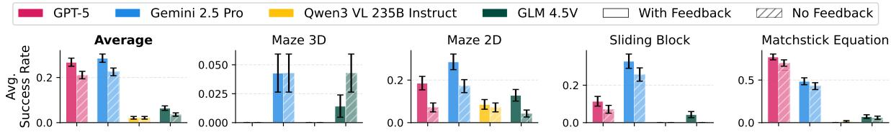

# 4.3. Removal of Text-based Feedback

Humans can infer action consequences directly from visual changes (Michotte, 1963), but it remains unclear whether VLMs can do the same. To study this, we select four tasks—Maze 3D, Maze 2D, Sliding Block, and Matchstick Equation—in which the environment feedback f (see Eq. (1)) provides not only formatting errors but also constraint violations (e.g., hitting a wall in Maze, sliding a block into an occupied cell). We remove this textual feedback and evaluate model using only visual state transitions; results are shown in Fig. 7.

Figure 7. **Effect of removing text-based environment feedback**. "With Feedback" includes environment feedback describing action execution at each turn; "No Feedback" removes this channel. Error bars show the standard error of the mean

All models show consistent drops in average performance. This indicates that models struggle to infer action validity directly from visual transitions. These findings show that current VLMs depend heavily on text-based feedback during visually interactive decision-making and are less sensitive to pure visual feedback.

