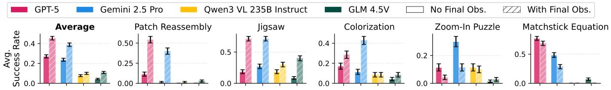

# 4.4. Providing Final Goal at Beginning

Providing the solution image upfront simplifies the tasks to visually aligning current observations with a known target, shifting the difficulty from reasoning to visual perception and tool-calling. We test this on five tasks, Patch Reassembly, Jigsaw, Colorization, Zoom-In Puzzle, and Matchstick Equation, where constructing the goal observation involves significant effort. For these tasks, we augment the instruction with the ground-truth final observation  $o_{qt}$ , and show results in Fig. 8.

Figure 8. Effect of providing the final goal observation at the beginning of the episode. "No Final Obs." and "With Final Obs." denote settings without and with access to the goal observation at the start. Error bars show the standard error of the mean.

Across tasks, models improve substantially, indicating that a major bottleneck lies in *constructing or imagining* the target state. However, performance remains far from perfect, indicating additional limitations beyond

reasoning, such as fine-grained visual perception and action calling. Surprisingly, GPT-5 and Gemini 2.5 Pro underperform on the Zoom-In Puzzle and Matchstick Equation when the final goal observation is provided, often terminating early despite visible misalignment. A follow-up test confirms this stems from visual misjudgment due to limited visual perception: we queried Gemini 2.5 Pro on 100 pairs of initial and final-goal observations with the prompt "Do the two images look exactly the same?" and it incorrectly judged images as identical 80% and 57% of the time for these tasks, versus only 18%, 2%, and 0% for Colorization, Jigsaw, and Patch Reassembly. This confirms that perception errors can invert the expected benefit of an explicit goal observation.

