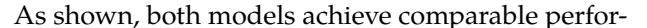
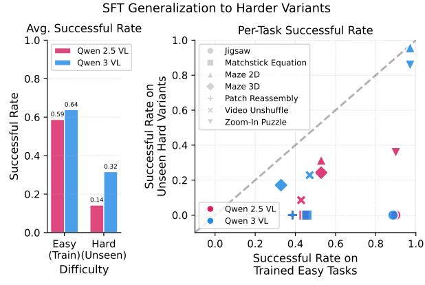

# **5.2. Stronger Base Model Generalizes Better**

Existing work has discussed the limitations of supervised finetuning (Ross et al., 2011) and found that it exhibits limited generalization to task variants (Caccia et al., 2024; Deng et al., 2023; Jang et al., 2022). This motivates re-examining generalization in the context of modern VLMs, whose capabilities may shift the boundary of what supervised finetuning can or cannot retain.

To this end, we select a set of environments where the easy-to-hard difficulty gap introduces substantial state changes (e.g., more views in the Zoom-In Puzzle, more patches in Patch Reassembly, larger maze sizes; details in Sec. E). We finetune Qwen2.5-VL- Figure 9. Generalization to unseen difficulty from mixed-7B-Instruct and Qwen3-VL-8B-Instruct on the same mance in Fig. 9.

task supervised finetuning. (*Left*): average success rate mixed-task training data using identical optimization across 7 tasks in easy (seen) and hard (unseen) settings for hyperparameters (see Sec. 5.1), and report perfor- Qwen2.5-VL and Qwen3-VL. (Right): task-level plot comparing success rates; X-axis = easy, Y-axis = hard.

mance on the easy variants they were trained on (e.g., 0.59 vs. 0.64), but the more recent Qwen3-VL generalizes substantially better to the harder variants, nearly doubling the success rate on average relative to Qwen2.5-VL. This trend highlights that newer VLMs provide stronger out-of-distribution generalization in multi-step visual decision-making despite being finetuned on an identical setup.

