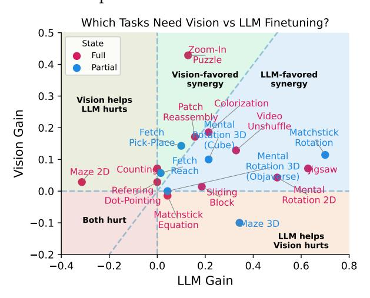

# 5.3. Vision and LLM Both Matter

Classic perception–action theories emphasize that fine-grained visual encoding and temporal integration are jointly necessary for interactive behavior (Gibson, 1979). We examine whether this holds for VLMs by fine-tuning variants that modify either the vision encoder or the LLM backbone to isolate each module's contribution, where the vision encoder provides fine-grained perceptual features and the LLM performs temporal integration across steps.

As shown in Fig. 10, most tasks benefit from finetuning both components, with the LLM contributing the larger performance gain—particularly in tasks with partial observability or unknown environment  $_{\rm Figure~10}$ . Tasks benefiting from finetuning different modand history integration remain the primary bottlenecks for current VLMs, while strong fine-grained visual encoding is necessary (e.g., Zoom-In Puzzle not sufficient for multi-step decision-making.

dynamics. This highlights that temporal reasoning ules. "Vision Gain" and "LLM Gain" denote improvements from jointly finetuning both components, compared to finetuning only the LLM or the vision part. The dashed line (y = x) divides vision-favored (above) and LLM-favored primarily benefits from vision finetuning) but often (below) synergy. "Full" and "Partial" denote whether observability and dynamics are fully known.

