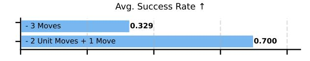
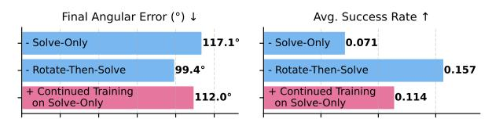

# 5.4. Importance of Information-Revealing Behaviors for SFT Curation

Not all experiences contribute equally to decisionmaking: trajectories that reveal hidden states or disambiguate perceptual aliasing are often far more valuable (McCallum, 1994; Fujii et al., 1998). We ask whether inducing such information-revealing behaviors during supervised finetuning helps VLMs form more accurate state representations. We evaluate this servability), with results in Figs. 11 and 12.

In Matchstick Rotation, the baseline demonstrations perform three stochastic moves toward the target. In contrast, the information-revealing demonstrations first perform two unit-scale steps to expose the correspondence between action magnitude and perceptual effect before executing the final aligning move. This structured exploration raises success from 32.9% to 70.0%.

In Mental Rotation, the baseline trajectories rotate along each principal axis once to reach the goal, while the information-revealing ones deliberately fully ro- (*Right*): average task success rate (higher is better). tate along each axis to expose the full 3D geometry

Figure 11. Effect of data curation strategies on task performance when environment dynamics are unknown. Numon two tasks, Matchstick Rotation (unknown dynam- bers represent average task success (higher is better). "3 ics) and Mental Rotation 3D Objaverse (partial ob- Moves" and "2 Unit Moves + 1 Move" are two curation strate-

Figure 12. Effect of data curation strategies on task performance when environment is partially observable. "Solve-Only" and "Rotate-Then-Solve" are two curation strategies, and "Continued Training on Solve-Only" denotes further finetuning on Solve-Only after training on Rotate-Then-Solve. (*Left*): final angular error on the test set (lower is better).

before settling on the target orientation. This strategy improves performance in both metrics. To verify that gains are not simply due to longer trajectories, we further continue training on baseline demonstrations

starting from the model already finetuned with information-revealing data. Performance deteriorates in this setting, confirming that the observed improvements stem from the *informative structure* of the demonstrations rather than quantity or length. These results highlight that SFT effectiveness depends on whether demonstrations induce state-disambiguating behaviors, not merely on the number of examples.

