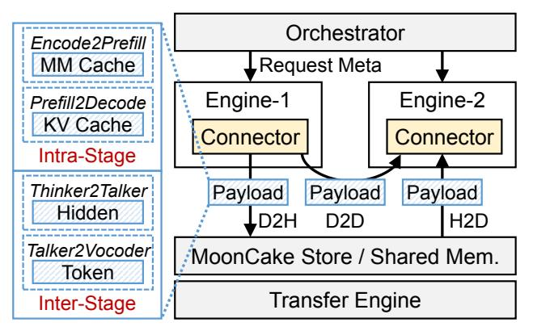
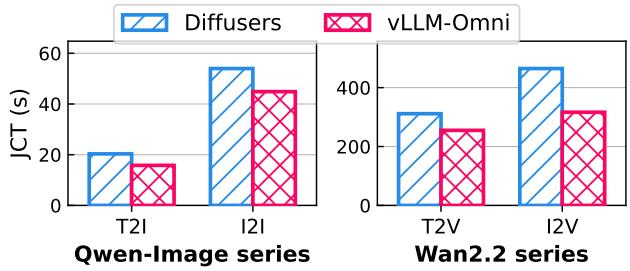

# 3.1. Overview

Figure [3](#page-3-2) illustrates an overview of vLLM-Omni. We show the backend architecture of vLLM-Omni in Figure [3\(](#page-3-2)a). On the backend, an orchestrator manages the execution of stages and schedules incoming requests. Each stage is served by an independent execution engine, enabling independent stage scaling, resource allocation, and intra-stage request batching. During inference, the model runner iteratively takes batched requests, applies the corresponding *preprocess* function on each scheduled request, and executes one batched forward step for each iteration. A unified connector then transfers intermediate data between stages, enabling fully disaggregated execution across the entire pipeline.

Figure [3\(](#page-3-2)b) presents the stage abstraction exposed to model developers: each component of an any-to-any model (e.g., LLM and DiT) is implemented as an independent stage equipped with a customized *preprocess* function and a batched *forward* function. The *preprocess* function enables developers to modify stage inputs with additional data produced by preceding stages. From the endpoint users' perspective (Figure [3\(](#page-3-2)c)), vLLM-Omni exposes runtime configurations, including parallelism strategies and memory budgets for different stages, allowing users to tune performance and resource usage without changing model code.

### 3.2. Stage Abstraction

vLLM-Omni provides a flexible and easy-to-use frontend interface for any-to-any model programming, as illustrated by the template in Figure [3\(](#page-3-2)b). In this system, users define any-to-any models as a *stage graph*, where nodes represent model stages and edges represent stage-transfer functions. This allows for the decomposition of complex architectures (i.e., autoregressive LLMs, DiTs, or CNN modules) into distinct stages.[3](#page-3-3) Specifically, for each AR stage, users implement a *preprocess* function to modify stage inputs and a *forward* function in the same step-centric manner as in existing LLM serving systems, enabling batched execution within the stage. To manage data flow between these stages, users define stage-transfer functions that control how query states and intermediate data are transformed during transitions. By combining these stage execution and transfer definitions, the stage graph encapsulates the full execution pipeline of the any-to-any model.

We show an example of implementing the Qwen2.5-Omni model using vLLM-Omni in Figure [4.](#page-4-1) As we discussed in Section [2.1,](#page-1-1) Qwen2.5-Omni includes three stages: (i) an LLM Thinker for text generation, (ii) an LLM Talker for

3Multimodal encoders can be treated either as a separate stage or as part of the LLM stage.

*Figure 4.* An example implementation of Qwen2.5-Omni (i.e., stage graph and workflow for the model). Qwen3-Omni is similar.

audio code generation, and (iii) a DiT Vocoder for waveform synthesis. The model takes multimodal inputs, where dedicated encoders transform audio, image, and video into embeddings that are concatenated with the textual inputs. These inputs are first fed into the Thinker LLM to produce textual outputs and corresponding hidden states. Next, the Talker stage receives the Thinker outputs and concatenates the Thinker hidden states and multimodal embeddings with the Talker input embeddings. The Talker LLM then autoregressively generates codec tokens, repeatedly concatenating the Thinker hidden states at each decoding step. Finally, the generated codec sequence is passed to the Vocoder, which produces audio waveforms via DiT denoising.

Under the stage paradigm of vLLM-Omni, users implement three types of functions: (i) the *forward* function for each model stage (e.g., thinker forward, talker forward, dit decode); (ii) *preprocess* functions that construct stage inputs (e.g., mm encode to obtain multimodal embeddings and concatenate them with Thinker inputs[4](#page-4-2) ; and process input to concatenate Thinker hidden states with Talker input embeddings, and is called in each decode iteration); and (iii) stage-transfer functions between stages (e.g., Thinker2Talker and Talker2Vocoder, they are only called once). In typical use, users define the *forward* and *preprocess* logic for each node, construct a stage graph, and assign transfer functions to the edges. In this way, vLLM-Omni decouples any-to-any models into modular stages while still fully exploiting the performance optimizations of underlying serving engines, allowing users to benefit from efficient resource utilization without manually handling batching or scheduling logic.

### 3.3. Stage Execution

Given a stage graph and user-specified runtime configurations, vLLM-Omni first initializes a set of execution engines, where each engine hosts a single model component, loads the corresponding model parameters, and starts serving according to the configured parallelism policy and memory budget. An orchestrator process is then launched to manage request routing and data exchange across stages.

As each stage runs on an independent engine, vLLM-Omni can naturally disaggregate execution across different stages from the complex any-to-any model structures. Engines can be configured with different parameters and accelerator resources according to the characteristics and demands of each underlying model stage. For example, in the three-stage Qwen3-Omni pipeline, the Thinker model is the largest (30B), so more accelerator memory can be allocated to the Thinker stage; the Talker model is smaller but more compute-intensive, so it can be assigned less memory but higher parallelism and more accelerators. Each engine can also enable standard serving optimizations such as chunked prefill [\(Agrawal et al.,](#page-8-10) [2023\)](#page-8-10) and runtime execution-graph compilation, inheriting the performance benefits of LLM serving systems.

AR stage support. We use the vLLM [\(Kwon et al.,](#page-9-6) [2023\)](#page-9-6) engine for serving AR stages. For each engine, batching scheduling, KV-cache management, and model execution are handled independently by its own scheduler, KV manager, and model runner. The model runner implements the logic for executing the customized preprocess function for each request, which enables flexible composition of multistage models. Specifically, we introduce a predefined dictionary for storing intermediate per-request data that users can access and update on both the transform functions and the preprocess functions. The preprocess function is invoked at every iteration, since some stages need to combine outputs from previous stages with the current forward inputs at each decoding step (e.g., Talker stage for Qwen-Omni). The output processor is responsible for applying the transform function, storing the resulting data in CPU memory, and then transferring it to the device that hosts the next stage.

DiT stage support. vLLM-Omni integrates a dedicated diffusion engine seamlessly into its multi-stage pipeline architecture.[5](#page-4-3) By treating the diffusion process as a distinct node within the stage graph, the system extends its core disaggregated serving principles to diffusion workflows, ensuring efficient inference for audio, image, and video generation tasks. To maximize throughput and reduce latency, the engine implements a suite of optimization techniques, including advanced attention mechanisms (flash attention [\(Dao et al.,](#page-8-11) [2022\)](#page-8-11), SAGE attention [\(Zhang](#page-11-14)

4 In this example, we regard the multimodal encoder as a part of the Thinker stage, follow the implementation of vLLM.

5[Could implement other generation stages within this engine.](#page-11-14)

*Figure 5.* Disaggregated data transfer with unified connector.

[et al.\)](#page-11-14), and TurboAttention [\(Kang et al.,](#page-9-16) [2025\)](#page-9-16)), caching strategies for the iterative denoising process (TeaCache [\(Liu](#page-10-10) [et al.,](#page-10-10) [2025a\)](#page-10-10), cache-dit [\(DefTruth,](#page-8-12) [2025\)](#page-8-12)), and parallelization approaches such as RingAttention-based context parallelism [\(Liu et al.\)](#page-10-11) and Ulysses sequence parallelism. These optimizations enable vLLM-Omni to serve diffusion models with improved throughput and reduced latency compared to baseline implementations.

Ultimately, the diffusion engine empowers vLLM-Omni to support a wide range of state-of-the-art diffusion models, including text-to-image generation (Z-Image [\(Cai et al.,](#page-8-13) [2025\)](#page-8-13), Qwen-Image [\(Wu et al.,](#page-11-3) [2025\)](#page-11-3), Flux [\(Labs et al.,](#page-9-11) [2025\)](#page-9-11)), image editing tools (Qwen-Image-Edit [\(Wu et al.,](#page-11-3) [2025\)](#page-11-3), LongCat-Image-Edit [\(Ma et al.,](#page-10-12) [2025b\)](#page-10-12)), and video generation variants (Wan2.2 variants [\(Wang et al.,](#page-11-15) [2025a\)](#page-11-15), HunyuanVideo [\(Kong et al.,](#page-9-17) [2024\)](#page-9-17)).

Streaming stage output. In multi-stage pipeline execution, some downstream stages do not require complete outputs from their preceding stages to begin computation. In the Qwen-Omni pipeline, for example, the Vocoder can start processing audio generation as soon as the Talker produces initial tokens, rather than waiting for the entire sequence to be completed. To support this pattern, vLLM-Omni implements streaming stage output, where intermediate results are transferred to downstream stages incrementally as they become available. The output processor asynchronously streams partial outputs, such as newly generated tokens or embeddings, to the next stage while the upstream stage continues execution. By enabling overlapped execution across stages, streaming stage output reduces time-to-first-token (TTFT) for the final output and supports streaming responses to users without requiring stages to be tightly synchronized.

### 3.4. Disaggregated Data Transfer

vLLM-Omni supports disaggregated data transfer through a *unified connector* interface that decouples transport from model logic. Inspired by vLLM's KV cache transfer mechanisms for prefill–decode disaggregation, vLLM-Omni generalizes the connector interface to handle a broader range of data objects, including embeddings, hidden states, and audio or image tensors. This unified connector layer is responsible for data movement between stages, enabling full disaggregation of components such as encoders, prefill, decode, and modality-specific generators.

The unified connector is responsible for transferring data between model stages. For single-node deployments, it provides low-latency transfer by using inline control queues for small payloads and system shared memory for larger ones. In distributed multi-node settings, we leverage Ray [\(Moritz et al.,](#page-10-13) [2018\)](#page-10-13) to orchestrate cross-node execution. A Mooncake-based connector [\(Qin et al.,](#page-10-14) [2025\)](#page-10-14) complements this by enabling TCP- or RDMA-based transport, allowing stages on different servers to exchange data via a common put/get interface while passing only lightweight metadata through the control plane. By separating stage execution from data transport and allowing per-edge connector setting, vLLM-Omni flexibly supports heterogeneous deployment topologies and scales any-to-any pipelines across nodes without changing the programming model.

The unified connector also handles intra-stage transfers, including KV cache between prefill and decode and multimodal (MM) cache between encoder and prefill. This design remains compatible with existing EPD (encode–prefill–decode) disaggregation [\(Singh et al.\)](#page-10-15).

### 3.5. Hardware Support

vLLM-Omni supports diverse hardware platforms to enable flexible any-to-any model serving. Built upon vLLM's hardware plugin architecture, vLLM-Omni achieves crossplatform compatibility through a decoupled plugin mechanism that allows for registering hardware-specific implementations independently.

## 4. Experimental Evaluation

### 4.1. Experiment Settings

Models. vLLM-Omni extends the serving capabilities of vLLM to any-to-any tasks with support for multimodal outputs. Specifically, we evaluate the system using a set of representative and state-of-the-art models: (i) Thinker-Talker architecture that connects two autoregressive (AR) models within the execution pipeline, i.e., Qwen3-Omni [\(Xu](#page-11-6) [et al.,](#page-11-6) [2025b\)](#page-11-6) and Qwen2.5-Omni [\(Xu et al.,](#page-11-5) [2025a\)](#page-11-5), which are any-to-any models with both text and audio outputs. (ii) two-stage models that couple an AR LLM with additional modality-specific components for generation: e.g., BAGEL [\(Deng et al.,](#page-8-9) [2025\)](#page-8-9) employs a Mixtureof-Transformer-Experts design with separate experts for multimodal understanding and generation (paired with separate visual encoders), while MiMo-Audio [\(Zhang et al.,](#page-11-12)

2025) combines a patch encoder, an AR LLM backbone, and a patch decoder to generate audio tokens autoregressively. (iii) diffusion models with image or video outputs, i.e., Qwen-Image (Wu et al., 2025), Qwen-Image-Edit (Wu et al., 2025), and Wan2.2 series (Wang et al., 2025a), built primarily on diffusion transformers.

**Baseline Systems.** For Qwen-Omni models, we use their default Hugging Face Transformers (Wolf et al., 2020) implementations to evaluate offline inference performance, as vLLM and SGLang only support their thinker part. For BAGEL and MiMo-Audio, we adopt its original implementation as our baseline. For Diffusion-based models, we adopt Diffusers library (von Platen et al., 2022) as our baseline.

Metrics. For models with audio outputs (i.e., the Qwen-Omni series and MiMo-Audio), we primarily evaluate Real-Time Factor (RTF) and Job Completion Time (JCT) as our performance metrics. RTF is defined as the ratio between the end-to-end processing time and the duration of the generated audio. JCT measures the end-to-end latency of each request, from submission to completion. For the Qwen-Omni models, we further report Tokens Per Second (TPS) for both the thinker and the talker components. Thinker TPS denotes the throughput of generated text tokens per second, while talker TPS denotes the throughput of generated audio tokens per second. For visual generation models, we adopt JCT as our main performance metric.

**Testbed.** The experiments were conducted on a server equipped with two accelerator devices (80GB memory each), 24 CPU cores, and 192 GB of system memory. The environment was configured with a virtual setup, and vLLM version 0.12.0 was used.

#### 4.2. End-to-End Performance

Thinker-Talker architecture. Figure 6 shows the end-to-end performance of vLLM-Omni and the baseline on the Qwen-Omni series. We use the *librispeech\_asr* (Panayotov et al., 2015), *food101* (Bossard et al., 2014), and *ucf101-subset* (Soomro et al., 2012) datasets as the audio, image, and video inputs, respectively. All evaluations use the first 100 queries from each dataset as input. The experiments are run on 2 accelerators with 80GB memory, where the baseline uses the default tensor-parallel configuration of the Transformers implementation. vLLM-Omni applies tensor parallelism to the Thinker across both accelerators, while placing the Talker on device-1 and the Vocoder on device-0.

For Qwen2.5-Omni, compared with the baseline Transformers implementation, vLLM-Omni reduces RTF by 61.4% and JCT by 61.6%. For Qwen3-Omni, vLLM-Omni reduces RTF by 90.7% and JCT by 91.4%. These results indicate that vLLM-Omni delivers substantial end-to-end performance gains over the existing implementation. To

Figure 6. End-to-end results on Qwen-Omni models.

Figure 7. Execution time decompose for Qwen3-Omni.

further analyze the bottlenecks, we report Thinker TPS and Talker TPS. vLLM-Omni achieves 1.29× and 1.97× higher TPS on the Thinker and Talker, respectively, for Qwen2.5-Omni, and 12.97× and 7.98× higher Thinker TPS and Talker TPS for Qwen3-Omni. These results show that vLLM-Omni significantly accelerates Qwen3-Omni, with more than 10× speedup on the Thinker. This large improvement on Qwen3-Omni is attributed to the additional optimizations implemented in vLLM-Omni, while the baseline implementation does not fully exploit modern LLM serving techniques such as execution graph compilation. Since Qwen3-Omni has a much larger Thinker model (30B) than Qwen2.5-Omni (7B), vLLM-Omni can better amortize its optimized execution pipeline and thus achieves higher relative gains.

Figure 7 illustrates the time decomposition across different stages for the Qwen3-Omni model. The results show that, for both systems, the Talker stage accounts for most of the

Figure 8. End-to-end results on DiT-based models.

overall latency because it needs to generate substantially more tokens for audio than the Thinker does for text. For example, on video-input tasks, the average input token count (including video tokens) is 841.6, the average number of output text tokens is 150.9, while the average number of output audio tokens reaches 545.4. Consequently, the Talker runs many more decoding iterations than the Thinker and results in longer latency.

**BAGEL Model.** We evaluated BAGEL on an accelerator with 80 GB memory on Vbench (Huang et al., 2024). For image generation tasks with 1024×1024 resolution, the baseline implementation achieves a JCT (Job Completion Time) of 23.12s for text-to-image (T2I) and 41.39s for image-to-image (I2I). Our method reduces JCT to 9.64s for T2I and 11.12s for I2I, yielding a 2.40× speedup for T2I and 3.72× speedup for I2I over the baseline.

**Mimo-Audio model.** We evaluated Mimo-Audio on one accelerator on SeedTTS (text-to-speech) (Anastassiou et al., 2024). The baseline implementation achieves an RTF of 1.39, while our method reduces RTF to 0.60 without execution-graph compilation and to 0.12 with graph compilation, yielding an 11.58× speedup over the baseline.

#### 4.3. Micro Experiments

Diffusion engine. We compare vLLM-Omni with Diffusers on DiT-based image and video generation models using the VBench (Huang et al., 2024) dataset. For text-to-image and image-to-image generation, we employ Qwen-Image and Qwen-Image-Edit, respectively. For video generation, we use Wan2.2-T2V and Wan2.2-I2V for text-to-video and image-to-video tasks. The output image resolution is 1024x1024 for Qwen-Image and 480x640 for Wan2.2, with 80 output frames. Results demonstrate that vLLM-Omni consistently outperforms Diffusers with a 1.26x overall speedup. This performance gain stems from vLLM-Omni's diffusion engine, which reuses operator optimizations and the flash-attention backend from vLLM, enabling efficient execution across diverse generation tasks.

**Unified connector.** We evaluate the data transfer overhead of vLLM-Omni's unified connector in Table 1. Results demonstrate that the connector overhead is negligible rela-

*Table 1.* Data transfer time with using vLLM-Omni's unified connector. The model is Qwen2.5-Omni.

| Latency (ms)  | Thinker2Talker | Talker2Vocoder |
|---------------|----------------|----------------|
| Shared Memory | 5.49           | 0.53           |
| Mooncake      | 8.28           | 3.34           |

tive to overall inference latency (tens of seconds), making it a practical solution for disaggregated execution. Despite the minimal performance cost, the unified connector provides substantial flexibility by abstracting data movement across heterogeneous deployment topologies.

### 5. Related Work

**LLM serving systems.** Existing systems for autoregressive LLM serving, such as vLLM (Kwon et al., 2023) and SGLang (Zheng et al., 2024), provide efficient support for text-only or multimodal input LLMs with text-only output. These systems offer a step-wise frontend interface that abstracts away serving optimizations from users. The execution backend integrates LLM execution optimizations, including attention implementations (e.g., paged attention (Kwon et al., 2023), flash attention (Dao et al., 2022)), KV cache management, and prefix tree caching (Zheng et al., 2024). They incorporate various optimizations to achieve lower latency and higher throughput, such as chunked prefill (Agrawal et al., 2023), continuous batching (Yu et al., 2022), and Prefill-Decode (PD) (Zhong et al., 2024) disaggregation. Additionally, these systems support multiple parallelism strategies, such as data parallelism and tensor parallelism. Since vLLM-Omni's execution engine extends vLLM's engine, it inherits these optimizations for AR stages within any-to-any pipelines.

Multimodal model serving. Current LLM serving systems (Kwon et al., 2023; Zheng et al., 2024; Wolf et al., 2020) support LLM with multimodal inputs (Bai et al., 2025; Chen et al., 2024c; Li et al.), with optimizations like Encode-Prefill-Decode (EPD) disaggregation (Singh et al.; Qiu et al., 2025) and multimodal embedding cache (Wan et al., 2024). They still focus on text-only output scenarios and lack the support for models with multimodal output. However, they focus exclusively on text-only output and lack support for multimodal generation. Separately, diffusion-based systems (Fang et al., 2024; von Platen et al., 2022; Huang et al., 2022; 2025b) efficiently accelerate visual and audio generation through optimizations like quantized attention (Kang et al., 2025; Zhang et al.), parallel denoising (Liu et al.), and caching strategies (DefTruth, 2025; Liu et al., 2025a; Agarwal et al., 2024). Yet these frameworks are specialized for diffusion models and struggle with complex architectures, particularly when integrating heavy LLM-based text encoders. In contrast, vLLM-Omni provides unified support for complex pipelines by seamlessly combining autoregressive models with diffusion models, enabling efficient serving for any-to-any multimodal models. Such ability is essential for deploying next-generation any-to-any models at scale.

## 6. Conclusion

In this paper, we presented vLLM-Omni, a serving system for efficient deployment of any-to-any multimodal models. The key insight of our work is decomposing complex any-toany model architectures into a stage graph, where each stage can be independently optimized and executed. Through our disaggregated stage execution backend, vLLM-Omni enables efficient serving support for diverse any-to-any models. Our experimental results demonstrate substantial improvements compared to existing approaches.

