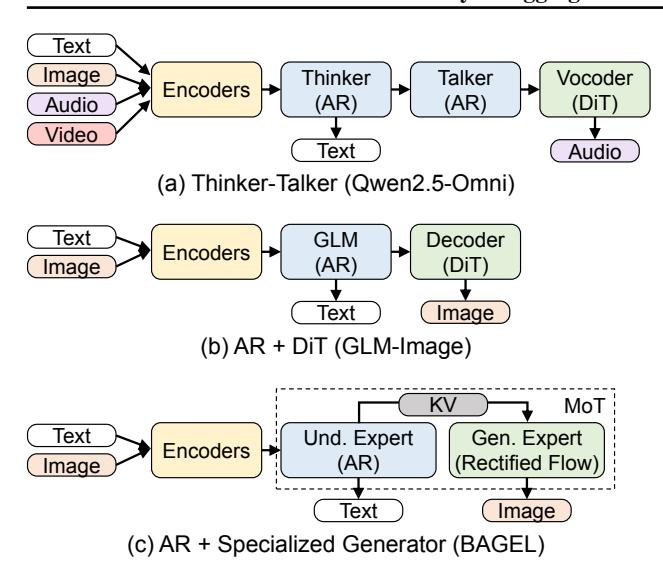

# vLLM-Omni: Fully Disaggregated Serving for Any-to-Any Multimodal Models

Peiqi Yin $^{*12}$  Jiangyun Zhu $^{*3}$  Han Gao $^{*1}$  Chenguang Zheng $^{*1}$  Yongxiang Huang $^{*1}$  Taichang Zhou $^{*1}$  Ruirui Yang $^{*1}$  Weizhi Liu $^{*1}$  Weiqing Chen $^{*1}$  Canlin Guo $^{1}$  Didan Deng $^{1}$  Zifeng Mo $^{4}$  Cong Wang $^{1}$  James Cheng $^{2}$  Roger Wang $^{5}$  Hongsheng Liu $^{1}$ 

#### **Abstract**

Any-to-any multimodal models that jointly handle text, images, video, and audio represent a significant advance in multimodal AI. However, their complex architectures (typically combining multiple autoregressive LLMs, diffusion transformers, and other specialized components) pose substantial challenges for efficient model serving. Existing serving systems are mainly tailored to a single paradigm, such as autoregressive LLMs for text generation or diffusion transformers for visual generation. They lack support for any-toany pipelines that involve multiple interconnected model components. As a result, developers must manually handle cross-stage interactions, leading to huge performance degradation. We present vLLM-Omni, a fully disaggregated serving system for any-to-any models. vLLM-Omni features a novel stage abstraction that enables users to decompose complex any-to-any architectures into interconnected stages represented as a graph, and a disaggregated stage execution backend that optimizes resource utilization and throughput across stages. Each stage is independently served by an LLM or diffusion engine with per-stage request batching, flexible GPU allocation, and unified inter-stage connectors for data routing. Experimental results demonstrate that vLLM-Omni reduces job completion time (JCT) by up to 91.4% compared to baseline methods. The code is public available at https://github.com/vllm-project/vllmomni.

Preprint. February 3, 2026.

Figure 1. Any-to-any multimodal model architecture.

#### 1. Introduction

Traditional large language models (LLMs) (Achiam et al., 2023; Anil et al., 2023; Yang et al., 2025) have achieved remarkable performance in language understanding and reasoning tasks, such as question answering (Kwiatkowski et al., 2019; Bai et al., 2024), summarization (Zhang et al., 2024; Zhong et al., 2021), and code generation (Fakhoury et al., 2024). However, LLMs are constrained to text-only modalities, especially for the output. The growing demand for processing multimodal data has motivated the development of multimodal models that extend LLMs with encoders and decoders for diverse modalities (Wu et al., 2025; Cao et al., 2025; Z.AI, 2026; Ma et al., 2025a). A key trend is the emergence of any-to-any multimodal models (Xu et al., 2025a;b; Ma et al., 2025a; Wang et al., 2025b), unified architectures that seamlessly understand and generate across text, images, video, and audio through end-to-end training (Figure 1). This unification enables more flexible cross-modal reasoning and interaction compared to separate understanding and generation pipelines. Recent any-to-any models have achieved SOTA performance across multimodal understanding tasks such as image captioning (Wu et al., 2023; Hu et al., 2022), visual question answering (Shao et al., 2023; Schwenk et al., 2022), and voice-based assistance (Chen et al., 2024c; Li et al.), as well as generation tasks including image editing (Liu et al., 2025b; Kawar et al., 2023), speech translation (Chen et al., 2023; 2024a), and text-to-speech synthesis (Chen et al., 2024b; Wang et al., 2025c).

The emergence of these any-to-any patterns leads to more complex model structures than those of traditional LLMs. For example, to support audio generation, modern any-to-any models such as Qwen-Omni (Xu et al., 2025a;b) adopt a Thinker-Talker architecture that connects two autoregres-

\*Core Contributor. 1AI Framework and Data Technology Lab, Huawei 2The Chinese University of Hong Kong 3Institute of Software, Chinese Academy of Sciences 4Sun Yat-sen University 5Independent researcher . Correspondence to: Hongsheng Liu liuhongsheng4@huawei.com>.

sive (AR) LLMs, one dedicated to generating text tokens and the other to generating audio tokens. To support image generation, models like GLM-Image [\(Z.AI,](#page-11-4) [2026\)](#page-11-4) typically use an AR LLM to understand the input and then connect it to a diffusion transformer (DiT) [\(Peebles & Xie,](#page-10-4) [2023\)](#page-10-4) for visual synthesis. More advanced any-to-any models further integrate multiple AR and DiT components to simultaneously support both audio and visual outputs within a unified pipeline [\(Ma et al.,](#page-10-0) [2025a;](#page-10-0) [Gong et al.,](#page-9-5) [2025\)](#page-9-5).

Such complexity in model structure introduces substantial challenges for efficient model serving. Existing serving frameworks are typically specialized for a single generation paradigm. LLM serving frameworks such as vLLM [\(Kwon](#page-9-6) [et al.,](#page-9-6) [2023\)](#page-9-6) and SGLang [\(Zheng et al.,](#page-11-10) [2024\)](#page-11-10) are optimized for autoregressive LLM decoding and designed for textonly generation, while diffusion serving frameworks [\(von](#page-10-5) [Platen et al.,](#page-10-5) [2022;](#page-10-5) [Fang et al.,](#page-9-7) [2024\)](#page-9-7) are optimized for DiT denoising and designed for image and video generation. As a result, these frameworks lack native support for any-to-any pipelines that involve multiple autoregressive LLMs, DiT models, or other specialized neural components that must interact in customized ways to produce multi-modal outputs. Developers are thus unable to leverage these frameworks and instead resort to custom implementations that are tightly coupled with specific models, resulting in poor performance and limited extensibility.

To address the challenges, we propose vLLM-Omni, a fully disaggregated serving system for any-to-any models, featuring a stage abstraction frontend and stage execution backend. Unlike existing LLM serving frameworks that operate on a single AR decoding or DiT denoising stage, vLLM-Omni supports complex any-to-any architectures by introducing the concept of a *stage graph*. Through vLLM-Omni's stage abstraction, users can decompose an any-to-any model into multiple stages and explicitly define the pipeline as a stage graph. The nodes represent model stages (e.g., AR or DiT), and edges correspond to user-defined functions that transform and route intermediate data to subsequent stages.

Given this stage graph specification, vLLM-Omni delivers efficient serving for any-to-any models by leveraging a disaggregated stage-execution backend that optimizes execution and resource utilization across stages. Each stage is independently served by a specialized execution engine, in which vLLM for LLM stages and a dedicated diffusion engine for DiT stages. Each engine performs per-stage request batching to maximize resource utilization. Users can flexibly allocate computing accelerators and memory resources to each stage according to its computational characteristics. To support the disaggregated execution across the entire pipeline, vLLM-Omni employs a unified connector between stages for flexible and customized intermediate data transfer. Our evaluation shows that vLLM-Omni achieves substantial

performance improvements across diverse multimodal models. For Qwen3-Omni, vLLM-Omni reduces job completion time by up to 91.4% compared to baseline method.

To summarize, we make the following contributions.

- We introduce vLLM-Omni, a fully disaggregated serving system for any-to-any multimodal models. vLLM-Omni propose a stage graph abstraction, enabling native support for multi-stage model pipelines.
- We present a stage execution backend that enables stagewise optimizations, a unified connector for data transfer, and a diffusion engine for visual generation.
- Our experiments demonstrate that vLLM-Omni consistently outperforms baselines across diverse any-to-any models and tasks.

## 2. Background & Motivation

### 2.1. Any-to-Any Multimodal Models

Any-to-any multimodal models [\(Xu et al.,](#page-11-6) [2025b](#page-11-6)[;a;](#page-11-5) [Gong](#page-9-5) [et al.,](#page-9-5) [2025;](#page-9-5) [Ma et al.,](#page-10-0) [2025a;](#page-10-0) [Wang et al.,](#page-11-7) [2025b\)](#page-11-7) extend the capabilities of text-only LLMs by processing and generating outputs across diverse modalities, including text, image, video, and audio. Unlike standard LLMs, Any-to-any models employ specialized architectures for cross-modality understanding and generation. For multimodal comprehension, modern models adopt dedicated encoders (audio encoders such as Whisper [\(Radford et al.,](#page-10-6) [2023\)](#page-10-6) and Audio Transformer; vision encoders such as ViT [\(Bai et al.,](#page-8-8) [2025\)](#page-8-8) and SigLIP [\(Tschannen et al.,](#page-10-7) [2025\)](#page-10-7)) that map multimodal inputs into a shared embedding space connected to an LLM backbone. For multimodal generation, the LLM backbone generate embedding outputs and parsed to modality-specific decoders, including text-to-speech models [\(Jia et al.;](#page-9-8) [Du](#page-9-9) [et al.,](#page-9-9) [2024\)](#page-9-9) and image/video generation models [\(Esser](#page-9-10) [et al.,](#page-9-10) [2024;](#page-9-10) [Labs et al.,](#page-9-11) [2025\)](#page-9-11), to produce diverse output modalities.[1](#page-1-0) The combination of these components creates increasingly complex architectures that may combine multiple autoregressive (AR), diffusion transformer (DiT), or other specialized generators.

Multiple AR LLM decoders. Some any-to-any models employ multiple autoregressive (AR) LLM decoders within their pipeline. Qwen-Omni series [\(Xu et al.,](#page-11-5) [2025a](#page-11-5)[;b\)](#page-11-6) exemplifies this design (i.e., Figure [2\(](#page-2-0)a)), supporting inputs across text, image, video, and audio while generating both textual and audio outputs. The model comprises multimodal encoders for input processing, a "Thinker" LLM for text

1We refer the model with multiple input and output modalities as "any-to-any" models in this work. Noted that not all any-to-any models support all input and output modalities. Some models may support multimodal inputs (e.g., text, image, audio) but only generate text and images, or text and audio.

Figure 2. Architecture for existing any-to-any models. (a) Qwen2.5-Omni (Xu et al., 2025a); (b) GLM-Image (Z.AI, 2026); (c) BAGEL (Deng et al., 2025).

generation, a "Talker" LLM for audio codec generation, and a "Vocoder" module for audio waveform reconstruction.2 This Thinker–Talker design incorporates two sequential autoregressive LLM models in the execution pipeline. Similar architectures have been adopted by other any-to-any models, e.g., Ming-Omni series (Ma et al., 2025a; Gong et al., 2025).

AR with specialized generators. Many any-to-any models adopt a modular pipeline that separates (i) semantic generation from (ii) modality-specific synthesis. A common instantiation combines an AR LLM with diffusion transformers (DiT) (Peebles & Xie, 2023) to translate high-level semantics into high-fidelity outputs. GLM-Image (Z.AI, 2026) follows such a hybrid design (Figure 2(b)): it first employs semantic-VQ (Geng et al., 2025) with a VAE-based encoder (Van Den Oord et al., 2017) to extract visual features, and then uses a 9B autoregressive LLM (GLM-4 (Zeng et al., 2024)) for semantic understanding and token generation. The generated tokens are subsequently consumed by a 7B single-stream DiT decoder to synthesize the final image.

This "AR + specialized generator" principle also appears in other any-to-any models with visual or audio outputs (Wang et al., 2025b; Huang et al., 2025a; Ge et al., 2024; Dong et al., 2023; Tong et al., 2025; Zhang et al., 2025; Deng et al., 2025). For example, LongCat-Flash-Omni (Wang et al., 2025b) uses a 560B-parameter MoE LLM backbone for autoregressive token generation, followed by a lightweight LSTM/CNN-based audio decoder that reconstructs waveforms in real time. Step-Audio (Huang et al., 2025a) employs a 130B-parameter LLM for generate speech token, followed by a hybrid decoder with DiT flow-matching

for Mel-spectrograms and neural vocoding for waveforms. BAGEL (Deng et al., 2025) can likewise be interpreted through this modular lens: its Mixture-of-Transformers (MoT) design separates multimodal semantic understanding from visual generation via different experts, which can be viewed as two stages within a unified model (Figure 2(c)).

### 2.2. Challenges to Existing LLM Serving Frameworks

Existing open-source LLM serving frameworks, such as vLLM (Kwon et al., 2023), SGLang (Zheng et al., 2024), are designed around a *step-centric* paradigm optimized for text-only LLM inference. These frameworks encapsulate iteration logic and attention key-value (KV) cache management within their runtime, enabling model developers to implement only a single forward pass through the forward function. This abstraction is specifically tailored for sequential text generation, where a model produces tokens iteratively from a fixed input prompt to a text output.

However, the emergence of any-to-any multimodal LLMs introduces architectural challenges that expose the limitations of this step-centric design. Any-to-any models typically include multiple model components of different types, such as autoregressive (AR) LLMs, diffusion transformers (DiTs), and other neural network architectures, connected in complex multi-stage pipelines. The step-centric abstraction becomes a fundamental mismatch: it is designed to represent a single forward pass of text generation, not the coordinated execution and data flow across multiple heterogeneous stages. Consequently, existing frameworks like vLLM and SGLang cannot support multimodal generation, as their abstraction cannot express a multi-stage pipeline.

Owen-Omni models adopt the Thinker-Talker architecture with three model components, and their pipeline logic cannot be expressed within the step-centric frameworks. Developers need to first implement the step-centric forward pass for each stage independently, then manually orchestrate the inter-stage transfer outside the serving framework. The workflow proceeds as follows: multimodal inputs are passed to the LLM Thinker stage via the end-to-end generate() function, which executes the encodes and the AR decoding loop to generate output text. Upon completion, the output hidden states are extracted and transformed into input embeddings for the Talker stage. The Talker then executes its own AR generation loop via the customized generate() function. Finally, upon completion of the Talker stage, outputs are passed to the Vocoder stage for waveform reconstruction.

Such manual implementations incur significant performance penalties. First, serving multimodal generation cannot leverage the efficiency optimizations provided by wellengineered serving frameworks. Existing serving systems are designed with fixed input and output types, making it

&lt;sup>2For the Vocoder, Qwen2.5-Omni adopts a DiT architecture, while Qwen3-Omni uses a lightweight CNN-based approach.

*Figure 3.* vLLM-Omni architecture.

difficult to deploy on even one particular model stage. Such that, performance optimization techniques such as continuous batching [\(Yu et al.,](#page-11-13) [2022\)](#page-11-13) for decoding and chunked prefill [\(Agrawal et al.,](#page-8-10) [2023\)](#page-8-10) processing cannot be applied. Second, as model components are implemented and executed together as a monolithic program, computing resources cannot be efficiently allocated across stages, and the overall pipeline cannot be decomposed or dynamically adjusted. This co-location of stages prevents fine-grained resource distribution, further degrading serving performance.

