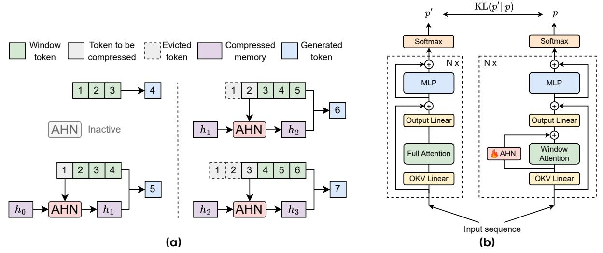

# **1 Instruction**

"Memory is the treasury and guardian of all things" [\[16\]](#page-10-0). Inspired by the fundamental role of memory in intelligence, researchers have long sought to model this cognitive function in artificial systems. Early efforts centered on Recurrent Neural Networks (RNNs) [\[15,](#page-10-1) [25,](#page-11-0) [35,](#page-11-1) [37,](#page-11-2) [38,](#page-11-3) [43,](#page-12-0) [92\]](#page-14-0), where sequential information is encoded by continuously updated hidden states. Over time, diverse paradigms for memory representation emerged, including key-value (KV) caches in attention mechanisms [\[85\]](#page-14-1), external memory modules in Neural Turing Machines and Memory Networks [\[29,](#page-11-4) [93\]](#page-14-2), and external databases for retrieval-augmented models [\[47\]](#page-12-1). Among these, RNN-like and attention-based models have become the most widely used, each offering distinct advantages and limitations [\[52,](#page-12-2) [109\]](#page-15-0).

RNN-like models compress all historical information into a fixed-size hidden state, which can be treated as memory. At each step, they update the memory using the current input and the previous memory. This design ensures constant memory and computation per step, making them efficient for long sequences. However, compressing all information into a fixed-size memory inevitably leads to information loss, especially in tasks that require precise long-range information recall [\[91\]](#page-14-3).

To address the limitations of RNNs, attention mechanisms and the Transformer architecture are introduced [\[6,](#page-10-2) [59,](#page-13-0) [85\]](#page-14-1). In causal attention, the key-value cache functions as memory: for each input token, a new key and value are generated and appended to the cache. Unlike RNNs, this memory is essentially lossless, as it retains all token-level information, thereby providing much higher memory capacity. The introduction of the Transformer quickly revolutionized sequence modeling, giving rise to a series of powerful models [\[12,](#page-10-3) [21,](#page-11-5) [64,](#page-13-1) [71,](#page-13-2) [72\]](#page-13-3). Yet, the lossless nature of KV cache is a double-edged sword: while it enables powerful memory retention, the memory size grows linearly with sequence length, and the total computational cost of attention updates scales quadratically. This becomes a significant challenge when processing extremely long sequences.

When Transformers with growing lossless memory struggle for very long sequences, it is natural to revisit the RNNs' fixed-size compressed memory, which offers constant per-token update cost regardless of context length [\[31,](#page-11-6) [45,](#page-12-3) [103\]](#page-15-1). This contrast highlights a fundamental trade-off between the efficiency of compressive memory and the fidelity of lossless memory. To address this problem, it is instructive to consider how the human brain maintains nearly constant volume through early and middle adulthood [\[17,](#page-10-4) [20,](#page-11-7) [27\]](#page-11-8) while still supporting efficient processing of information across the human lifespan. The theory of Multi-Store Model of memory (MSM) in Cognitive Science and Neuroscience [\[4\]](#page-10-5) suggests that although lossless short-term memory (or called working memory [\[5\]](#page-10-6)) has limited capacity and duration [\[4,](#page-10-5) [61,](#page-13-4) [70\]](#page-13-5), the hippocampus continually consolidates them into long-term cortical representations [\[3,](#page-10-7) [24,](#page-11-9) [60,](#page-13-6) [76,](#page-13-7) [80,](#page-14-4) [83\]](#page-14-5).

Inspired by MSM [\[4\]](#page-10-5), we propose an artificial neural memory framework that converts lossless short-term memory into compressed long-term memory. Our method maintains a sliding window of the Transformer's KV cache as lossless short-term memory. Information that moves beyond this window is processed by a learnable compression module we term the Artificial Hippocampus Network (AHN). This network recurrently compresses the out-of-window context into a fixed-size state as the long-term compressed memory. AHNs can be instantiated with RNN-like architectures, and the overall framework is illustrated in Figure [1a.](#page-0-0)

To evaluate the effectiveness of AHNs, we instantiate them using Mamba2 [\[19\]](#page-10-8), DeltaNet (DN) [\[75,](#page-13-8) [104\]](#page-15-2) and GatedDeltaNet (GDN) [\[105\]](#page-15-3), resulting in the AHN-Mamba2, AHN-DN and AHN-GDN. We introduce an efficient self-distillation training scheme in which the teacher model is an open-weight attention-based model (e.g., Qwen), and the student model shares the teacher's parameters but with token mixer of window attention and AHN. We employ a KL divergence loss, optimizing only the AHN parameters while freezing all remaining parameters, as shown in Figure [2b.](#page-3-0) The models on trained on ChatQA 2 [\[99\]](#page-15-4) with 1B tokens, sample sequence length up to 24k, and random sliding window size up to 8k, which only cost ∼ 10 hours on 32 A100 GPUs to train AHNs to augment 7B model. Notably, for inference, we set a default sliding-window attention size of 32k, which is substantially larger than those used in prior attention–RNN hybrid methods (e.g., 64 in [\[41,](#page-12-4) [112\]](#page-15-5)) AHNs activate only when the sequence length exceeds the 32k window, addressing the quadratic-complexity issue of attention that emerges at that scale.

Experimental results on long-context benchmarks LV-Eval [\[110\]](#page-15-6) and InfiniteBench [\[113\]](#page-16-0) show that AHN-

augmented models consistently outperform their sliding window counterparts, and match or even surpass full attention models while significantly reducing computational and memory cache costs. For instance, as shown in Figure 1b, augmenting Qwen2.5-3B-Instruct [100] with AHNs (+0.4% parameters) reduces FLOPs by 40.5% and memory cache by 74.0%, while improving average score from 4.41 to 5.88 on LV-Eval (128k sequence length) [110].

The contributions of this paper are twofold. First, we introduce the concept of Artificial Hippocampus Networks (AHNs), which continually transform lossless memory outside the sliding window into a compressed memory representation, enabling the model to leverage both memories for efficient long-context modeling. Second, to empirically validate the effectiveness of AHNs, we instantiate the concept into AHN-Mamba2, AHN-DN, and AHN-GDN, and train these instances using an efficient self-distillation scheme. Experimental results demonstrate that these instances substantially enhance model efficiency on long-sequence benchmarks, while achieving competitive performance compared to the full attention model.

#### 2 Method

### 2.1 Preliminary

Most modern autoregressive large language models are built on Transformer architecture [85], which employs self-attention as the core mechanism for token mixing. Given an input sequence of L tokens  $X = (x_1, x_2, ..., x_L) \in \mathbb{R}^{L \times D}$  (D is the hidden dimension), self-attention first projects the tokens into query (Q), key (K), and value (V) matrices via learned linear transformations:

$$Q = XW_Q, K = XW_K, V = XW_V (1)$$

where  $W_Q$ ,  $W_K$ , and  $W_V$  are trainable weight matrices. The attention output is then computed as a weighted sum of the value vectors:

Attention
$$(Q, K, V) = \operatorname{softmax} \left( \frac{QK^T}{\sqrt{d_{in}}} \odot \mathcal{M} \right) V$$
 (2)

where  $\mathcal{M} \in \mathbb{R}^{L \times L}$  is the causal mask, defined by  $\mathcal{M}_{ij} = 1$  if  $j \leq i$ , and  $\mathcal{M}_{ij} = 0$  otherwise.

#### 2.2 Artificial Hippocampus Networks

**Definition.** Inspired by MSM [4] and the hippocampus [76] that consolidates lossless short-term memory into compact and long-term representations, we introduce Artificial Hippocampus Networks (AHNs) to emulate this biological function by compressing historical information into a fixed-size recurrent state. An AHN operates alongside a sliding attention window of size W. For the token at step t > W, the AHN updates the compressive memory by processing the key-value (KV) pair  $(k_{t-W}, v_{t-W})$  that just exited the sliding window. This recurrent memory update is defined as:

$$h_{t-W} = AHN((k_{t-W}, v_{t-W}), h_{t-W-1})$$
(3)

where  $h_{t-W}$  is the updated compressed memory summarizing context up to and including position t-W.  $h_{t-W}$  can be a vector or matrix. Due to the recurrent formulation of Equation 3, AHNs can be implemented with RNN-like architectures, enabling the learnable and efficient compression of long context history.

Integration with lossless memory. Within the predefined sliding window, standard causal attention is applied to preserve lossless memory of recent tokens. Once the input sequence length exceeds the window size, AHNs are activated to compress the KV pair outside the window, i.e.,  $(k_{t-W}, v_{t-W})$ , into a fixed-size compressed memory  $h_{t-W}$ . After this compression, the original KV pair beyond the window can be safely discarded, retaining only the KV cache within the window  $\{(k_i, v_i)\}_{i=t-W+1}^t$ . Finally, the current query  $q_t$  accesses information from both compressed and lossless memories to produce the output:

$$y_t = f(h_{t-W}, \{(k_i, v_i)\}_{i=t-W+1}^t, q_t)$$
(4)

An illustration of the overall model mechanism with AHNs is provided in Figure 2a. Besides, the illustration of AHNs with attention sinks [98] is shown in Figure 6 in the appendix.

Figure 2 (a) Illustration of the model augmented with Artificial Hippocampus Networks (AHNs). In this illustrative example, we set the sliding window length to 3 for clarity. For model inference in our experiments, the default window length is 32k. When the input sequence length is less than or equal to the window length, the model operates identically to a standard Transformer. For longer sequences, AHNs continually compress the token outside the window into a compact memory representation. The model then utilizes both the lossless information within window, and the compressed memory to generate the next token. (b) Self-distillation training framework of AHNs based on an open-weight LLM. During training, the base LLM's weights are frozen, and only the AHNs' parameters are trained.

#### 2.3 Instantiation

As discussed above, AHNs can be instantiated using RNN-like architectures. In our experiments, we focus on modern linear recurrent models for their efficient parallel training. Specifically, we utilize three architectures including Mamba2 [19], DeltaNet (DN) [75, 104], and its enhanced version, GatedDeltaNet (GDN) [103], to instantiate AHNs into AHN-Mamba2, AHN-DN and AHN-GDN, respectively. Below, we present the implementation of AHN-GDN for each head as a representative example, and the other two AHN instances are described in Appendix A. Specifically, AHN-GDN updates memory via the gated delta rule [75, 103, 104]:

$$h_{t-W} = \text{AHN-GDN}((k_{t-W}, v_{t-W}), h_{t-W-1}, x_{t-W})$$
  
=  $\alpha(x_{t-W})(\mathbf{I} - \beta(x_{t-W})k_{t-W}^T k_{t-W})h_{t-W-1} + \beta(x_{t-W})k_{t-W}^T v_{t-W}$  (5)

where learnable parameters for per head are  $W_{\alpha} \in \mathbb{R}^{D \times 1}$  in  $\alpha(\cdot)$  and  $W_{\beta} \in \mathbb{R}^{D \times 1}$  in  $\beta(\cdot)$ . Unlike GatedDeltaNet [105], which compresses all past tokens, AHN-GDN only compresses tokens outside the sliding window. For each position t, the query  $q_t$  derived from  $x_t$  is used to access the compressed memory  $h_{t-W}$ . Note that AHNs do not introduce separate QKV projection layers. Instead, they directly transform the lossless memory (i.e., the KV cache) from attention into a fixed-size compact memory. The compressed memory  $h_{t-W}$  is further modulated by a gate function  $\gamma(x_t)$  and then is transformed by a linear projection to generate output:

$$y_{\text{AHN},t} = \gamma(x_t)q_t h_{t-W} W_o \tag{6}$$

Different from GatedDeltaNet [105], the output of  $\gamma(x_t) = x_t W_{\gamma}$  is a scalar for each head with learnable parameter  $W_{\gamma} \in \mathbb{R}^{D \times 1}$ , and the output linear is grouped by heads [42, 46] with learnable weight  $W_o \in \mathbb{R}^{H \times H}$  (H denotes head dimension). Finally, we simply sum the outputs from AHN and the attention mechanism:

$$y_t = y_{\text{AHN},t} + \text{Attention}(\{(k_i, v_i)\}_{i=t-W+1}^t, q_t)$$
 (7)

Complexity analysis. Table 1 summarizes the computational and memory complexities of the attention token mixer with and without AHN-GDN, and Figure 3 compares the complexities of Qwen2.5-3B with and without AHN-GDN. As shown, integrating AHNs significantly improves efficiency over standard full attention in both memory usage and FLOPs. In particular, AHN-GDN reduces the computational complexity of attention to linear in sequence length while keeping the memory cache size constant. By contrast, vanilla full attention incurs quadratic computational cost and memory usage that grows linearly with sequence length.

**Table 1** Complexity of causal attention with and without AHN-GDN. Here, L: input sequence length; D: hidden dimension;  $N_{\rm q}/N_{\rm kv}$ : number of query/key-value heads; H: head dimension; W: sliding window size. AHNs are activated only when L>W. FLOPs account for matrix multiplication only; softmax, normalization, and matrix element summation are omitted. Items shown in gray can be further omitted compared to the other terms.

| Token mixer  | Causal attention (Full)     | Causal attention (Window) $+$ AHN-GDN                             |
|--------------|-----------------------------|-------------------------------------------------------------------|
| Parameters   | $2DH(N_{\rm q}+N_{\rm kv})$ | $2DH(N_{\rm q} + N_{\rm kv}) + 3DN_{\rm q} + H^2N_{\rm q}$        |
| Memory cache | $2LHN_{\rm kv}\sim O(L)$    | $2WHN_{\rm kv} + H^2N_{\rm q} \sim O(W)$                          |
| FLOPs        |                             | $4LDH(N_{\rm q} + N_{\rm kv}) + 2HN_{\rm q}W^2 + 2(L - W) \times$ |
|              |                             | $(2WHN_{q} + H^{2}N_{q} + 3DN_{q} + H^{2}N_{q}) \sim O(WL)$       |

#### 2.4 Training framework

While an AHN-augmented model can be trained from scratch, we adopt a more computationally efficient approach using self-distillation [34, 111, 114]. This allows us to leverage powerful pre-trained models. Our training framework uses an open-weight LLM (e.g., Qwen [100]) as the teacher model, with its output probability denoted as p'. The student model is the same LLM, but we modify its attention mechanism to operate over a limited receptive field of a sliding window at every layer. These window attention layers are then augmented with AHNs. The student's output probability is denoted as p. We train the student to mimic the teacher's output distribution by minimizing the Kullback-Leibler (KL) divergence: l = KL(p'||p). To maximize efficiency, the base model's weights are frozen during training, and only the AHN parameters are optimized. Taking AHN-GDN as an example, only the parameters involved in Equations 5 and 6 are learnable. For each attention head, these trainable parameters consist of the gating weights  $W_{\alpha} \in \mathbb{R}^{D \times 1}$  in  $\alpha(\cdot)$ ,  $W_{\beta} \in \mathbb{R}^{D \times 1}$  in  $\beta(\cdot)$ ,  $W_{\gamma} \in \mathbb{R}^{D \times 1}$  in  $\gamma(\cdot)$  as well as the output projection  $W_{o} \in \mathbb{R}^{H \times H}$ . Here, D and H denote the hidden dimension and the head dimension, respectively. With  $N_{q}$  attention heads, the model contains  $N_{q}$  such sets of parameters, amounting to only  $\sim 0.4\%$  relative to the frozen base model's parameters. The framework is illustrated in Figure 2b.

