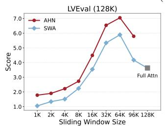
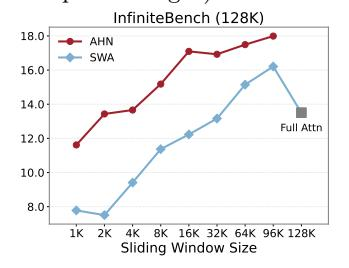
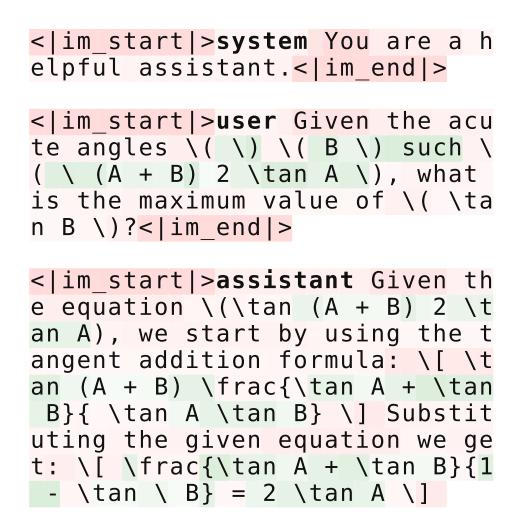

# 3 Experiments

#### 3.1 Setups

Models and datasets. We build our AHNs on top of open-weight Qwen2.5-Instruct series (3B, 7B, 14B) [100]. To demonstrate architectural flexibility, we implement the AHN module using three modern recurrent models: Mamba2 [19], DeltaNet [75, 104], and GatedDeltaNet [103]. The training data is ChatQA2 dataset [99], an open-source collection of diverse long-context tasks. We evaluate our methods across a comprehensive suite of long-context benchmarks, including LongBench [7], InfiniteBench [113], and LV-Eval [110], with an additional illustrative example drawn from PG19 [73].

**Baselines.** We evaluate AHN-augmented models against two primary baselines: sliding window attention (SWA) with attention sinks [98] and the Compressive Transformers (CT) [73]. We implement the Compressive

Figure 3 Complexity analysis of the Qwen2.5-3B-Instruct and model perplexity, with and without AHNs. AHNs are only activated when the sequence length exceeds the window size (32k in this example). (a) The model with AHN enjoys linear computational complexity with respect to sequence length. (b) The model with AHN maintains a consistent memory cache size. (c) Perplexity results on the first book of the PG19 test set (57K tokens). While Qwen-3B-Instruct degrades beyond its pre-trained context length, AHN-augmented models maintain consistently low perplexity. (d) Peak GPU memory under the same example.

**Table 2** Performance and efficiency analysis on the 128k length subset of LV-Eval and InfiniteBench. The mixing/model FLOP ratio measures the relative computational cost of the token mixer or the entire model compared with the full attention baseline. For all methods except full attention, the lossless memory of attention sinks [\[98\]](#page-15-8) and sliding window attention (SWA) is 32k tokens. Compressive Transformers (CT) [\[73\]](#page-13-9) are implemented with attention sinks [\[98\]](#page-15-8) and a compression function of max or average pooling.

|                         |                                                  | Extra                | Mixing                          | Model                           | Memory                          |                                 | LV-Eval                      |                                  |                              |                                  | InfiniteBench                    |                                  |
|-------------------------|--------------------------------------------------|----------------------|---------------------------------|---------------------------------|---------------------------------|---------------------------------|------------------------------|----------------------------------|------------------------------|----------------------------------|----------------------------------|----------------------------------|
| Base model           | Token mixer                                      | param ratio       | FLOP ratio                   | FLOP ratio                   | cache ratio                  | cmrc -mixup                  | loogle-SD -mixup          | dureader -mixup               | Avg.∗                        | En. QA                           | Zh. QA                           | Avg.                             |
| Qwen2.5-3B Instruct  | Full Attn Sinks + SWA CT-Max CT-Average | 0% 0% 0% 0% | 100% 46.6% 47.1% 47.1% | 100% 59.3% 59.7% 59.7% | 100% 25.6% 26.0% 26.0% | 7.28 7.48 6.10 6.95    | 0.89 4.59 3.88 4.70 | 13.22 11.49 11.37 11.40 | 4.41 4.59 4.12 4.47 | 7.28 8.63 7.40 8.30     | 11.75 12.31 12.59 13.32 | 9.52 10.47 10.00 10.81  |
|                         | AHN-Mamba2 AHN-DN AHN-GDN                  | 0.4% 0.4% 0.4% | 46.7% 46.7% 46.7%         | 59.4% 59.4% 59.4%         | 26.0% 26.0% 26.0%         | 7.84 9.41 7.96            | 5.20 5.99 7.21         | 12.35 11.49 12.52          | 5.13 5.68 5.88         | 9.29 10.61 10.61           | 15.58 16.41 15.87          | 12.44 13.51 13.24          |
| Qwen2.5-7B Instruct  | Full Attn Sinks + SWA CT-Max CT-Average | 0% 0% 0% 0% | 100% 48.0% 48.5% 48.5% | 100% 65.5% 65.8% 65.8% | 100% 25.6% 26.0% 26.0% | 4.30 9.52 8.35 9.48    | 0.17 4.76 4.02 4.86 | 12.8 14.09 12.34 13.78  | 3.62 5.34 4.82 5.28 | 11.23 10.66 10.56 10.63 | 15.76 15.66 15.45 15.99 | 13.50 13.16 13.00 13.31 |
|                         | AHN-Mamba2 AHN-DN AHN-GDN                  | 0.2% 0.2% 0.3% | 48.2% 48.2% 48.2%         | 65.6% 65.6% 65.6%         | 26.0% 26.0% 26.0%         | 12.57 11.97 12.69         | 5.54 5.67 4.71         | 14.13 16.52 15.30          | 6.21 6.82 6.54         | 11.36 12.86 13.37          | 17.06 20.10 20.48          | 14.21 16.48 16.93          |
| Qwen2.5-14B Instruct | Full Attn Sinks + SWA CT-Max CT-Average | 0% 0% 0% 0% | 100% 49.5% 49.8% 49.8% | 100% 62.3% 62.6% 62.6% | 100% 25.6% 25.9% 25.9% | 8.79 11.96 10.55 11.89 | 1.45 7.59 7.53 7.41 | 13.84 12.23 12.08 12.46 | 4.99 5.69 5.28 5.64 | 11.23 11.62 10.58 10.61 | 13.19 13.45 12.73 13.28 | 12.21 12.54 11.66 11.95 |
|                         | AHN-Mamba2 AHN-DN AHN-GDN                  | 0.3% 0.3% 0.4% | 49.7% 49.7% 49.7%         | 62.4% 62.4% 62.5%         | 25.9% 25.9% 25.9%         | 14.03 13.13 14.16         | 7.20 9.14 8.54         | 15.39 14.46 13.94          | 6.43 6.50 6.51         | 14.21 16.54 14.48          | 16.20 18.42 18.55          | 15.21 17.48 16.52          |

Transformer using max and average pooling to compress tokens outside the sliding window at a 4× compression rate. To ensure a fair comparison, all methods are allocated the same lossless memory budget, and the memory size of compressed tokens for CT is set to equal the memory size of the hidden state of AHNs. The performance of full attention is also reported as a reference.

Implementation details. We implement all AHN instances in PyTorch [\[68\]](#page-13-10), building on LLaMA-Factory [\[117\]](#page-16-2) and Flash Linear Attention [\[102\]](#page-15-10). During training, we freeze the entire base LLM and only train the newly added AHN module (only ∼ 0.4% parameters relative to base LLM) using self-distillation, as illustrated in Figure [2b.](#page-3-0) To ensure the AHN module learns a generalizable compression strategy, we randomize the starting position (the number of attention sinks) of the AHN modules and also the sliding window size. Specifically, we use a maximum sequence length of 24k tokens during training. For each example, the attention-sink size is uniformly sampled from [0, 32, 64, 128, 512, 2048, 4096] after removing any candidates larger than half of the sequence length. The total token number of lossless memory (attention sinks + sliding window) is uniformly sampled from [32, 64, 128, 256, 512, 1024, 2048, 4096, 8192] after filtering out values smaller than one-eighth of the sequence length. For optimization, we use the AdamW [\[58\]](#page-13-11) optimizer with a learning rate of 1e-4, which is warmed up linearly over the first 10% of steps and then cosine decayed. All models are trained for one epoch on the ChatQA2 dataset, consisting of 1B tokens, using a global batch size of 128 for a total of 740 update steps. Training AHNs for a 7B base model requires only ∼10 hours on 32 A100 GPUs.

## **3.2 An illustrative example**

By compressing historical information beyond the sliding window into a fixed-size memory, AHN-augmented models significantly reduce both computational complexity and memory footprint, as shown in Figure [3a](#page-4-1) and [3b.](#page-4-1) We demonstrate this advantage with a real example on a 57K token passage from the PG19, a benchmark of long-form books designed to test extended context understanding. We compare the base 3B-Instruct models against their AHN-GDN counterparts. As shown in Figure [3c,](#page-4-1) the perplexity of standard Qwen models rises sharply once the 32k token context window is exceeded. In contrast, the AHN-GDN augmented model maintains consistently low perplexity. Furthermore, Figure [3d](#page-4-1) illustrates that while the base models' memory usage grows linearly under FlashAttention, AHN-GDN keeps the CUDA memory usage nearly constant, highlighting its effectiveness for processing long-context sequences.

**Table 3** Qwen2.5-based model performance on six LongBench tasks (average sequence length > 8k). For all methods, the lossless memory of attention sinks [\[98\]](#page-15-8) and sliding window attention (SWA) is 8192 tokens. Compressive Transformers (CT) [\[73\]](#page-13-9) are implemented with attention sinks [\[98\]](#page-15-8) and a compression function of max or average pooling.

| Base model              | Token mixer                         | DuReader                | HotpotQA                | MuSiQue                 | NarrativeQA             | QMSum                   | TriviaQA                | Avg.                    |
|-------------------------|-------------------------------------|-------------------------|-------------------------|-------------------------|-------------------------|-------------------------|-------------------------|-------------------------|
| Qwen2.5-3B              | Sinks + SWA                         | 23.28                   | 43.70                   | 16.55                   | 15.35                   | 21.54                   | 85.44                   | 34.31                   |
|                         | CT-Max                              | 22.81                   | 40.92                   | 17.22                   | 16.58                   | 21.07                   | 85.55                   | 34.03                   |
|                         | CT-Average                          | 23.28                   | 44.65                   | 16.32                   | 16.36                   | 21.18                   | 85.29                   | 34.51                   |
| Instruct                | AHN-Mamba2                          | 24.38                   | 42.95                   | 18.31                   | 16.70                   | 21.89                   | 85.18                   | 34.90                   |
|                         | AHN-DN                              | 25.12                   | 42.83                   | 19.78                   | 19.11                   | 22.35                   | 86.17                   | 35.89                   |
|                         | AHN-GDN                             | 25.47                   | 42.76                   | 19.31                   | 18.95                   | 21.85                   | 84.93                   | 35.55                   |
| Qwen2.5-7B              | Sinks + SWA                         | 24.93                   | 51.57                   | 22.34                   | 22.29                   | 21.49                   | 88.48                   | 38.52                   |
|                         | CT-Max                              | 25.08                   | 50.61                   | 20.65                   | 23.17                   | 21.34                   | 88.89                   | 38.29                   |
|                         | CT-Average                          | 24.81                   | 51.85                   | 21.65                   | 22.66                   | 21.54                   | 88.48                   | 38.50                   |
| Instruct                | AHN-Mamba2                          | 26.10                   | 53.24                   | 27.93                   | 24.86                   | 21.97                   | 89.24                   | 40.56                   |
|                         | AHN-DN                              | 26.42                   | 54.24                   | 29.30                   | 25.08                   | 21.69                   | 89.49                   | 41.04                   |
|                         | AHN-GDN                             | 26.97                   | 54.17                   | 26.83                   | 24.00                   | 21.80                   | 89.75                   | 40.59                   |
| Qwen2.5-14B Instruct | Sinks + SWA CT-Max CT-Average | 25.46 24.63 25.48 | 55.68 54.45 56.08 | 29.01 27.78 29.15 | 23.21 22.16 23.26 | 21.45 21.16 21.40 | 89.06 88.16 89.53 | 40.65 39.72 40.82 |
|                         | AHN-Mamba2 AHN-DN AHN-GDN     | 26.34 26.80 26.51 | 56.52 58.71 58.09 | 30.32 32.92 31.40 | 24.01 22.95 24.71 | 22.19 22.08 22.35 | 88.63 87.50 88.35 | 41.34 41.83 41.90 |

## **3.3 Long-context benchmarks**

We now systematically evaluate AHN-augmented models on long-context benchmarks to assess their effectiveness and efficiency. Our evaluation is structured across two settings: First, we conduct ultra-long-context evaluation on InfiniteBench [\[113\]](#page-16-0) and LV-Eval [\[110\]](#page-15-6) (both use 128k-length subset), comparing AHN-augmented models with full attention, sliding window attention (SWA) with attention sinks, and Compressive Transformer (CT) using average and max pooling as the compression functions. Besides, we evaluate six tasks with average sequence lengths exceeding 8k on LongBench [\[8\]](#page-10-10).

Ultra-long-context. LV-Eval is a challenging long-context benchmark, covering both single-hop QA and multi-hop QA. It introduces several design challenges, including confusing facts insertion, keyword and phrase replacement, and a keyword-recall-based metric. We evaluate all methods on the 128k-context subsets across all 11 datasets. For sliding window-based methods (SWA and AHN), we use a 32768-token lossless memory, consisting of 128-token attention sinks and a 32640-token sliding window during inference. To further validate this setting, we also test on InfiniteBench, a benchmark tailored to evaluate language models' ability to process, understand, and reason over super-long contexts. As shown in Table [2,](#page-5-0) AHN-augmented models consistently outperform SWA with attention sinks baseline across nearly all tasks. Remarkably, they also surpass the performance of full attention, demonstrating the effectiveness of the compressed memory mechanism while offering substantial computational and memory savings. We include full results in the appendix.

Long-context. To evaluate our models on a broader range of practical scenarios, we use LongBench, which features diverse tasks across multiple domains and languages, designed to rigorously test long-context understanding in more realistic scenarios. While many tasks on LongBench have relatively short inputs, we focus on six tasks with an average length exceeding 8192 tokens to create a challenging evaluation. In this setup, we constrain all methods to a fixed 8192-token lossless memory budget (128 attention sinks and an 8064-token sliding window). As reported in Table [3,](#page-6-0) AHN-augmented models again achieve consistently superior accuracy compared to both baselines. These results strongly suggest that the recurrent hidden states effectively capture and utilize historical information, leading to improved performance across diverse scenarios.

#### **3.4 Ablation study**

Having demonstrated the effectiveness of AHN-augmented models, we now conduct an ablation study to analyze the impact of our three design choices: the training objective, randomization of training window size, and the inference window size. For these experiments, we use AHN-GDN (Qwen2.5-7B-Instruct) as the

**Figure 4** The AHN-augmented model consistently outperforms the sliding-window attention (SWA) baseline across all window sizes on both LV-Eval and InfiniteBench (128k sequence length). **Table 4** Ablation of AHN training de-

sign choices based on Qwen2.5-7B-Instruct: (1) the training objective (2) randomized vs.

| (1) the training objective (2) randomized vs. |  |  |
|-----------------------------------------------|--|--|
| fixed window.                                 |  |  |

| Training target                                                                            | Training window size     | LongBench (Average of 6 tasks) |
|--------------------------------------------------------------------------------------------|-----------------------------|--------------------------------------|
| Self-distill (KL loss) Next-token pred. (CE loss) Random size Self-distil. (KL loss) | 1024 (fixed) Random size | 38.53 39.59 40.59              |

starting point.

Training objectives: self-distillation vs. next-token prediction. We train AHNs using self-distillation, minimizing the KL divergence between the AHN-augmented logits and the full attention outputs. As a comparison, we also apply standard next-token prediction with cross-entropy (CE) loss, which encourages AHNs to "learn to compress" directly from data distribution. As shown in Table [4,](#page-7-0) this replacement results in a marked performance drop on LongBench. We hypothesize this is because CE provides sparse learning signals, and pushes the small AHN modules towards shortcuts in the training data. In contrast, self-distillation offers denser guidance over the teacher's entire output distribution, compelling AHNs to learn more generalizable context representations.

Training window size: randomized vs. fixed. We train AHNs using randomized sliding-window sizes to encourage a more general and robust compressive module that can adapt to varying context lengths. In contrast, models trained with a fixed window often overfit to that specific configuration and fail to generalize to unseen context lengths, leading to noticeable performance degradation, as shown in Table [4.](#page-7-0)

Inference window size. To further evaluate context length generalization, we fix the attention sinks to 128 tokens and test AHN-augmented models with sliding window sizes ranging from 1k to 96k on the 128k-context subsets of both LV-Eval and InfiniteBench. As shown in Figure [4,](#page-7-0) the AHN-augmented model maintains competitive performance across all window configurations, and consistently outperforms sliding window attention (SWA). Notably, as the inference window size increases from 1k to 16k, the performance improves steadily, highlighting the importance of a large attention window for extra-long context tasks. Beyond this range, however, we observe a noticeable performance drop, after 64k on LV-Eval and 96k on InfiniteBench, which may be attributed to the attention-dilution effect, where the the attention distribution becomes overly diffuse when the number of keys grows very large, weakening the model's ability to focus on relevant information. Balancing performance and computational cost, we therefore adopt a 32k sliding window as the default configuration for inference. Additional LongBench results are provided in the appendix.

**Figure 5** Green regions mark tokens with low L2 gradient magnitudes, indicating they are preferentially selected by AHN to store in the compressed memory; red denotes the opposite.

#### **3.5 Probing AHN with gradients visualization**

Beyond benchmark performance, we seek to understand how effectively AHNs compress and exploit out-ofwindow information. We probe the backward dynamics of AHN-augmented models by visualizing gradients of

the self-distillation loss, which is formally defined by:

$$\frac{\partial}{\partial x_{\text{out}}} \text{KL}(f'(x_{\text{win}}, x_{\text{out}}) \parallel f(x_{\text{win}}, h_{\text{AHN}}))$$
(8)

where f ′ (·) and f(·) denote the teacher and student forward models, hAHN represents the compressed memory of AHN, xwin are in-window token embeddings, and xout are out-of-window embeddings. Out-of-window tokens with small gradient magnitudes indicate that their information has already been well captured in AHN's compressed memory.

Figure [5](#page-7-1) shows an example from AceMath-Instruct-Training-Data [\[57\]](#page-13-12). The full sequence has 811 tokens, and we evaluate the AHN-augmented model using a 512-token sliding window (AHN activates once the context surpasses 512 tokens). The snippet shows the gradients for the first 139 tokens. As illustrated in Figure [5,](#page-7-1) AHN tends to preserve the information of mathematical symbols and numbers while neglecting less critical ones such as pronouns and special tokens, demonstrating its AHNs can learn to prioritize more informative tokens for storage.

## **4 Related work**

#### **4.1 Memory in neural networks**

Memory mechanisms play a crucial role in enabling neural networks to process and retain information over time, which is essential for tasks that require understanding of temporal dependencies, sequential data, or context preservation. Traditional feedforward neural networks lack the capability to maintain information across time steps, which limits their effectiveness in tasks such as language modeling, sequence prediction, and reasoning. To address this limitation, Recurrent Neural Networks (RNNs) are introduced [\[25,](#page-11-0) [37,](#page-11-2) [38,](#page-11-3) [43,](#page-12-0) [92\]](#page-14-0). RNNs maintain a hidden state that is updated at each time step, allowing information to persist across sequences. However, vanilla RNNs suffer from issues such as vanishing and exploding gradients, making it difficult to capture long-term dependencies [\[11\]](#page-10-11). To mitigate these problems, more advanced architectures like Long Short-Term Memory (LSTM) networks [\[35\]](#page-11-1) and Gated Recurrent Unit (GRU) [\[15\]](#page-10-1) are proposed. These models incorporate gating mechanisms that regulate the flow of information, enabling them to learn longer-term dependencies more effectively. Because these RNN-like models maintain a fixed-size memory and a consistent memory update cost for each input token, they are highly efficient for processing long sequences. Therefore, our AHNs are designed within the RNN paradigm to inherit this advantageous property.

Beyond RNN-based architectures, memory-augmented neural networks have been developed to further enhance the memory capacity of neural models. For example, the Neural Turing Machine (NTM) [\[29\]](#page-11-4) and the Differentiable Neural Computer (DNC) [\[30\]](#page-11-11) introduce external memory modules that the network can read from and write to, allowing for more complex reasoning and algorithmic tasks. Over the past decade, attention mechanisms [\[6\]](#page-10-2) have revolutionized the way neural networks handle memory. The Transformer architecture [\[85\]](#page-14-1), which relies entirely on self-attention mechanisms, enables direct access to all previous states in a sequence, providing a form of memory that is both lossless and scalable. This has led to significant improvements in various domains [\[21,](#page-11-5) [23,](#page-11-12) [71,](#page-13-2) [72\]](#page-13-3), and has spurred the emergence of new technological paradigms and innovations [\[32,](#page-11-13) [64](#page-13-1)[–66\]](#page-13-13), such as In-Context Learning [\[12\]](#page-10-3) and Chain-of-Thought (CoT) reasoning [\[90\]](#page-14-6). However, modeling long sequences exacerbates the quadratic computational complexity cost of attention mechanisms [\[14\]](#page-10-12). Our proposed AHNs address this challenge by employing an RNN-like network to compress the historical KV cache.

#### **4.2 Memory management**

RNN-like models [\[9,](#page-10-13) [15,](#page-10-1) [19,](#page-10-8) [25,](#page-11-0) [31,](#page-11-6) [35,](#page-11-1) [45,](#page-12-3) [69,](#page-13-14) [81,](#page-14-7) [103–](#page-15-1)[105,](#page-15-3) [115\]](#page-16-3) maintain memory through a fixed-size hidden state, regardless of input sequence length. Therefore, memory caching is not a major concern for these architectures. In contrast, Transformers store key-value (KV) pairs for every token in the input sequence, resulting in linear growth of the KV cache with sequence length. This results in significant memory consumption and presents a major challenge for processing long sequences. To mitigate this issue, various approaches have been proposed [\[49\]](#page-12-7), including KV cache selection [\[1,](#page-9-0) [28,](#page-11-14) [33,](#page-11-15) [51,](#page-12-8) [56,](#page-12-9) [84,](#page-14-8) [95,](#page-14-9) [98,](#page-15-8) [116\]](#page-16-4), budget allocation

[\[13,](#page-10-14) [26,](#page-11-16) [97,](#page-15-11) [101\]](#page-15-12), merging [\[55,](#page-12-10) [63,](#page-13-15) [86,](#page-14-10) [89\]](#page-14-11), quantization [\[36,](#page-11-17) [53,](#page-12-11) [77,](#page-14-12) [79,](#page-14-13) [96,](#page-15-13) [106\]](#page-15-14), low-rank decomposition [\[22,](#page-11-18) [108\]](#page-15-15), external memory [\[67,](#page-13-16) [88\]](#page-14-14), and neural architecture design [\[2,](#page-10-15) [40,](#page-12-12) [54,](#page-12-13) [62,](#page-13-17) [78,](#page-14-15) [82,](#page-14-16) [94,](#page-14-17) [107\]](#page-15-16). Among them, a straightforward strategy is to use a sliding window for attention [\[85\]](#page-14-1), but this method discards KV pairs outside the window, thereby losing long-range context. Sparse Transformers [\[14\]](#page-10-12) address this by retaining KV pairs at specific pattern positions to capture long-range dependencies, but still drop portions of the KV cache, potentially missing important information. Transformer-XL [\[18\]](#page-10-16) introduces a segment-level recurrence mechanism by caching the last segment of hidden states as a First-In, First-Out (FIFO) memory. Compressive Transformer [\[73\]](#page-13-9) extends this by compressing older memories into a secondary FIFO memory, but it still discards memory once the slots are full. In contrast, AHNs adopt an RNN-like paradigm that continually compresses KV pairs outside the sliding window into a lifelong compressed memory, rather than discarding them outright [\[52,](#page-12-2) [62,](#page-13-17) [74\]](#page-13-18). AHNs (like AHN-GDN [\[105\]](#page-15-3)) can also dynamically control memory decay [\[19,](#page-10-8) [75,](#page-13-8) [104,](#page-15-2) [105\]](#page-15-3). Recent studies integrate RNNs and attention either in interleaved layers [\[19,](#page-10-8) [48,](#page-12-14) [52,](#page-12-2) [74,](#page-13-18) [105\]](#page-15-3) or within a single layer [\[10,](#page-10-17) [50,](#page-12-15) [62\]](#page-13-17). By contrast, we abstract the compression module as an AHN concept, yielding a more general memory framework. We employ a sliding-window attention mechanism, activating AHNs whenever a token leaves the window. Additionally, we introduce a simple self-distillation scheme that trains AHNs efficiently.

Compared with recent attention-RNN-Hybrid works [\[62,](#page-13-17) [87,](#page-14-18) [112\]](#page-15-5) and concurrent work [\[41\]](#page-12-4), the goal of the AHN memory framework is to leverage the efficiency of RNNs specifically to address the computational bottleneck of attention on extra-long sequences. The distinct insight introduced by AHNs is to employ a large sliding-window size (e.g., 32k) for attention, such that the RNN-like AHN modules only activate when the sequence length exceeds this window. This design provides two major advantages: 1) It highlights the efficiency benefits of RNNs on extra-long context tasks (e.g., 128k), achieving substantial FLOP and memory-cache savings. In contrast, for short-context tasks where attention is already efficient, introducing RNNs provides no efficiency gain. 2) It requires no additional effort to preserve attention performance on short-context tasks, because AHNs remain inactive in these regimes, and the model behaves exactly as a pure attention-based Transformer.

