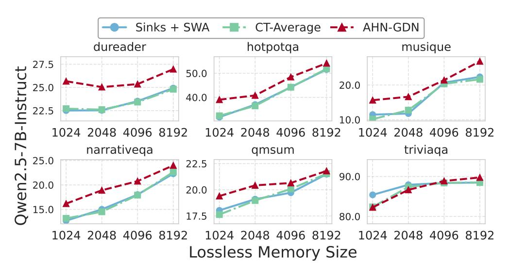

# **B Additional benchmark results**

This section further examines the effectiveness of AHNs in long-context scenarios, presenting additional benchmark results, while also acknowledging their inherent limitations on exact-recall tasks due to the lossy nature of compressed memory.

LV-Eval[\[110\]](#page-15-6). We present complete results on all 11 LV-Eval tasks under the 128k context setting. All models are configured with 32768 tokens of lossless memory, including 128-token attention sinks and a 32640-token sliding window.

RULER [\[39\]](#page-12-16) is a comprehensive benchmark that extends the standard needle-in-a-haystack (NIAH) [\[44\]](#page-12-17) paradigm by introducing increased task difficulty and additional categories. We evaluate an AHN-augmented model (AHN-GDN) on all NIAH tasks within the RULER-128k subset, using Qwen2.5-7B-Instruct as the base

model. For a fair comparison, both AHN-GDN and sliding window attention with attention sinks are configured with 128 attention sinks and a 32640-token sliding window. As shown in Table 5, AHN-GDN performs on par with sliding window attention but markedly worse than full attention on exact-recall tasks. This reflects the inherent trade-off of lossy compression: while AHN-augmented models enable efficient long-context reasoning, they inevitably struggle on tasks that require exact-recall from the compressed memory. This limitation suggests opportunities for future research, such as memory management that preserves critical information in lossless memory while leveraging compression for efficiency.

**Table 5** Performance on advanced needle-in-a-haystack (NIAH) tasks performance from RULER-128k. Both sliding window approaches use 128 attention sinks with a 32640 sliding window.

| Method      | single_1 | single_2                  | single_3 | $multikey_1$ | multikey_2 | multikey_3 | multivalue | multiquery |
|-------------|----------|---------------------------|----------|--------------|------------|------------|------------|------------|
| Full Attn   | 98.60    | $97.20 \\ 25.40 \\ 25.20$ | 98.40    | 89.20        | 23.60      | 23.20      | 55.40      | 85.45      |
| Sinks + SWA | 26.80    |                           | 28.00    | 27.80        | 10.60      | 9.00       | 22.95      | 24.00      |
| AHN-GDN     | 26.80    |                           | 28.20    | 27.40        | 11.40      | 8.60       | 23.45      | 23.35      |

**Table 6** Complete results on all 21 tasks in the 128k subset of LV-Eval. All sliding window-based methods use a lossless memory of 32768 tokens, consisting of 128 attention sinks and a 32640-token sliding window.

| Model                    | Dataset                   | Full Attn    | Sinks + SWA  | CT-Max | CT-Average | AHN-Mamba2  | AHN-DN      | AHN-GDN |
|--------------------------|---------------------------|--------------|--------------|--------|------------|-------------|-------------|---------|
|                          | Average                   | 4.41         | 4.59         | 4.12   | 4.47       | 5.13        | 5.68        | 5.88    |
|                          | cmrc mixup                | 7.28         | 7.48         | 6.10   | 6.95       | 7.84        | 9.41        | 7.96    |
|                          | dureader_mixup            | 13.22        | 11.49        | 11.37  | 11.4       | 12.35       | 11.71       | 12.52   |
| Ψ,                       | factrecall_en             | 6.88         | 3.34         | 3.86   | 3.59       | 5.58        | 9.22        | 12.51   |
| Qwen2.5-3B- Instruct  | $factrecall\_zh$          | 2.80         | 1.28         | 1.37   | 1.18       | 1.57        | 4.19        | 1.79    |
| ven2.5-3                 | $hotpotwikiqa_mixup$      | 0.09         | 0.30         | 0.08   | 0.48       | 1.11        | 0.06        | 0.65    |
| ven Ins               | lic_mixup                 | 7.68         | 6.86         | 6.39   | 6.49       | 8.13        | <u>7.78</u> | 7.38    |
| \$ <u></u>               | $loogle\_CR\_mixup$       | 0.06         | 2.24         | 1.61   | 2.28       | 1.55        | 1.65        | 1.96    |
|                          | loogle_MIR_mixup          | 0.00         | 0.64         | 0.47   | 0.58       | 1.39        | 1.14        | 1.06    |
|                          | $loogle\_SD\_mixup$       | 0.89         | 4.59         | 3.88   | 4.70       | 5.20        | 5.99        | 7.21    |
|                          | $multifieldqa_en_mixup$   | 0.00         | 0.33         | 0.43   | 0.08       | 0.00        | 0.00        | 0.19    |
|                          | $multifieldqa\_zh\_mixup$ | 9.59         | 11.91        | 9.74   | 11.41      | 11.72       | 11.31       | 11.42   |
|                          | Average                   | 3.62         | 5.34         | 4.82   | 5.28       | 6.21        | 6.83        | 6.54    |
|                          | cmrc_mixup                | 4.30         | 9.52         | 8.35   | 9.48       | 12.57       | 11.97       | 12.69   |
|                          | dureader_mixup            | 12.80        | 14.09        | 12.34  | 13.78      | 14.13       | 16.52       | 15.30   |
| κ                        | factrecall_en             | 5.33         | 4.65         | 4.67   | 4.65       | 5.84        | 5.74        | 5.14    |
| Qwen2.5-7B- Instruct  | $factrecall\_zh$          | 0.80         | 1.29         | 1.11   | 1.35       | 1.43        | 2.05        | 1.68    |
| 2.5 tru               | $hotpotwikiqa_mixup$      | 0.24         | 0.69         | 0.48   | 0.82       | 0.16        | 0.99        | 0.76    |
| wen2.5-7] Instruct    | lic_mixup                 | 3.40         | <u>10.19</u> | 8.49   | 10.07      | 9.27        | 8.73        | 10.63   |
| Ö                        | loogle_CR_mixup           | 0.57         | 0.50         | 0.81   | 0.47       | 2.26        | 2.59        | 1.58    |
|                          | loogle_MIR_mixup          | 0.00         | 0.71         | 1.08   | 0.92       | 0.91        | 3.08        | 2.70    |
|                          | $loogle\_SD\_mixup$       | 0.17         | 4.76         | 4.02   | 4.86       | 5.54        | 5.67        | 4.71    |
|                          | $multifieldqa_en_mixup$   | 0.00         | 0.47         | 0.71   | 0.45       | 0.00        | 0.28        | 0.06    |
|                          | $multifieldqa\_zh\_mixup$ | 12.24        | 11.90        | 10.93  | 11.27      | 16.18       | 17.49       | 16.74   |
|                          | Average                   | 4.99         | 5.69         | 5.28   | 5.64       | 6.43        | <u>6.50</u> | 6.51    |
|                          | cmrc_mixup                | 8.79         | 11.96        | 10.55  | 11.89      | 14.03       | 13.13       | 14.16   |
|                          | $dureader_mixup$          | 13.84        | 12.23        | 12.08  | 12.46      | 15.39       | 14.46       | 13.94   |
| ф                        | factrecall_en             | 4.31         | 0.45         | 0.77   | 0.45       | <u>1.19</u> | 0.30        | 0.15    |
| -14 ict               | $factrecall\_zh$          | 0.22         | 0.07         | 0.13   | 0.00       | 0.15        | 0.00        | 0.00    |
| 2.5 tru               | hotpotwikiqa_mixup        | 0.00         | 0.64         | 0.53   | 0.64       | 0.33        | 0.67        | 0.49    |
| Qwen2.5-14B- Instruct | lic_mixup                 | <u>11.96</u> | 10.18        | 9.52   | 10.19      | 11.57       | 12.17       | 11.13   |
| O. O.                    | loogle_CR_mixup           | 0.3          | 3.64         | 2.74   | 3.57       | 3.60        | 2.34        | 3.64    |
| •                        | $loogle\_MIR\_mixup$      | 0.94         | 1.56         | 1.38   | 1.36       | 1.65        | 1.19        | 0.65    |
|                          | $loogle\_SD\_mixup$       | 1.45         | 7.59         | 7.53   | 7.41       | 7.20        | 9.14        | 8.54    |
|                          | $multifieldqa\_en\_mixup$ | 0.00         | 0.41         | 0.39   | 0.06       | 0.60        | 1.08        | 0.94    |
|                          | $multifieldqa\_zh\_mixup$ | 13.10        | 13.82        | 12.50  | 14.05      | 14.97       | 17.06       | 17.94   |

Figure 7 AHN modules demonstrate strong context generalization capacity on LongBench.

**Table 7** One-step training FLOPs  $(10^{17})$  under the setting of AdamW optimizer, next-token prediction, full-parameter tuning, batch size 128, sequence length 24k, and sliding-window size 8k.

| Model                                                                                                           | 3B     | 7B                         | 14B                        |
|-----------------------------------------------------------------------------------------------------------------|--------|----------------------------|----------------------------|
| $ \begin{array}{c} \text{Full attention} \\ \text{Attention Sinks} + \text{SWA} \\ \text{AHN-GDN} \end{array} $ | 0.5405 | 1.1519 1.0334 1.0359 | 2.5396 2.2252 2.2319 |

