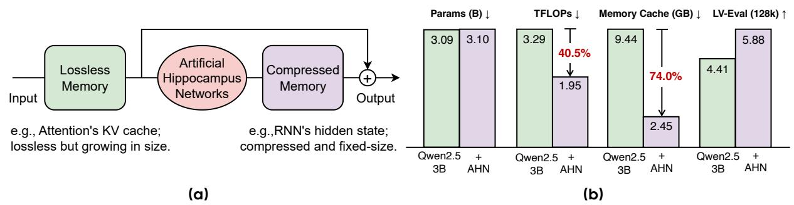

# Yunhao Fang\*, Weihao Yu\*, ≅, Shu Zhong, Qinghao Ye, Xuehan Xiong¶, Lai Wei ByteDance Seed

\*Equal contribution, □Corresponding author

Figure 1 (a) Artificial Hippocampus Networks (AHNs) transform lossless memory into fixed-size compressed representations for efficient long-context modeling. Lossless memory (e.g., attention's KV cache) stores exact input information but grows with sequence length, leading to high cost for long sequences. In contrast, compressed memory (e.g., RNNs' hidden state) maintains a constant cache size and computational cost per input token, but inevitably loses details. In our framework, a sliding window attention maintains exact recent context as lossless short-term memory, while AHN recurrently compresses out-of-window information into a fixed-size state as compressed long-term memory. This allows the model to process long sequences efficiently, retaining both precise short-term information and a compact summary of history. See Figure 2 for more details. (b) On the long-context benchmark LV-Eval (128k sequence length), augmenting Qwen2.5-3B-Instruct with AHNs (+0.4% parameters) reduces FLOPs by 40.5% and memory cache by 74.0%, while improving average score from 4.41 to 5.88.

Abstract: Long-sequence modeling faces a fundamental trade-off between the efficiency of compressive fixed-size memory in RNN-like models and the fidelity of lossless growing memory in attention-based Transformers. Inspired by the Multi-Store Model in cognitive science, we introduce a memory framework of artificial neural networks. Our method maintains a sliding window of the Transformer's KV cache as lossless short-term memory, while a learnable module termed Artificial Hippocampus Network (AHN) recurrently compresses out-of-window information into a fixed-size compact long-term memory. To validate this framework, we instantiate AHNs using modern RNN-like architectures, including Mamba2, DeltaNet, and GatedDeltaNet to augment open-weight LLMs. We also propose an efficient self-distillation training method where the base model's all parameters are frozen and only the parameters from AHNs are optimized. For inference, our method sets a default large sliding window size of 32k for attention, and AHNs activate only when the sequence length exceeds the 32k window, addressing the quadratic-complexity issue of attention that emerges at that scale. Extensive experiments on long-context benchmarks LV-Eval and InfiniteBench demonstrate that AHN-augmented models consistently outperform sliding window baselines and achieve performance comparable or even superior to full-attention models, while substantially reducing computational and memory requirements.

 $\textbf{Correspondence:} \ Weihao \ Yu \ at \ \texttt{weihao.yu@bytedance.com}$ 

Code: https://github.com/ByteDance-Seed/AHN Models: https://huggingface.co/ByteDance-Seed

¶Work done while at ByteDance Seed.

