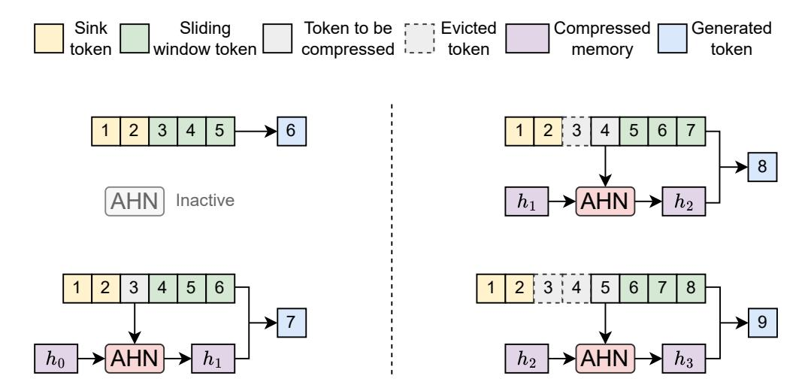

# **Appendix**

## **A AHN instantiation**

This section describes how to instantiate AHNs with Mamba2 [\[19\]](#page-10-8) and DateNet (DN) [\[75,](#page-13-8) [104\]](#page-15-2). For the AHN-Mamba2 instance, the compressed memory update rule is

$$h_{t-W} = \text{AHN-Mamba2}((k_{t-W}, v_{t-W}), h_{t-W-1}, x_{t-W})$$

$$= \exp(-\Delta(x_{t-W})A)h_{t-W-1} + \Delta(x_{t-W-1})k_{t-W}^T v_{t-W}$$
(9)

As for AHN-DN, the update rule can be expressed as

$$h_{t-W} = \text{AHN-DN}((k_{t-W}, v_{t-W}), h_{t-W-1}, x_t)$$

$$(\mathbf{I} - \beta(x_{t-W})k_{t-W}^T k_{t-W})h_{t-W-1} + \beta(x_{t-W})k_{t-W}^T v_{t-W}$$
(10)

The output rule of AHN-Mamba2 and AHN-DN are the same as AHN-GDN, as shown in Equation [6.](#page-3-2)

We also provide an illustration of AHN-augmented networks with attention sinks [\[98\]](#page-15-8), as shown in Figure [6.](#page-17-0)

**Figure 6** Illustration of the model augmented with Artificial Hippocampus Networks (AHNs). In this example, the number of attention sinks is 2, and the sliding window length is 3. When the input sequence length is less than or equal to the sum of attention sinks and the window length, the model operates identically to a standard Transformer. For longer sequences, AHNs continually compress the token outside the window into a compact memory representation. The model then utilizes the lossless information within the attention sinks and the sliding window, as well as the compressed memory to generate the next token.

