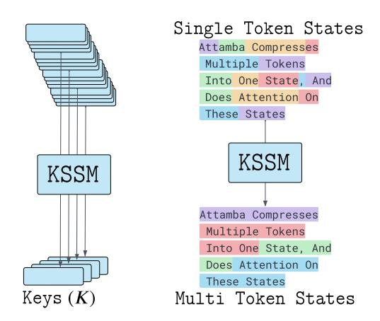
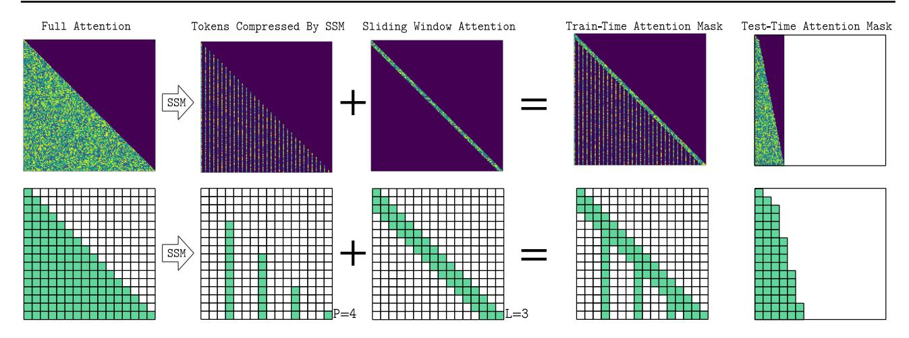

# 3. Preliminaries

## 3.1. Attention

Let X ∈ R n×e be the input to the attention mechanism, where n is the sequence length and e is the model embedding dimension. The embedding dimension e can be expressed as e = h × d, where h is the number of attention heads, and d is the per-head dimension. The projection matrices WQ, W K, WV ∈ R e×e are used to compute the query, key, and value representations respectively. SM denotes the softmax operation, and Attn represents the attention computation. S represents the scaled attention scores, and A represents the attention probabilities (normalized weights).

$$\operatorname{Attn}(\mathbf{X}) = \operatorname{SM}\left(\underbrace{\frac{\mathbf{X}W^Q(\mathbf{X}W^K)^T}{\sqrt{d}}}_{S}\right) \cdot \mathbf{X}W^V \quad (1)$$

## 3.2. SSMs

State Space Models maintain a hidden state x(t) ∈ R DS , which evolves over time based on the input sequence and state transition matrices. Computing the output sequence from a given input is linear in complexity, requiring O(nDS) in time-complexity and O(DS) in space. In the Mamba framework [\(Gu & Dao,](#page-7-7) [2023\)](#page-7-7), variable-length sequence handling is streamlined using cu seqlens (cumulative unique sequence lengths), which denotes cumulative sequence lengths. This allows efficient indexing of flattened batch sequences, avoiding padding overhead. We leverage cu seqlens for efficient processing of chunkedsequences. In Section [A.1,](#page-8-0) we investigate different schemes for token chunking.

## 3.3. Auto-regression and Masking

Transformers are trained for next-word prediction, by modelling the probability of each token, given all previous tokens in a sequence. To enforce *causality* (to not attend to future tokens), a causal mask is applied to the attention mechanism during training, when computing A in Equation [1.](#page-2-0) Specifically, the causal mask M ∈ R n×n is defined to prevent positions from attending to future tokens as below:

$$M_{i,j} = \begin{cases} 0, & \text{if } j \le i, \\ -\infty, & \text{if } j > i. \end{cases}$$
 (2)

Figure 3. Attamba uses SSM blocks to compress chunks of tokens (P = 4 in the example above) into a single token.

Figure 4. Full-Attention has a purely causal mask, attending to all past tokens. Attamba uses Key-Value SSM blocks to compress chunks of P tokens (e.g. P = 4) into one state. Tokens compressed by SSMs are at chunk boundaries. This is incorporated with a sliding-window attention (when L > 1). At test-time (inference), only the chunk boundaries and sliding window tokens need to be preserved, reducing KV-Cache and Attention FLOPs.

This M mask is applied before the softmax, resulting in A = SM(S + M). Setting elements of M to −∞, the attention weights become zero after the softmax, which effectively excludes future tokens from the computation. This mechanism can also be used to emulate a token being omitted by appropriately adjusting the mask.

In next-word prediction tasks, the output at position k depends on all previous tokens from positions 0 to k − 1, building up cumulative information in hidden states, with each position k capturing knowledge of all tokens up to that point. This property is essential for capturing dependencies across the sequence. Leveraging this cumulative information property of auto-regressive models such as SSMs and Transformers, along with the flexibility of mask M controlling token omissions makes it possible to control range and choice of tokens each position attends to.

