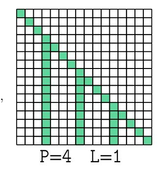
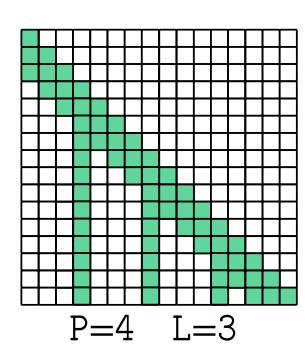

# 4. Attamba: Attentive SSMs

Auto-regressive transformers and SSMs enable us to compress information about prior tokens into a singular, final representation. For next-word prediction, this property is used to transform the representation to what the next word should be. Further, we can control what past information transformers attend to with the attention mask, described in Section [3.3.](#page-2-1) Attamba leverages these properties to (1) compress P tokens into a single token using SSM blocks, exhibiting linear complexity, and (2) leverage attention mask to attend to only these compressed states for efficient training and inference. Specifically, we preserve the query sequence length, to enable *causally valid* training of all next-word prediction problems in a given input sequence, and replace the key and value projection matrices with SSM blocks.

## 4.1. Formulation

Attamba integrates State Space Models (SSMs) into the attention mechanism to efficiently handle long sequences. As seen in Figure [2,](#page-1-0) it replaces key and value projection matrices with SSM blocks and a residual connection that processes chunks of tokens, reducing computational complexity of attention while preserving context of input sequence.

Let P denote the chunk size, i.e., the number of tokens processed by the SSM at a time. Given an input sequence X ∈ R n×e , the query vector is computed as usual to preserve the auto-regressive nature of transformers. However, the keys and values are obtained by processing the input sequence through SSMs. The sequence is divided into nonoverlapping chunks of size P (Figure [3\)](#page-2-2), and each chunk is processed auto-regressively by the SSM. For simplicity, we assume n is divisible by the chunk size P in this discussion, though SSMs can seamlessly handle partial chunks, as they do during auto-regressive inference in Attamba.

Let X(p) ∈ R P ×e denote the p-th chunk of the input sequence, where p = 1, 2, . . . , n P . The SSM processes each chunk to produce compressed key and value representations:

$$\mathbf{K}^{(p)} = \text{SSM}_K \left( \mathbf{X}^{(p)} \right), \ \mathbf{V}^{(p)} = \text{SSM}_V \left( \mathbf{X}^{(p)} \right)$$
 (3)

where SSMK and SSMV denote the SSMs used for keys and values, respectively.

At train-time, we need to preserve all SSM outputs, since next-word prediction problems require attending to incomplete (partial) chunks as well. Thus, we keep the SSM outputs for every token, giving us:

$$\begin{bmatrix} \mathbf{K}_{\text{SSM}} \\ \mathbf{V}_{\text{SSM}} \end{bmatrix} = \begin{bmatrix} \mathbf{K}^{(1)} & \mathbf{K}^{(2)} & \cdots & \mathbf{K}^{(n)} \\ \mathbf{V}^{(1)} & \mathbf{V}^{(2)} & \cdots & \mathbf{V}^{(n)} \end{bmatrix} \in \mathbb{R}^{2 \times n \times e}$$
 (4)

To perform attention, the queries Q attend to compressed keys-values at chunk boundaries and the latest partial chunk (Self-Attention). Thus, the attention mask Mtrain must account for both causality and chunk boundaries:

$$(M_{\text{train}})_{i,j} = \begin{cases} 0, & \text{if } \left( \left\lfloor \frac{j}{P} \right\rfloor = \left\lfloor \frac{i}{P} \right\rfloor \text{ and } j \leq i \right) \\ & \text{or } (j \leq i \text{ and } j \text{ mod } P = P - 1), \\ -\infty, & \text{otherwise.} \end{cases}$$
(5)

At test-time, the outputs K(p) [−1], V(p) [−1] ∈ R 1×e are compressed representations of each chunk, as only the final representation is needed. This is obtained by taking (K(p) [−1], V(p) [−1]) from Equation [3.](#page-3-0) By concatenating these, we obtain:

$$\begin{bmatrix} \mathbf{K}_{\mathrm{SSM}} \\ \mathbf{V}_{\mathrm{SSM}} \end{bmatrix} = \begin{bmatrix} \mathbf{K}^{(1)}[-1] & \cdots & \mathbf{K}^{(\frac{n}{P})}[-1] \\ \mathbf{V}^{(1)}[-1] & \cdots & \mathbf{V}^{(\frac{n}{P})}[-1] \end{bmatrix} \in \mathbb{R}^{2(\frac{n}{P}) \times e}$$

(6) As shown in Figure [4,](#page-3-1) at test-time, an appropriate attention mask Mtest can be constructed:

$$(M_{\text{test}})_{i,j} = \begin{cases} 0, & \text{if } j \le \left\lfloor \frac{i}{P} \right\rfloor, \\ -\infty, & \text{otherwise.} \end{cases}$$
 (7)

By replacing key and value projections with SSMs that compress chunks of tokens, we reduce the computational cost of the attention mechanism from (n 2 e) to (n 2 e/P). We can also achieve O(nP e) complexity if we divide the input sequence length into P chunks, irrespective of sequence length, resembling Attamba-Linear in Figure [13.](#page-10-0) We find that SSMs are robust to even randomized chunk boundaries, which may facilitate this complexity trade-off.

Chunk Sizes and Leading Tokens: In Attamba, the notion of *chunk-size* (C/P) play a critical role in determining how tokens are compressed using SSMs. The chunk-size refers to the number of consecutive tokens that are grouped together and processed as a single unit by the SSM to create a compressed key-value representation. The *leading tokens* (L) specifies the number of recent tokens that should retain *full attention* after the SSM. This is akin to sliding-window attention and has a constant cost as shown in Figure [5.](#page-4-0) Chunked attention with L > 1 would need us to parse the SSM block outputs as described in Equation [8.](#page-4-1)

$$\begin{bmatrix} \mathbf{K}_{\text{SSM}} \\ \mathbf{V}_{\text{SSM}} \end{bmatrix} = \begin{bmatrix} \mathbf{K}^{(1)}[-1] & \cdots & \mathbf{K}^{(\frac{n}{P})}[-L:-1] & \mathbf{K}^{(\frac{n}{P})}[-1] \\ \mathbf{V}^{(1)}[-1] & \cdots & \mathbf{V}^{(\frac{n}{P})}[-L:-1] & \mathbf{V}^{(\frac{n}{P})}[-1] \end{bmatrix}$$
(8)

Figure 5. Leading-Tokens (L) control how many 'leading' tokens full-attention happens over, preserving full-attention on the newest tokens. This resembles Sliding-Window attention. Chunk-size (P) controls how many tokens are chunked by the SSM.

Other Design Considerations: In developing Attamba, several design choices were empirically validated, detailed in Appendix [A.](#page-8-1) First, we found that removing Key-Value projection weights did not significantly impact model quality (1% perplexity difference), simplifying the architecture. Secondly, cyclic chunk boundaries across layers mitigate bias introduced by fixed chunk boundaries on the input sequence (5% improvement). Third, increasing SSM state dimensions beyond Ds > 32 yielded diminishing returns on P = 8 (< 1% perplexity difference), allowing us to minimize SSM parameter overhead. Fourth, preserving leading tokens as un-chunked ensured improved model quality by maintaining full attention on recent tokens, emulating sliding window behavior (8.5% improvement with L = P). Further, incorporating residual connections in Key-Value SSMs improved model quality, even without K-V projections. Finally, Attamba was robust to even randomized chunk boundaries (at both train and test time!). These are explained in more detail in the Appendix [A.](#page-8-1)

