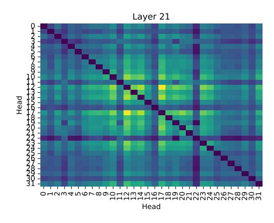

# 5. Experiments

In this section, we present experimental results comparing the WikiText2 test-set perplexity. Training is done on 10% of dclm-baseline-1.0 [\(Li et al.,](#page-7-14) [2024\)](#page-7-14), with a batch size of 16, sequence length of 1024. We use the Meta Lingua [\(Videau](#page-7-15) [et al.,](#page-7-15) [2024\)](#page-7-15) framework. Unless otherwise specified, we train on approximately 1B tokens (982M tokens). *Where relevant, we add the final WK2 perplexity in the graph legend*.

Figure 6. Comparing Attamba with SSMs (Mamba), minGRU, Hawk and Transformers (Xmer) by training on 8 billion tokens. E, P, L, Ds, G, H denote Model-Dim, Chunk Size, Leading Tokens, SSM State-Dim, Num. Groups and Num. Heads respectively, 0 when not applicable. Models  $\in$  [60, 64]M params, with Transformer having 4× larger KV and attention map footprint. (+KV) & (+SWA) transformer variants are 53M params, to match Attamba KV-Cache and Attention Map memory footprint more closely. [Logs]

#### 5.1. On transformer baselines

Attamba compresses the sequence length for keys and values, significantly reducing KV-Cache size and the operational intensity of the  $L^2$  attention map, with the majority of savings occurring in inference-time activations. Comparing Attamba directly with a transformer of similar parameter count is not ideal, as traditional transformers incur much larger KV-Cache and attention map overhead. To provide a fairer context for Attamba's performance, we construct baselines with reduced KV-Cache sizes and attention map dimensions, detailed in Appendix A. Specifically, for transformers, we emulate smaller KV-Cache sizes by reducing the attention model dimension F such that  $F = \frac{E}{P}$ , and smaller attention maps by employing sliding window attention (SWA) during evaluation.

In Figure 7, we observe that transformers with a  $4\times$  to  $8\times$  larger KV-Cache and attention map can outperform Attamba, but these comparisons do not reflect equivalent memory or computational constraints. When matched for KV-Cache and attention map size, Attamba consistently outperforms transformer baselines, showcasing its efficiency. Furthermore, as sequence length increases, transformers must reduce their attention dimension F proportionally, resulting in greater trade-offs in quality. Attamba, on the other hand, demonstrates robust and scalable token compression, with a mere 2.2% perplexity increase when transitioning from P=4 to P=8, highlighting its ability to balance efficiency and model quality effectively, particularly for long-context tasks.

#### 5.2. Comparison with Mamba, minGRU, Hawk

We conduct an extended training experiment with Attamba, Transformer (Xmer), minGRU (Feng et al., 2024), Hawk (De et al., 2024), Mamba models within the parameter budget  $\in [60, 64]M$  params (roughly *iso-Parameter* configurations), training for 100,000 steps over 8 billion tokens, as shown in Figure 6. We also construct appropriate baselines for transformers, by reducing the model-dimension (specifically in the attention mechanism) to emulate KV-Cache compression (+KVC) and testing sliding window attention (+SWA), similar to Section 5.1.

Figure 7. Comparing Attamba with a base transformer with matching parameter counts. Further, we train variants with smaller KV-Cache size to match Attamba. Additionally, to match the attention map size, we evaluate these models in *Sliding Window* attention with window size  $=\frac{L}{P}$ . Attamba significantly out-performs a similarly sized transformer baseline (Smaller KVC + SWA). [Logs]

We find that Attamba out-performs fair transformer baselines as well as Mamba. Mamba will still show better performance scaling for extremely long context, but model quality may suffer (Wang & Li). Since Attamba uses SSMs to compress fixed-sized chunks of tokens, SSMs will not have to scale beyond their trained chunk-length, but merely attend to compressed token representations. Transformer (+KVC) is 5% worse, but still materializes a  $L^2$  attention map. Transformer (+SWA) is conducted on top of the Transformer (+KVC) variant, with a notable dip in perplexity due to a significantly constrained attention map.

### 6. Limitations

Currently, most of our training is limited to only 1B tokens on a 60M parameter model on a single A6000 GPU. Further, our test-time evaluation is on WikiText2 (Merity et al., 2022), a task that is highly local. Thus, our variants Attamba with chunk-size 128 performs extremely well (Appendix A). While this variant offers a  $128 \times$  reduction in KV-Cache size and attention op-intensity over longer contexts, we also maintain full attention on the leading (latest) 128 tokens. This is why, it out-performs even Attamba with chunk size 4. From Figure 17, we can see this in more detail, specifically, our Attamba P128 L1 variant (true 128× KV-Cache reduction, with only 1 leading token (for self-attention)) performs significantly worse than Transformers. However, Attamba with chunk size 8 and 64 uncompressed leading tokens gives us a KV-Cost :  $(\frac{L_K + L_V}{2} + 2 \times 64)E$  which offers  $\approx 8 \times$  KV-compression and  $\approx 1/8$  attention computation cost with a 10% perplexity trade-off. However, a transformer with model-dimension E/8 on attention performs 7.11% worse, and has no memory savings on the attention map, as each head would still materialize the  $L^2$ tensor. Further, our method leads to no improvements in the FFN, as we preserve the query sequence length to enable auto-regressive training of the transformer. Finding the right transformer design for a fair comparison is key to better understand trade-offs of attention on compressed states. Modifications in chunking strategy, or training on more tokens may alleviate issues with high chunk-sizes, but more thorough evaluation of this methodology on Long-Context evaluation, retrieval and other tasks are key to understand if effective attention can be achieved on compressed states. Finally, every model we have reported has been trained from scratch, exploring fine-tuning strategies and inference-time studies on chunk boundary robustness of models, as well as the impact of leading token L (sliding window attention) need to be tested.

#### 7. Conclusion

Attamba introduces a novel approach to efficiently handle long sequences in transformers by integrating State-Space Models (SSMs) to compress tokens, reducing attention cost and KV-cache memory requirements. Experiments show that cyclic chunking outperforms other strategies, maintaining competitive performance with significant efficiency gains. By replacing conventional key-value projection matrices with SSMs and incorporating variable-length token chunking, Attamba effectively balances computational and memory efficiency, potentially enabling a smooth transition between quadratic and linear scaling if SSMs are flexible to chunk boundary lengths. However, our evaluation was limited to small-scale models and local tasks, such as WikiText2. Consequently, the observed performance improvements may not directly generalize to long-context benchmarks or billion-parameter language models. Future research should focus on extensive evaluation across a wider range of long-context tasks, exploration of token importancebased chunking strategies, and a deeper investigation into the trade-offs between efficiency and information retention in compressed states.

## References

Akhauri, Y., AbouElhamayed, A. F., Dotzel, J., Zhang, Z., Rush, A. M., Huda, S., and Abdelfattah, M. S. ShadowLLM: Predictor-based contextual sparsity for large language models. In Al-Onaizan, Y., Bansal, M., and Chen, Y.-N. (eds.), Proceedings of the 2024 Conference on Empirical Methods in Natural Language Processing, pp. 19154–19167, Miami, Florida, USA, November 2024. Association for Computational Linguistics. URL https://aclanthology.org/2024.emnlp-main.1068.

Chang, C.-C., Lin, W.-C., Lin, C.-Y., Chen, C.-Y., Hu, Y.-F., Wang, P.-S., Huang, N.-C., Ceze, L., Abdelfattah, M. S., and Wu, K.-C. Palu: Compressing kv-cache with low-rank projection, 2024. URL https://arxiv.org/abs/2407.21118.

Chen, Y., Zhang, X., Hu, S., Han, X., Liu, Z., and Sun, M. Stuffed mamba: State collapse and state capacity of rnn-based long-context modeling. arXiv preprint arXiv:2410.07145, 2024.

Choromanski, K. M., Likhosherstov, V., Dohan, D., Song, X., Gane, A., Sarlos, T., Hawkins, P., Davis, J. Q., Mohiuddin, A., Kaiser, L., et al. Rethinking attention with performers. In *International Conference on Learning Representations*.

Dao, T. and Gu, A. Transformers are ssms: Generalized models and efficient algorithms through structured state

- space duality. In *Forty-first International Conference on Machine Learning*.
- De, S., Smith, S. L., Fernando, A., Botev, A., Cristian-Muraru, G., Gu, A., Haroun, R., Berrada, L., Chen, Y., Srinivasan, S., et al. Griffin: Mixing gated linear recurrences with local attention for efficient language models. *arXiv preprint arXiv:2402.19427*, 2024.
- Feng, L., Tung, F., Ahmed, M. O., Bengio, Y., and Hajimirsadegh, H. Were rnns all we needed?, 2024. URL <https://arxiv.org/abs/2410.01201>.
- Gloeckle, F., Idrissi, B. Y., Roziere, B., Lopez-Paz, D., and Synnaeve, G. Better & faster large language models via multi-token prediction. In *Forty-first International Conference on Machine Learning*.
- Gu, A. and Dao, T. Mamba: Linear-time sequence modeling with selective state spaces. *arXiv preprint arXiv:2312.00752*, 2023.
- Gu, A., Goel, K., and Re, C. Efficiently modeling long sequences with structured state spaces. In *International Conference on Learning Representations*.
- Gu, A., Dao, T., Ermon, S., Rudra, A., and Re, C. Hippo: ´ Recurrent memory with optimal polynomial projections. *Advances in neural information processing systems*, 33: 1474–1487, 2020.
- Li, J., Fang, A., Smyrnis, G., Ivgi, M., Jordan, M., Gadre, S., Bansal, H., Guha, E., Keh, S., Arora, K., Garg, S., Xin, R., Muennighoff, N., Heckel, R., Mercat, J., Chen, M., Gururangan, S., Wortsman, M., Albalak, A., Bitton, Y., Nezhurina, M., Abbas, A., Hsieh, C.-Y., Ghosh, D., Gardner, J., Kilian, M., Zhang, H., Shao, R., Pratt, S., Sanyal, S., Ilharco, G., Daras, G., Marathe, K., Gokaslan, A., Zhang, J., Chandu, K., Nguyen, T., Vasiljevic, I., Kakade, S., Song, S., Sanghavi, S., Faghri, F., Oh, S., Zettlemoyer, L., Lo, K., El-Nouby, A., Pouransari, H., Toshev, A., Wang, S., Groeneveld, D., Soldaini, L., Koh, P. W., Jitsev, J., Kollar, T., Dimakis, A. G., Carmon, Y., Dave, A., Schmidt, L., and Shankar, V. Datacomp-lm: In search of the next generation of training sets for language models, 2024.
- Lieber, O., Lenz, B., Bata, H., Cohen, G., Osin, J., Dalmedigos, I., Safahi, E., Meirom, S., Belinkov, Y., Shalev-Shwartz, S., et al. Jamba: A hybrid transformer-mamba language model. *arXiv preprint arXiv:2403.19887*, 2024.
- Merity, S., Xiong, C., Bradbury, J., and Socher, R. Pointer sentinel mixture models. In *International Conference on Learning Representations*, 2022.
- Merrill, W., Petty, J., and Sabharwal, A. The illusion of state in state-space models. In *Forty-first International Conference on Machine Learning*.

- Ren, L., Liu, Y., Lu, Y., Shen, Y., Liang, C., and Chen, W. Samba: Simple hybrid state space models for efficient unlimited context language modeling. *arXiv preprint arXiv:2406.07522*, 2024.
- Sun, H., Chang, L.-W., Bao, W., Zheng, S., Zheng, N., Liu, X., Dong, H., Chi, Y., and Chen, B. Shadowkv: Kv cache in shadows for high-throughput long-context llm inference, 2024. URL [https://arxiv.org/abs/](https://arxiv.org/abs/2410.21465) [2410.21465](https://arxiv.org/abs/2410.21465).
- Videau, M., Idrissi, B. Y., Haziza, D., Wehrstedt, L., Copet, J., Teytaud, O., and Lopez-Paz, D. Meta lingua: A minimal PyTorch LLM training library, 2024. URL [https:](https://github.com/facebookresearch/lingua) [//github.com/facebookresearch/lingua](https://github.com/facebookresearch/lingua).
- Wang, S. and Li, Q. Stablessm: Alleviating the curse of memory in state-space models through stable reparameterization. In *Forty-first International Conference on Machine Learning*.
- Wang, S., Li, B. Z., Khabsa, M., Fang, H., and Ma, H. Linformer: Self-attention with linear complexity. *arXiv preprint arXiv:2006.04768*, 2020.
- Xiao, G., Tian, Y., Chen, B., Han, S., and Lewis, M. Efficient streaming language models with attention sinks. In *The Twelfth International Conference on Learning Representations*.
- Zaheer, M., Guruganesh, G., Dubey, K. A., Ainslie, J., Alberti, C., Ontanon, S., Pham, P., Ravula, A., Wang, Q., Yang, L., et al. Big bird: Transformers for longer sequences. *Advances in neural information processing systems*, 33:17283–17297, 2020.
- Zhang, Z., Sheng, Y., Zhou, T., Chen, T., Zheng, L., Cai, R., Song, Z., Tian, Y., Re, C., Barrett, C., et al. H2o: ´ Heavy-hitter oracle for efficient generative inference of large language models. *Advances in Neural Information Processing Systems*, 36:34661–34710, 2023.

Figure 8. Each head in Llama-2-7B attends to tokens in a manner that is largely uncorrelated (Kendall-Tau  $\in [-0.2, 0.8]$ ) with other heads.

