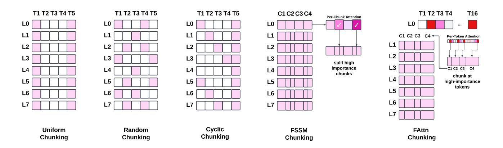
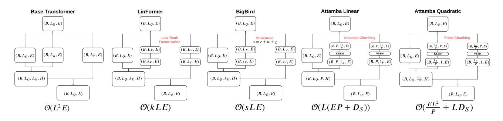
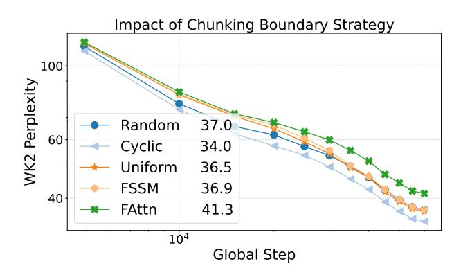
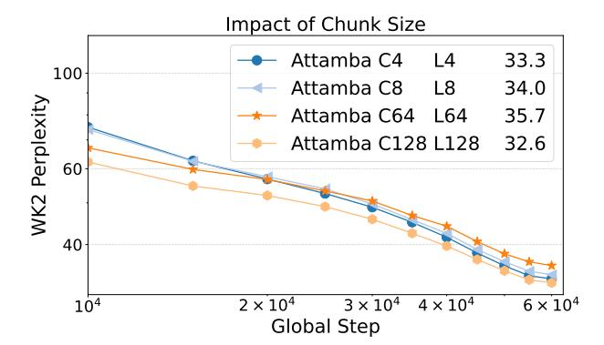
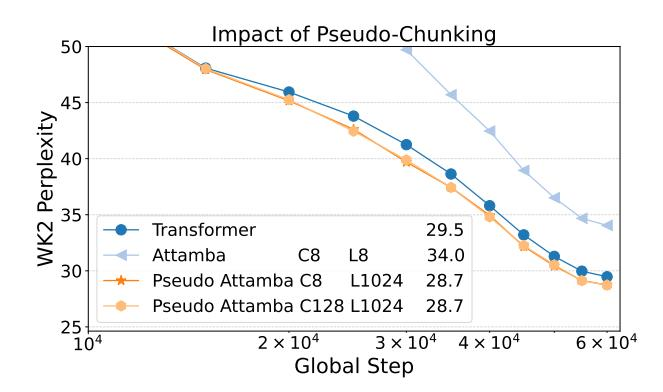
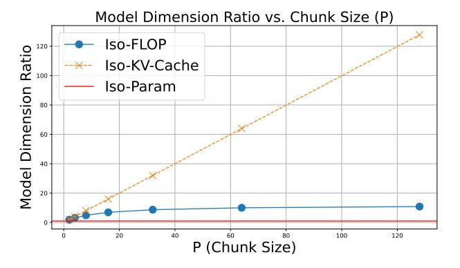
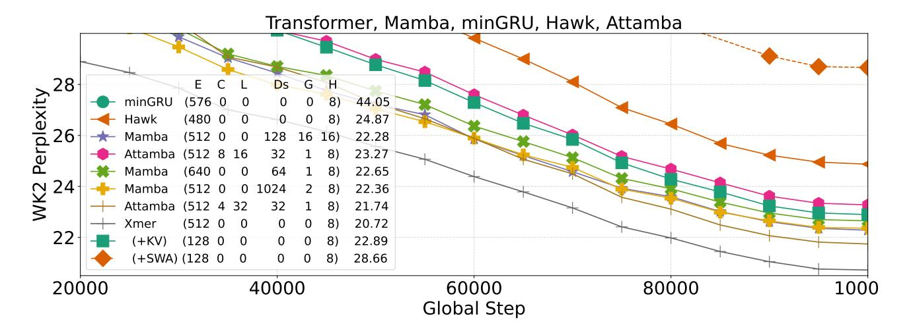

# A. Appendix

## A.1. On Token Chunking

Processing sequences in fixed-size chunks simplifies implementation, but can limit models flexibility. Prior research (Zhang et al., 2023) has found that certain tokens contribute largely to the perplexity and are contextually important (Akhauri et al., 2024). In this context, having chunk boundaries at important tokens for a given query can improve model quality, and maintaining this flexibility for research in token importance prediction can unlock improved efficient language modeling. To enable efficient processing of sequences with arbitrary chunk boundaries in the SSM, we do not reshape or explicitly chunk the sequence. Instead, we utilize the cu\_seqlens tensor in the Mamba library. This allows us to handle variable-length chunk boundaries without padding overhead. Figure 9 depicts token-chunking strategies we try. Random-Chunking partitions the sequence into P chunks with sizes  $\{s_i\}_{i=1}^P$ , where  $s_i \sim \text{Random}(S)$ and  $\sum_{i=1}^{P} s_i = n$ . From Figure 14, we can see that Random-Chunking works as well as Uniform-Chunking, indicating that SSM based token chunking is flexible.

#### A.1.1. CYCLIC CHUNKING

Fixed chunk boundaries intorduce biases into the model, as tokens near chunk boundaries may be over-represented due to their position. To aim to mitigate this, we employ a cyclic chunking strategy, with different layers using chunk boundaries with a layer offset. Essentially, the chunk boundary is shifted by the index of the current layer. This ensures different layers process different token groupings, distributing boundary effects across the model.

By varying chunk boundaries across layers we encourage the SSM to be robust to chunk boundaries. We experiment with more chunk boundary decision strategies detailed in the next subsection, but find that cyclic chunking is a simple and effective strategy.

#### A.1.2. ON CHUNK BOUNDARY SELECTION

In addition to cyclic chunking, we explore alternative strategies for determining chunk boundaries to improve model performance. One such method, referred to as **FAttn**, involves using full attention in the first layer to identify important tokens based on attention magnitudes. Specifically, we compute the attention weights in the first layer using the standard full attention mechanism and select the sequence positions with the highest attention scores as chunk boundaries for subsequent layers. This aims to place chunk boundaries at tokens deemed important by the model, potentially enhancing the quality of the compressed representations.

Another approach, termed **FSSM**, utilizes the attention map of chunks from the first layer with uniform chunk boundaries. We compute the attention scores for each chunk and identify the top k chunks with the highest attention values. These selected chunks are then split into 2 smaller chunks in the subsequent layers, effectively allocating more resources to the most informative parts of the sequence.

While we experiment with an array of chunk boundary selection methods, we found that cyclic chunk boundaries yield the best quality improvements. On the other hand, **FSSM** and **FAttn** do not aid chunk boundary selection too much. This may be attributed to our finding that different heads attend to different tokens, and using the first layer to decide all head-boundaries is worse than randomized/cyclic methods. This effect is visible even within a single layer on the Llama-2-7B model, in Figure 8 we can see that for 1024 token context on WikiText2, each head on layer 21 has low correlation between tokens attended to.

## A.2. On Pseudo-Chunking

We find that SSMs can serve as a drop-in replacement for the key-value projection matrices, enabling us to save on KV-Cache and the quadratic attention cost by token chunking. However, we can also *pseudo-chunk* the input. That is, given a parameter budget for model size, we can use the SSM as a replacement for projection matrix, and maintain full-attention. This is more computationally expensive, but also improves model quality. Psuedo-chunking can be thought of as Attamba, where L (Leading Tokens in Figure 5) is the same as the sequence length.

### **B.** Experiments

In this section, we present experimental results comparing the WikiText2 test-set perplexities during model training for a 60M parameter transformer model, with 8 layers, 8

Figure 9. Different token-chunking strategies we investigate. L, T, C represent layer, token and chunk respectively.

Figure 10. Attamba employs Key and Value State-Space Models (SSMs) to accumulate local information within chunks of tokens. At test time, only the final accumulated activations from each chunk are used in the standard attention mechanism. The red lines denote the auto-regressive SSMs, accumulating *causally valid* local context within chunks. This approach significantly reduces attention complexity by compressing multiple tokens into single representations, while preserving essential contextual information from each chunk.

heads and 512 model-dimension on a single A6000 GPU. Training is done on 10% of dclm-baseline-1.0 [\(Li et al.,](#page-7-14) [2024\)](#page-7-14), with a batch size of 16, sequence length of 1024. We use the Meta Lingua [\(Videau et al.,](#page-7-15) [2024\)](#page-7-15) framework. Unless otherwise specified, we train on approximately 1B tokens (982,630,400 tokens). *Where relevant, we add the final WK2 perplexity in the graph legend*.

SSMs For Key-Value Projections: We replace the KV projection matrices with SSMs to enable chunked-attention. In Figure [11,](#page-10-2) we compare the WikiText2 perplexities. We use uniform 8-token chunking and compare models with and without KV-weight-projections. We find marginal benefits in perplexity by keeping the KV projection matrices before the SSM, and decide to remove it. This also reduces the parameter count and overall FLOPs of the model.

SSM Parameter Count: The SSMs need to do the Key-

Value projections, but also compress states for accurate attention, as well as information propagation in the value activations. Thus, the hidden-state of the SSM is important. In Figure [12,](#page-10-2) we study the impact of varying SSM size, from total approximate parameter-overhead of 2M, 4M and 16M parameters on a 60M parameter model. We see that for a token-chunking size of 8, the SSM does not need to be too large, as the benefit is marginal. For the rest of the experiments, we keep the total SSM parameter overhead 4M, but this can likely be optimized with chunk-size.

Chunking Methodology: Chunking can significantly impact model quality. To test it, we try different chunking methodologies *Uniform*, *Random*, *Cyclic*, *FAttn* and *FSSM*. From Figure [14,](#page-10-1) we can see that cyclic performs the best. However, it is important to note that *Random* chunking performs similarly to *Uniform* chunking, indicating that Attamba is robust to chunking boundaries, and can signifi-

Figure 11. Removing the Key-Value projection matrices when using K-V SSMs does not impact WikiText2 test-perplexity significantly.

Figure 12. Increasing the state dimension  $(D_s)$  of Key-Value SSMs does not improve perplexity when processing chunks of 8 tokens.

Figure 13. Attamba-Linear maintains linear complexity, by having a fixed-size attention, and dividing the sequence length (L) into chunks. Attamba-Quadratic has quadratic complexity (albeit lower FLOPs/Memory than standard transformer) as the SSM only processes P tokens. w, r, q, k, E denote window, random, global, low-rank dimension and model dimension respectively.

Figure 14. A simple cyclic chunk boundary performs better than other strategies. Notably, randomized chunk boundaries work as well as uniform chunking, indicating potential for flexibility in test-time token chunking.

Figure 15. Chunk size of 128 implies a 128× smaller KV-Cache. It outperforms Chunk 4/8/64 because we do full-attention on partial-chunks, giving significant advantage as chunk-size increases on local evaluation tasks like WikiText2.

cantly benefit from research in token importance prediction.

**Token Chunking Size:** As shown in Figure 5, our chunking methods keeps full attention on the final chunk by default (leading tokens smaller than the chunk size are preserved).

This means that as we increase token chunking size, latest chunk\_size tokens get full attention. This is not compulsory, but we aim to emulate the local sliding window attention with this, as the computational over-head is constant. In Figure 15, we compare different chunk sizes. We

Figure 16. Pseudo-Chunking (replacing Key-Value projection matrices with SSMs, but attending to all tokens) can marginally improve transformer perplexity. (C: Chunk Size)

Figure 18. iso-Parameter and iso-FLOPs still has higher memory overhead and does not address the  $L^2$  attention and KV-Cache overhead.

observe a trend where smaller chunk sizes yield better performance, with Chunk 4 outperforming Chunk 8, which outperforms Chunk 64. However, Chunk 128 performs the best, this is simply because WikiText2 is a highly local task, and keeping the latest 128 tokens un-chunked improves perplexity. More rigorous long-context evaluation is required to determine how well token-information is preserved.

**Pseudo-Chunking:** We replace the KV projection weights with SSMs, and enforce chunk boundaries in the attention mask to emulate KV-Cache optimizations. However, it is also possible to use the SSM so that each token has more information about prior local tokens, without optimizing the transformer for performance. This can be achieved by simply keeping a purely causal mask on Attamba, with no chunk-boundaries. In Figure 16, we find that pseudochunking can actually improve transformer performance, even in iso-parameter count settings.

#### Estimating FLOPs, KVCache and Activation Overhead

Attamba compresses states differently from existing meth-

Figure 17. Leading tokens improve test-time perplexity, a proper chunk-size to leading token trade-off is important. This may also indicate limitations in Attamba's ability to compress tokens.

Figure 19. The ratio of Attamba Model Dimension with Transformer Attention Model Dimension (E) required for varying isosetting baselines as we scale chunk size.

ods of controlling transformer architectures via model dimensions. Comparing Attamba solely with iso-parameter count baselines is inappropriate because transformers produce significantly larger intermediate activations, such as attention maps. To find appropriate transformer baselines, we use a simplified approach to calculate iso-KV-cache size, isomemory, and iso-FLOPs settings for the *Transformer Block*. These calculations exclude scaling, normalization, and softmax considerations, focusing on high sequence lengths.

We define the following parameters: Transformer attentiononly model dimension (F), Attamba model dimension (E), number of heads (H), assumed to be 1 unless otherwise stated), chunk size (P), sequence length (L), SSM dimension  $(D_S)$ , and batch size (B). To find the right F, we solve simply by substituting the default Attamba configurations, and use this F dimension in the attention mechanism of the base-transformer.

**Iso-KV Settings:** For iso-KV settings, the appropriate F

Figure 20. Comparing Attamba with SSMs (Mamba), minGRU, Hawk and Transformers (Xmer) by training on 8 billion tokens. E, C, L,  $D_s$ , G, H denote Model-Dim, Chunk-Size, Leading-Tokens, SSM State-Dim, Num. Groups and Num. Heads respectively, 0 when not applicable. Models  $\in [60, 64]$ M params, with Transformer having significantly larger KV-footprint [Logs]

is solved for as follows:

$$2BLF = \frac{2BLE}{P} + 2BD_S \tag{9}$$

**Iso-FLOPs Settings:** For iso-FLOPs settings, the appropriate *F* is solved for as follows:

$$6BLF^{2} + 4BL^{2}F = 2BLE^{2} + 2BL\left(\frac{E}{H}(5HD_{S} + D_{S}) + 21D_{S}\right) + \frac{4BL^{2}E}{P}$$
(10)

This derivation is more verbose than Figure 2, which included simplified equations for brevity. These formulations enable comparisons across iso-KV-cache, iso-memory, and iso-FLOPs scenarios.

**Iso-Activation Settings:** For iso-activation settings, the appropriate F is solved for as follows:

$$4BLF = 2BLE\left(1 + \frac{1}{P}\right) + 2BD_S + BL^2H\left(\frac{1}{P} - 1\right)$$
(11)

Due to the  $\frac{1-P}{P}$  term always being negative, and the quadratic  $L^2$  scaling on high sequence lengths, we are unable to find an appropriate iso-activation transformer design in our budget. This is largely because Attamba significantly optimizes the  $L^2$  attention mechanism, which reduces the activation footprint.

| P | Attamba | IsoParam | IsoFLOP | IsoKV |
|---|---------|----------|---------|-------|
| 4 | 512     | 512      | 160     | 128   |
| 8 | 512     | 512      | 104     | 64    |

*Table 1.* Setting for Transformer Baseline (Model Dimension) for IsoFLOP and IsoKV at Fixed Attamba Dimension (E=512). Calculated for Sequence Length 4096.

#### **B.1.** Baselines

**Iso-KV Baseline:** For iso-KV settings, the transformer model dimension is adjusted to equate the total KV-cache footprint with that of Attamba. This comparison highlights the memory savings achieved by Attamba's reduced KV-cache size, however **this baseline does not account for the**  $L^2$  **attention matrix that is materialized.** In this sense, Attamba will still be significantly more efficient for long-context. For instance, at P=4, Attamba achieves the same KV-Cache size, but materializes a  $4\times$  smaller attention map per-head.

**Iso-FLOPs Baseline:** Iso-FLOPs baselines align the computational cost of the transformer with Attamba by scaling down the transformer model dimension (F) to match FLOP counts as estimated by us in Appendix A. As demonstrated in Figure 19 and Table 1, this compares the efficiency of Attamba in scenarios where computational budgets are fixed. However, this also fails to account for the KV-Cache overhead and larger attention map.

**Iso-Parameter Baseline:** Here, transformer baselines are chosen such that their parameter count approximately matches Attamba. This comparison does not factor in differences in KV-cache size and attention computation but offers

a straightforward view of the representational capacity of the models.

Inference efficiency strongly favors Attamba due to reduced memory bandwidth requirements, a major bottleneck in transformers. Iso-KV baselines ignore the quadratic scaling of attention maps, Iso-FLOPs and Iso-Parameter baselines do not optimize for KV-cache or activation footprint.

As shown in Figure [7,](#page-5-0) Attamba consistently outperforms Iso-FLOPs models due to its ability to compress and operate on compressed tokens effectively. It performs similarly to Iso-KV models but achieves additional gains by reducing attention map operations, which scale quadratically with sequence length. This gap widens at higher sequence lengths (e.g., L ≥ 4096), where Iso-KV models require progressively smaller attention dimensions to match Attamba's efficiency. As is expected, we perform worse than iso-Parameter models but are significantly better on FLOPs, KV-cache size, and attention map efficiency.