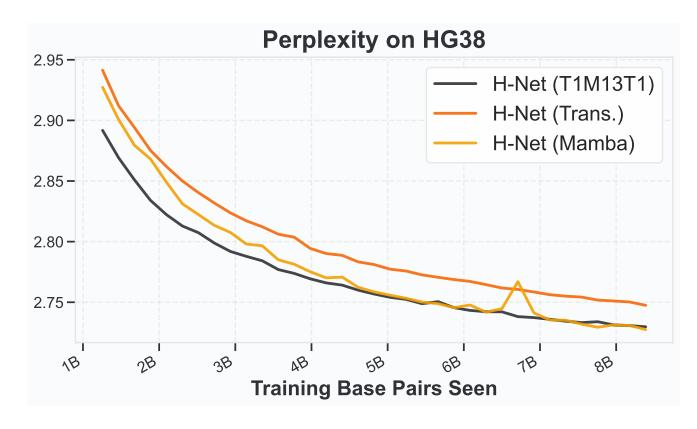

# D Additional Experimental Setup Details

### **D.1** Robustness Score

We introduce a metric called the *robustness score* to measure the robustness of a model's performance to textual perturbations, defined for Hellaswag as follows:

$$robustness \; score \coloneqq 100 \cdot \frac{perturbed \; accuracy - 0.25}{max(unperturbed \; accuracy - 0.25, 0)}$$

This score measures the percentage of original (unperturbed) performance that is captured by the model in the perturbed setting. We subtract by 0.25 as HellaSwag is multiple choice with 4 options, thus a model that scores 0.25 in the perturbed setting should be considered to have lost all of its original capability.

### **E** Additional Ablation Studies

### E.1 Different Downsampling Methods in the Chunking Layer

Given the dynamically determined boundaries from the boundary predictor, we explore various compression strategies in the chunking layer. We compare the default Downsample operation of H-Net (see Section 2.2.1) against three alternatives (see Figure 13-left): channel-wise max/mean pooling and cross-attention, all applied to vectors within the same boundary. Despite its simple design, the default compression in H-Net performs on-par with the other variants as demonstrated in Figure 13-right. This shows that the sequence mixing layers in encoder are trained to implicitly compress necessary context into vectors at boundaries, without explicit compression mechanisms such as pooling or cross-attention.

| Model | Architecture                  | Params. | Final ppl. ↓ |
|-------|-------------------------------|---------|-----------------|
| H-Net | M3T1 + T15 + M4   | 64M     | 2.705           |
| H-Net | M3T1 + M15 + M4   | 66M     | 2.697           |
| H-Net | M4 + T15 + M4     | 62M     | 2.722           |
| H-Net | M4 + M15 + M4     | 64M     | 2.706           |
| H-Net | M4 + T1M13T1 + M4 | 64M     | 2.706           |

Table 7: Encoder architecture ablations on HG38. Switching the encoder architecture from M3T1 to M4 leads to worse performance across the board, though the results are still better than isotropic models (Table [5\)](#page-16-2). Transformers in the encoder network do not appear to be helpful for text (Figure [8\)](#page-17-1), suggesting that this finding may be modality-specific.

Figure 14: Mamba-2-only encoder loss curves during the stable phase of training. The pure Mamba-2 model is more unstable with a loss spike. Adding Transformer layers to the main network near the DC modules can alleviate instabilities. H-Net (1-stage, principled) corresponds to the T1M13T1 main network architecture.

## E.2 Details of Chinese and Code Experiments

In Section [3.2,](#page-14-0) we analyzed the performance of H-Net (2-stage) against Transformer and H-Net (space) on Chinese and on code, finding superior scaling for H-Net (2-stage) versus the other architectures. Here, we describe additional details from the experiment.

Besides measuring scaling behavior, we also measured final checkpoints on bits-per-byte compression ability. We also evaluated the Chinese-language models on the Chinese split of XWinograd, a Chinese language-understanding task. For model architecture, we primarily matched the settings from the GPT-3 XL, including model and encoder/decoder architecture for H-Net models. However, we adjusted the number of layers in the main network of each model to account for slightly different compression ratios. Specifically, the Chinese-language models used a slightly higher total training flops target than the original language models, while the code models used a lower flops target. Full architecture details and results are also in Table [4.](#page-16-1)

