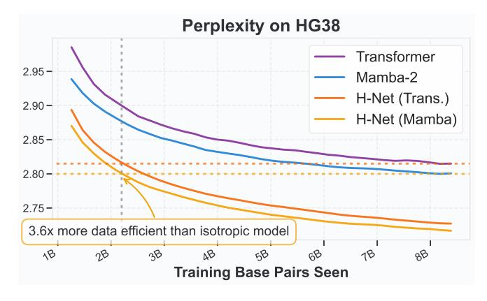
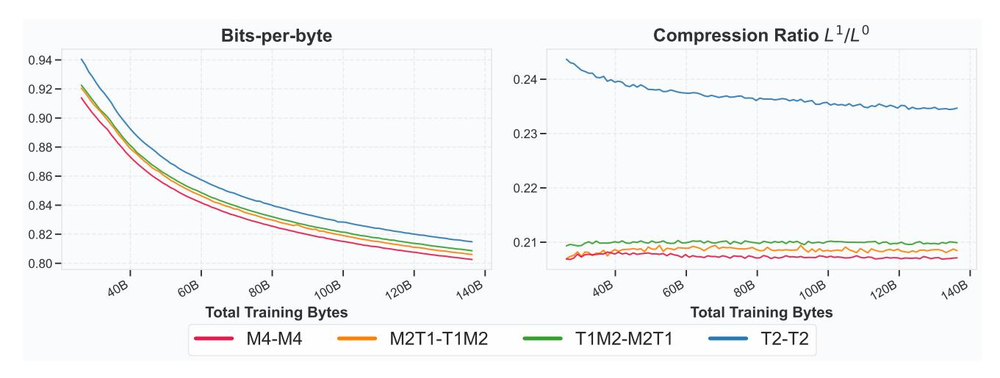
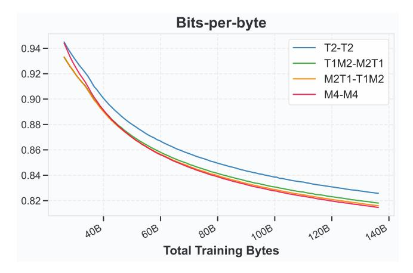
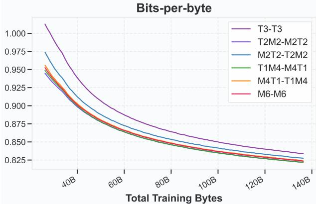
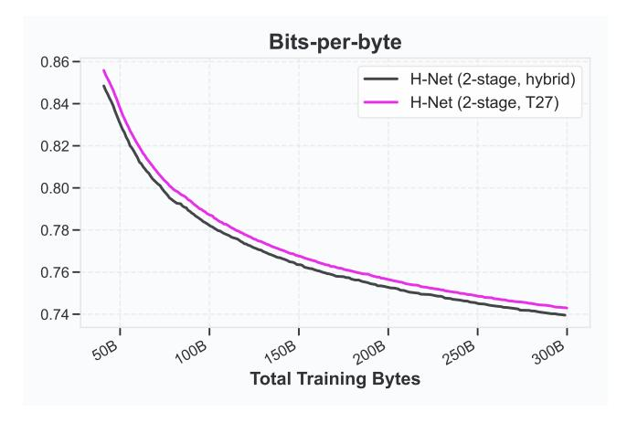
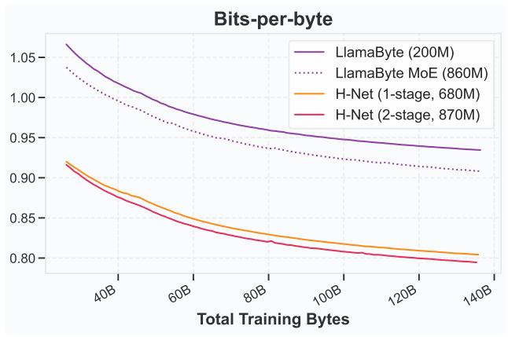

# Alternate Language Datasets

Besides conventional language modeling, we also examine three other language modeling settings: Chinese, code, and DNA. These three settings present distinct challenges for traditional language-modeling pipelines:

- Chinese characters consist of 3 utf-8 encoded bytes each and Chinese language does not have natural spaces; thus, constructing a vocabulary or picking boundaries requires special consideration.
- Code contains much more whitespace than typical language, which allows greater compressibility if handled properly. It also has latent hierarchical structure that can be leveraged for improved reasoning capabilities.
- · DNA does not have any natural tokenization cues and instead must be processed as raw base pairs.

Figure 5: **Validation Bits-per-byte (BPB) throughout training on Chinese language and code modeling.** H-Net (space) and H-Net (2-stage) are byte-level, while the Transformers use the Llama-3 tokenizer which was designed for multilingual. H-Net clearly outperforms both Transformer and H-Net (space) on Chinese language modeling, which does not have space-like segmentation cues, with lower BPB than H-Net (space) throughout training and crossing over with Transformer after around 25B bytes. On code, both H-Net (2-stage) and H-Net (space) significantly outperform BPE Transformer. Final post-decay results can be found in Table 4.

H-Net can operate on raw data without the need for handcrafted features (whether vocabulary or deliniation cues); it therefore provides a natural architecture that can operate naturally on any language.

**Experimental setup for Chinese and code.** On Chinese and code, we use 46B token subset from FineWeb-Edu-Chinese-V2.1 (Yu, Dai, et al. 2025) and Github subset from Pile (Gao, Biderman, et al. 2020) to train three models at the 1.3B GPT-3 XL scale: H-Net (2-stage), H-Net (space), and Transformer. We maintain the same bytes per gradient step (256 batch size with 8192 utf-8 encoded bytes per example) as the main text experiments. For the H-Net (2-stage), we use the same target downsampling ratio ( $N^0 = N^1 = 3$ ) as the main experiments. Unlike BPE or spacelike-based tokenization, whose downsampling ratios can vary widely by dataset, H-Net allows for using similar compute budgets without much adjustment. For H-Net (space), we use the same definition of spacelike as the original SpaceByte paper (Slagle 2024), and for BPE, we use the Llama3 tokenizer (Grattafiori et al. 2024), as the GPT2 tokenizer attains very poor downsampling ratios on both datasets. Despite this change, both H-Net (space) and Transformer (BPE) still have highly varied downsampling ratios between ordinary (primarily English) language, Chinese, and code. On the other hand, H-Net can adhere to a target ratio regardless of dataset, chunking into concepts at appropriate ratios.

Even with the Llama3 tokenizer, we find that H-Net (2-stage) scales better than BPE Transformer and H-Net (space) on both Chinese and code (Figure 5), and achieves lower compression after the decay phase (Table 4). We additionally measure the performance of each Chinese-language model on the Chinese split of XWinograd, a multilingual Winograd Schema Challenge (Muennighoff, Wang, et al. 2023), where H-Net (2-stage) is significantly better than H-Net (space) which in turn is better than Transformer (Table 4).

**DNA (Human Genome).** DNA is a setting that presents both a unique promise and challenge for hierarchical modeling. For one, handcrafted tokens do not work well on DNA, due to the lack of segmentation cues. Additionally, the same sequence of base pairs may serve different functions (*e.g.*, depending on whether or not the pair is inside a gene or not). Consequently, a naive BPE-based approach may not work either. On the other hand, DNA *can* exhibit higher resolution structure (*e.g.*, codons, various regulatory elements), suggesting that there is room for principled hierarchical modeling. Indeed, state-of-the-art DNA models (Brixi et al. 2025) operate directly on base pairs (A, C, G, T) with implicit hierarchical structure.

Thus, we evaluated four models on DNA: two isotropic models (pure Transformer and pure Mamba-2) operating at the base-pair level, and two corresponding H-Net (1-stage) with Transformer and Mamba-2 as the main network. Each model was trained on the HG38 dataset with a learning rate of  $5 \cdot 10^{-3}$  for modules at the base-pair resolution. For the H-Net

Table 4: Architecture details and model benchmarks for Chinese and code models. BPIC (defined in Table 2) denotes the compression between the main network and outermost stage (bytes). Each H-Net used (3,3)-DC, targeting an inner downsampling ratio of 9. However, the resulting BPIC was significantly different, indicating that code is much easier to compress than Chinese. In terms of results, H-Net (2-stage) performs better than both H-Net (space) and BPE Transformer on Chinese, which is reflected in the downstreams. On the other hand, H-Net (2-stage) achieves similar performance to H-Net (space) on code, and both H-Net models perform significantly better than Transformer.

| Model           |                 |     | Chinese                 | Code  |      |            |           |
|-----------------|-----------------|-----|-------------------------|-------|------|------------|-----------|
| WODE            | BPIC Main arch. |     | Val. BPB↓ XW-zh. acc. ↑ |       | BPIC | Main arch. | Val. BPB↓ |
| Transformer     | 3.62            | T15 | 0.7404                  | 0.599 | 3.58 | T13        | 0.3376    |
| H-Net (space)   | 3.38            | T19 | 0.7478                  | 0.629 | 7.97 | T40        | 0.3163    |
| H-Net (2-stage) | 5.81            | T30 | 0.7032                  | 0.663 | 7.23 | T28        | 0.3161    |

| Model / Architecture      | PARAMS. | Final ppl. $\downarrow$ |
|---------------------------|---------|-------------------------|
| Transformer (T9)          | 29M     | 2.769                   |
| Mamba-2 (M10)             | 33M     | 2.757                   |
| H-Net ( M3T1 + T15 + M4 ) | 64M     | 2.705                   |
| H-Net ( M3T1 + M15 + M4 ) | 66M     | 2.697                   |

Table 5: **Model details and final performance on HG38.** We trained two isotropic models and two H-Net models, varying the main network architecture (Transformer or Mamba-2). Each H-Net model outperforms the corresponding isotropic model. We empirically find that the  $\mathcal{E}^0 = \text{M3T1}$  encoder architecture slightly outperforms a pure Mamba-2 encoder  $\mathcal{E}^0 = \text{M4}$  (Appendix E.3).

Figure 6: **Scaling performance on HG38** during the stable phase of training. Each H-Net model achieves the same predecay perplexity of the corresponding isotropic model with approximately 3.6× less data.

models, we used a downsampling ratio of  $N^0 = 3$ . All models were trained with a  $d_{\text{model}}$  of 512, which was used for all isotropic modules of H-Net (including the main network).

Previous work has shown that SSMs show improved DNA modeling ability compared to Transformers (Gu and Dao 2024), and we find that this effect is preserved when examining Transformers vs. Mamba-2 as the main network (see Table 5). This finding suggests that existing layer selection principles can be applied when deciding main network architecture. In fact, by directly comparing the perplexity curves during the stable phase of training (Figure 6), we find that H-Net models can achieve similar performance to isotropic models with just 3.6× the amount of data, a finding that holds for both choices of main network architecture.

### 3.3 Ablation Studies

For ablation studies, we employ H-Net at *Large* scale following the configurations in Table 1, training on 36B tokens randomly sampled from FineWeb-Edu.

**Importance of Components in H-Net.** Figure 7 illustrates the impact of each architectural component on both model performance and compression ratio  $(L^{s+1}/L^s)$  stability during training. We conduct three targeted ablations: (i) using direct upsampling  $\tilde{z}_t = \hat{z}_t$  by removing the smoothing module (w/o smoothing), (ii) replacing the routing module that is based on scaled cosine similarity, with direct probability prediction from individual inputs (w/o cosine routing), and (iii) skipping the straight-through estimator in equation (9) (w/o STE).

The smoothing module proves essential for stable training dynamics. Without this module, compression ratios fluctuate

Figure 7: **Ablation study on key H-Net components** showing validation BPB (left) and compression ratios for the first stage  $L^1/L^0$  (center) and second stage  $L^2/L^1$  (right) during training. Using H-Net (2-stage), we evaluate the impact of removing three components: the smoothing module (w/o smoothing), the similarity-based routing module (w/o cosine routing), and Straight-Through Estimator (w/o STE).

Figure 8: **Encoder-decoder architecture ablation using raw byte inputs.** Validation BPB (left) and compression ratio  $L^1/L^0$  (right) for H-Net (1-stage) throughout training. We evaluate four encoder-decoder ( $\mathcal{E}^0 - \mathcal{D}^0$ ) configurations: M4-M4, M2T1-T1M2 and T1M2-M2T1, and T2-T2, where M denotes Mamba layers and T denotes Transformer layers.

severely throughout training, preventing the model from learning consistent chunking boundaries. This instability directly manifests as substantial performance degradation, confirming that smooth gradient flow through the decompression process is crucial for effective end-to-end learning. While less critical than the smoothing module, both the similarity-based routing module and STE operation exhibit importance in training stability and final performance. These components help maintain consistent compression ratios and lead to more interpretable chunking patterns. The similarity-based approach particularly enables the model to identify natural linguistic boundaries (*e.g.*, whitespaces, subwords) by comparing adjacent representations rather than making isolated predictions.

**Encoder & Decoder Layer Selection.** The composition of sequence mixing layers in H-Net's encoders and decoders substantially influences both compression efficiency and modeling capability. We systematically evaluate different architectural combinations using H-Net (1-stage) while fixing all other configurations in Table 1 the same. Four distinct encoder-decoder ( $\mathcal{E}^0$ - $\mathcal{D}^0$ ) pairings are tested: M4-M4, M2T1-T1M2, T1M2-M2T1, and T2-T2, where M denotes a Mamba-2

Figure 9: **SpaceByte++ encoder-decoder architecture ablation using raw byte inputs.** We evaluate four encoder-decoder  $(\mathcal{E}^0 - \mathcal{D}^0)$  configurations: M4-M4 , M2T1-T1M2 and T1M2-M2T1, and T2-T2, where M denotes Mamba layers and T denotes Transformer layers.

Figure 10: **Encoder-decoder architecture ablation using BPE-tokenized inputs.** Assuming that GPT-2 tokenizer serves as the outermost encoder-decoder (*i.e.*,  $\mathcal{E}^0$ - $\mathcal{D}^0$ ), we evaluate six  $\mathcal{E}^1$ - $\mathcal{D}^1$  combinations: M6-M6, M4T1-T1M4, T1M4-M4T1, M2T2-T2M2, T2M2-M2T2, and T3-T3.

layer and T denotes a Transformer layer. These combinations are chosen by keeping the symmetry and replacing each Transformer layer with two Mamba-2 layers, as they contain equivalent parameter counts  $-12D^2$  for Transformer ( $4D^2$  for the attention mechanism and  $8D^2$  for an MLP) vs.  $\approx 6D^2$  per Mamba-2 layer (no MLP).

Figure 8 and Figure 9 demonstrate that Mamba layers are essential for effective byte-level sequence processing. For both H-Net and SpaceByte++, **the pure Transformer configuration (T2-T2) exhibits by far the worst performance despite using more FLOPs** (it also down-compresses sequences poorly compared to other configurations, thus using more compute in the main network). This configuration struggles to compress byte sequences effectively, resulting in both computational waste and degraded modeling performance. Performance improves monotonically with increased Mamba layer allocation, achieving optimal results with the highest compression efficiency in the pure Mamba configuration (M4-M4). These findings align with recent research demonstrating SSMs' advantages over Transformers for fine-grained sequence modeling (Goel et al. 2022; Schiff et al. 2024), as corroborated by MambaByte's superior performance over LlamaByte in Figure 3.

A natural question arises: does the importance of Mamba layers (i) stem specifically from **processing fine-grained byte inputs**, or (ii) because **they are better for compressing information into the next stage, even at coarser input resolutions**? To investigate these hypotheses, we train a 1-stage H-Net on top of *BPE-tokenized* inputs processed by the GPT-2 tokenizer. We then evaluate six different encoder-decoder combinations.

- If hypothesis (i) holds, then we would expect different combinations of Mamba/Transformer layers in the encoder/decoder to have similar performance, since it is known that they have similar performance on standard tokenized language modeling.
- If hypothesis (ii) holds, then we would expect that encoders/decoders using some Mamba layers to be better than pure Transformer layers.

As demonstrated in Figure 10, Mamba layers prove significantly important even when processing BPE tokens rather than raw bytes, providing evidence for the second hypothesis.

We hypothesize that this consistent advantage across input granularities stems from fundamental architectural differences between SSMs and Transformers. While Transformers naturally store complete key-value caches for all positions, SSMs are designed to compress information into fixed-size states. This compression-oriented architecture aligns naturally with our chunking mechanism, which requires aggregating multiple input vectors into consolidated representations. The inherent compression capability of Mamba layers makes them particularly well-suited for the encoder and decoder roles in our hierarchical architecture (Gu 2025). Based on these findings, we employ Mamba layers throughout all encoders and decoders in our final H-Net configuration, as detailed in Table 1.

Figure 11: Hybrid main network. Bits-per-byte during the stable phase of training, for H-Net (2-stage) with Transformer main stage and with hybrid main stage. The hybrid main stage scales better, similar to findings for standard token-based language models. This finding suggests that design principles for isotropic (tokenized) models can carry over to choices of the main network.

Figure 12: Comparison to Mixtures-of-Experts. Bitsper-byte comparison of H-Net (both 1-stage and 2-stage) to LlamaByte-MoE, which is a FLOPs-matched MoE model that uses a similar number of parameters as H-Net (2-stage). Both H-Nets perform much better than LlamaByte-MoE, implying that H-Net's capabilities do not just come from sparsity.

These findings transfer to more general hierarchical structures (such as a 2-stage H-Net at the byte level), in which case the outermost encoder and decoder layers (E 0 and D0 ) serve a similar role as the GPT-2 tokenizer and the inner layers (E 1 and D1 ) would share similar findings of benefiting from using Mamba layers.

Hybrid Architectures for the Main Network. We also aimed to understand the role of architecture selection in the main network. To this end, we compared H-Net (2-stage) with an identical model where we replaced the Transformer stack with a hybrid model containing both 20 Mamba-2 and 7 Transformer layers interleaved in a 3:1 ratio. Hybrid architectures have shown promise in isotropic (BPE) models (Waleffe et al. [2024\)](#page-28-11), and similarly perform better for our choice of main network (Figure [11\)](#page-19-0).

Comparison to Mixture-of-Experts. H-Net can be viewed as a form of dynamic sparsity similar to Mixture-of-Experts (MoEs), in that they are able to improve performance by using more parameters, all while keeping the total FLOPs budget constant. We were interested in understanding whether or not its performance benefits were simply due to increasing sparsity. We compare against a sparsified version of LlamaByte (byte-level isotropic Transformer model) at the Large scale with a standard Mixture-of-Experts recipe (Fedus, Zoph, and Shazeer [2022\)](#page-25-4) and similar parameter count as ours (Figure [12\)](#page-19-0). While sparsity does improve LlamaByte performance, it is still far worse than either FLOPs-matched H-Net (1-stage) or H-Net (2-stage), even with similar parameter count. We interpret this result as: H-Net not only achieves sparsity, but does so in a more semantically meaningful manner, which allows for better scaling than even generic sparse methods.

Table 6: Related architectures. Comparison of related architectures, particularly those focused on byte-level modeling. H-Net is the first architecture that enables dynamic, multi-stage hierarchies. Extended discussion is provided in Appendix [A.](#page-30-0)

| Class                   | Autoregressive | Chunking Mechanism            | Multi-stage Hierarchy | Example Architectures                                                                 |
|-------------------------|----------------|-------------------------------|--------------------------|---------------------------------------------------------------------------------------|
| Isotropic               | ✗              | —                             | —                        | ByT5                                                                                  |
|                         | ✓              | —                             | —                        | MambaByte                                                                             |
|                         | ✗              | 𝑘-width pooling               | ✓                        | Funnel-Transformer Canine Charformer                                            |
| Hierarchical (static)   | ✓              | 𝑘-width pooling               | ✓                        | Hourglass Transformer SaShiMi MegaByte Block Transformer MBLM AU-Net 3 |
|                         | ✗              | delimiters                    | ✗                        | eByte WSF                                                                          |
| Hierarchical (external) | ✓              | delimiters                    | ✗                        | DPT (Whitespaces) SpaceByte AU-Net 2                                            |
|                         |                | entropy                       | ✗                        | DPT (Entropy) BLT                                                                  |
|                         |                | soft matching                 | ✗                        | MANTa                                                                                 |
| Hierarchical (dynamic)  | ✓              | soft gating                   | ✗                        | MrT5                                                                                  |
|                         |                | stochastic reparameterization | ✗                        | DPT (Gumbel)                                                                          |
| Hierarchical (dynamic)  | ✓              | dynamic chunking              | ✓                        | H-Net                                                                                 |

