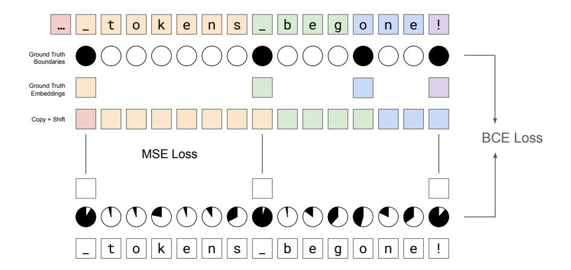
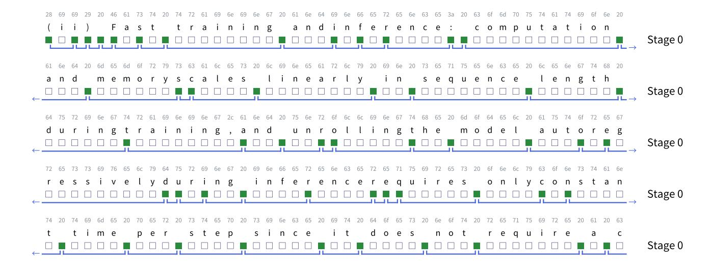

# F Distilling Token-Level Models to Byte-Level

The role of the outer stages in H-Net is analagous to that of the tokenizer, embedding module, and LM head in a traditional BPE-based language model; together, these modules interconvert between raw text and an embedding space that the main model backbone can process. Given this similarity, we investigated whether it would be possible to convert a BPE-tokenized model directly into a byte level H-Net. To do this, we trained a 1-stage H-Net with frozen main network initialized from the backbone of Llama 3.2 3B (base). Our H-Net uses 4 Mamba-2 layers without MLPs for both the encoder and decoder with a hidden dimension of 1536. Because the Llama model has a hidden dimension of 3072, we add MLP adapters with

Figure 15: **Auxiliary loss strategy for training the encoder** of a H-Net with pretrained main stage. In order to mimic the behavior of the tokenizer + embedding layer of a pretrained language model, we add supervision to both the routing module boundary probabilities and to the hidden states that we pass through to the main network. These losses encourage the encoder to tokenize once at the start of every token, while also passing the correct embedding into the main network near the start of the token, thus making maximal use of the next-token prediction ability.

Table 8: **Distilling Llama 3.2 3B to a byte level model.** Average acc indicates average of the benchmarks measured in Table 2. H-Net loses performance across the board compared to the teacher, which is expected because we cannot quite replicate the exact behavior of the original model due to non-causality of BPE tokens. However, it is still much stronger than an H-Net trained from scratch on this small amount of data (189B bytes).

| Model                     | LMB. acc↑ | Hella. acc_n ↑ | ~     |       | ARC-c acc_n↑ |       |       |       | MMLU (5-shot) ACC ↑ |
|---------------------------|--------------|-------------------|-------|-------|-----------------|-------|-------|-------|------------------------|
| Llama 3.2 3B (base)       | 0.701        | 0.737             | 0.768 | 0.745 | 0.460           | 0.688 | 0.428 | 0.647 | 0.561                  |
| Distilled H-Net (1-stage) | 0.634        | 0.702             | 0.761 | 0.721 | 0.433           | 0.665 | 0.414 | 0.617 | 0.519                  |

hidden dimension 8192 after chunking and right before dechunking (i.e. right before and after feeding into the main stage). We train the model for 90000 gradient steps with sequence length 8192 and batch size 256, for a total of 189B bytes.

**Aligning the encoder.** The primary difficulty in converting a tokenized model into a byte-level one is that the encoder and DC must produce chunks that the tokenized model can produce useful output with. Thus, our training (besides using the standard next-byte prediction loss), adds the following losses (see Figure 15 for a visual).

- 1. A binary cross-entropy boundary-prediction loss (with equal weight as the main loss) that operates on the routing module probabilities and targets the router to pass *the start of every real token* through the main network.
- 2. A hidden state matching loss that matches the post-adapter hidden state with the "correct" hidden state. Here, if  $\hat{z}_k$  is the hidden representation that was passed into the main network at (byte) position t, we try to match  $z_k$  with the embedding of the token that the tth byte was part of, except when the tth byte is the first byte of its token, in which case we match the  $z_t$  with the previous token's embedding. Embedding matching is done with an L2 loss with a weight of 0.02.

In the ideal case where both losses are zero, the router sends exactly the first byte of each token through to the main network with the right embedding. The main network would thus see exactly the representation it would see with a tokenizer + embedding setup. In practice, sending both losses to zero is literally impossible, as we discuss below. However, we still find that the boundary-prediction loss is crucial for learning a good matching, while the embedding-matching loss is helpful in speeding up training but not necessary. In fact, increasing the loss weight on the embedding-matching loss

Figure 16: Visualization of boundary positions dynamically drawn by H-Net (1-stage). The given text is perturbed that some whitespaces are missing. H-Net detects word boundaries even if they are not explicitly separated by whitespaces.

too much can harm the language-modeling loss.

**Tokenization bias.** We are not able to send all auxiliary losses to zero because online prediction of BPE boundaries is an impossible task. Phan et al. (2025) coined the term "tokenization bias" to represent the fact that the tokenization process implicitly contains next-byte information. For example, the Llama 3 tokenizer tokenizes the strings \_distill and \_distinct into [\_dist, ill] and [\_distinct]. Prior use of this term has been to suggest that if an autoregressive language model is prompted with \_dist, the nature of its training will be that it will never complete with inct (this is in fact a flaw of all tokenization-based models).

For us, however, tokenization bias implies that we cannot determine whether or not the i in \_disti is the start of a new word until *after* seeing the next character. In fact, the problem can be even worse-consider \_applicable (becomes [\_app, licable]) and \_applicant (becomes [\_applicant]): Determining whether 1 is the start of a token requires knowing the next two bytes as well.

While the H-Net does use the main network, it is not able to exactly match the behavior of the original tokenized model. Instead, it is finding slightly different representations of tokens to use in the main stage. Recent work has shown that tokenized language models can process tokenization sequences distinct from the "canonical" greedy tokenization (Vieira et al. 2024), so it is possible our H-Net found another alternate representation that the pretrained model could process.

**Remark.** One might ask if our distilled model has simply learned to tokenize on spaces (since spaces are always the start of a new token). It has not. Simply tokenizing on spaces would yield a sub-95% boundary prediction accuracy; however, our distilled model gets boundary prediction accuracy above 99.5%. This suggests that the resulting H-Net is able to recognize some, but not all, subword boundaries.

**Results.** The results from our distillation procedure are shown in Table 8. H-Net is able to approximately match performance across almost all benchmarks; in general, H-Net is not able to replicate the behavior of the tokenized model exactly, so it is not unexpected that the benchmarks are slightly worse. Byte-Latent Transformer (Pagnoni et al. 2024, Table 5) performs a similar experiment, and they see a greater gap among most benchmarks (particularly PiQA, Arc-Easy, and Arc-Challenge) despite using a much larger amount of data (220B *tokens* versus 189B *bytes*); it is possible that this performance difference is due to the fact that a BLT module cannot be supervised to align boundaries the way that end-to-end DC can.