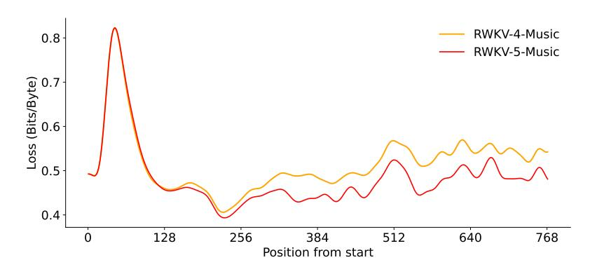
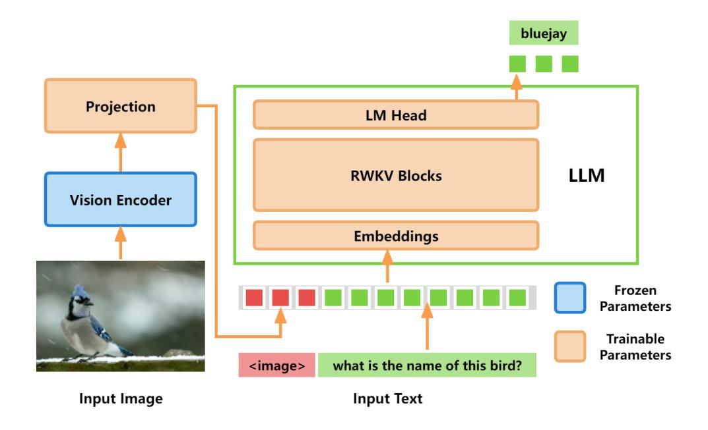

# 9 Speed and Memory Benchmarks

We compare the speed and memory utilization of the Attention-like kernels for Finch, Mamba2, and Flash Attention3 (Dao, 2023) in Figures 6 and 7. For all benchmarks, we use a batch size of 8, a model dimension of 4096, and a head size of 64 for both Flash Attention and Finch. For Mamba, we employ a state dimension of 16, a model dimension of 8192, to mimic Mamba's usage of an expansion factor of 2. Our findings indicate that Finch's speed in training scales linearly with respect to sequence length, exhibiting similar scaling to Mamba. We find Finch

 $^2$ We also plot Mamba 2x which uses 2 runs through the Mamba kernel instead of one. This is done to mimic the usage of twice the number of layers in Mamba vs Finch and Transformers

&lt;sup>3We use the PyTorch Implementation of Flash Attention v2

is significantly faster than Flash Attention for sequence lengths beyond 4k, being around 4.2x faster for a sequence length of 16k. Furthermore, Finch consistently outperforms Mamba and Flash Attention in terms of memory usage, using 40% and 17% less memory usage than Flash Attention and Mamba respectively. Further optimization of our Finch CUDA implementation, including algorithmic improvements, are possible, and could lead to speed increases and greater parallelization. However, this optimization is left for future work.

#### 10 Multimodal Experiments

In this section, we explore the capabilities of Eagle when extended to handle multimodal tasks, where the model processes and integrates textual inputs with inputs in a different domain.

#### 10.1 RWKV Music Modelling

To investigate the Eagle architecture's applicability to music modeling, we use the Irishman ABC music sheet dataset (Wu et al., 2023) to train a new RWKV-5-Music model using the same hyperparameters as the existing RWKV-4-Music model. The loss of RWKV-5 is approximately 2% lower than that of the previous generation model, and this improvement is primarily observed in the musical score part, indicating that RWKV-5 possesses stronger modeling and generalization capabilities than its predecessor. The model has a total of L=24 layers, with a dimension of D=512 and uses a byte-level tokenizer with V=128 tokens. The training context length is 1024 bytes. We use all 2,162 pieces of music in the validation set and calculate the loss for each position from the start. The loss is averaged across all pieces of music, then Gaussian smoothed over the position in the sequence.

The figure 8 shows the loss as a function of position. Note that the first 30-100 bytes of the ABC format are the file header and control codes, followed by the musical scores. The loss of RWKV-5 is approximately 2% lower than the previous generation model, and it is shown mainly in the musical score part, indicating that RWKV-5 has stronger modelling and generalization capabilities than its precedent model.

Figure 8: Music modelling loss over sequence position.

#### 10.2 VisualRWKV

VisualRWKV is the visual-enhanced version of the RWKV language model, enabling RWKV to handle various visual tasks. Our VisualRWKV follows a similar architecture to popular vision-language models (Liu et al., 2023a). We present the architecture in Figure 9. It consists of a vision encoder and a language model. Specifically, we use CLIP (Radford et al., 2021) as the vision encoder and Eagle 1.5B and 3B as the language model. We use LLaVA-1.5 dataset (Liu et al., 2023a). To adapt Eagle to this multimodal task, we employ a two-stage instruction-tuning process to enhance model performance. Initially, we conduct pre-training for feature alignment, during which only the projection layer is subjected to updates, while the rest of the model is kept in a frozen state. Following this, we move on to the fine-tuning end-to-end stage, where both the projection layer and the RWKV language model are fine-tuned, and the vision encoder

Figure 9: VisualRWKV architecture overview.

| Method                         | Vision Encoder | LLM          | GQA (†) | ScienceQA-IMG (†) | Text-VQA (†) | POPE (†) |
|--------------------------------|----------------|--------------|---------|-------------------|--------------|----------|
| BLIP-2 (Li et al., 2023a)      | EVA01-CLIP-G   | Vicuna-13B   | 41.0    | 61.0              | 42.5         | 85.3     |
| BLIP-2 (Li et al., 2023a)      | EVA01-CLIP-G   | Flan-T5-11B  | 44.6    | 64.5              | -            | -        |
| InstructBLIP(Dai et al., 2023) | EVA01-CLIP-G   | Vicuna-7B    | 49.2    | 60.5              | 50.1         | -        |
| InstructBLIP(Dai et al., 2023) | EVA01-CLIP-G   | Vicuna-13B   | 49.5    | 63.1              | 50.7         | 78.9     |
| IDEFICS-9B (IDEFICS, 2023)     | OpenCLIP-H     | LLaMA-7B     | 38.4    | -                 | 25.9         | -        |
| IDEFICS-80B (IDEFICS, 2023)    | OpenCLIP-H     | LLaMA-65B    | 45.2    | -                 | 30.9         | -        |
| TinyGPT-V (Yuan et al., 2023)  | EVA01-CLIP-G   | Phi-2 (2.7B) | 33.6    | -                 | -            | -        |
| VisualRWKV                     | CLIP-L         | Eagle-1.5B   | 48.5    | 46.2              | 37.8         | 81.8     |
| VisualRWKV                     | CLIP-L         | Eagle-3B     | 49.7    | 58.3              | 46.4         | 81.4     |

Table 6: A comparison of VisualRWKV to other state-of-the-art Multimodal Large Language Models (MLLMs) across 4 distinct benchmarks. We evaluate these models on benchmarks: GQA(Hudson & Manning, 2019), ScienceQA-IMG(Lu et al., 2022), Text-VQA(Singh et al., 2019) and POPE(Li et al., 2023c). For POPE, the average F1-score across three distinct categories—random, popular, and adversarial—was computed using the validation set of the MSCOCO dataset.

continue to be kept frozen. As shown in Table 6, we demonstrate that VisualRWKV's architecture is powerful for visual understanding and reasoning. With a smaller vision encoder CLIP-L (0.4B) and modest-sized LLMs of 1.5B and 3B, it achieves results comparable to the combination of CLIP-G (1.0B) and CLIP-H (1.0B) with larger LLMs of 7B and 13B. Moreover, in some benchmarks, it even outperforms larger models.

#### 11 RWKV on Audio

AudioRWKV is the audio-specific version of RWKV, with a better process of the input audio spectrogram. Inspired by the VRWKV (Wang et al., 2024), we introduce a quad-directional shift (Q-Shift) to capture the neighboring relationships in two-dimensional audio spectrograms in the first step of each spatial-mix and channel-mix module. Specifically, the Q-Shift operation allows all tokens to be shifted and linearly interpolated with their neighboring tokens. We conduct experiments on the AudioSet (Gemmeke et al., 2017) dataset with various model sizes from 8.7M to 105M. As shown in Table 7, AudioRWKV-Tiny achieves a comparable performance with AST-AT by a smaller model size.

| Model                      | #Parameters | mAP    |
|----------------------------|-------------|--------|
| DeepRes Ford et al. (2019) | 26M         | 0.392  |
| PANNs Kong et al. (2020)   | 81M         | 0.434  |
| HTS-AT Chen et al. (2022)  | 28.8M       | 0.437* |
| AudioRWKV-T                | 8.7M        | 0.435  |
| AudioRWKV-S                | 28.4M       | 0.452  |

Table 7: A comparison of AudioRWKV to other baselines on AudioSet dataset. \*Results reproduced by ourselves

