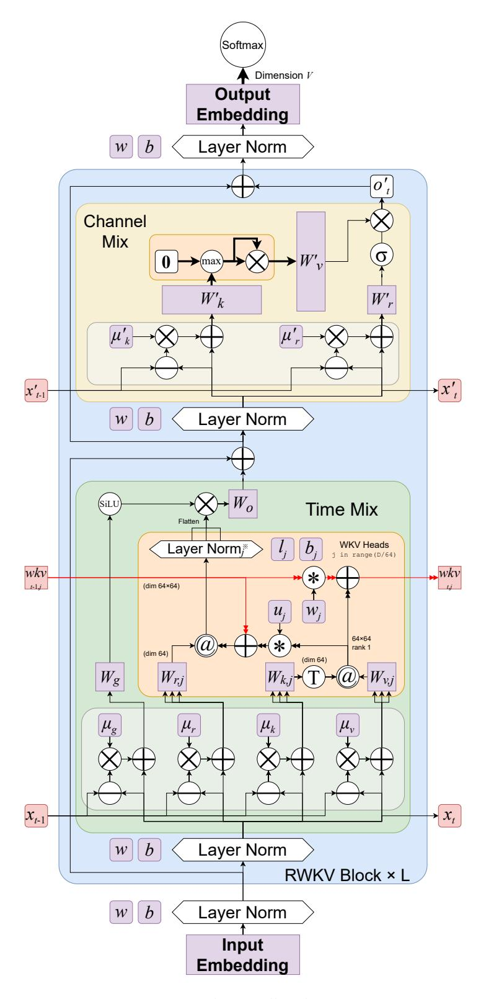

# <span id="page-28-0"></span>**B Additional Architecture Details**

The *WKV* computations of Eagle and Finch can be parallelized across the time dimension using a variety of techniques including associative scan or the parallelization techniques used in FlashAttention. [\(Dao et al.,](#page-18-10) [2022\)](#page-18-10) The simplest of these, while highly parallel, prove inefficient due to repeated expensive memory transfers between fast SRAM and slower HBM. We take a different approach when training, choosing to parallelize over non-time dimensions only while using a custom CUDA implementation that carefully keeps state operations in fast SRAM, which is simpler yet provides enough breadth for a highly efficient implementation. See Section [9](#page-13-0) for kernel experiments. We provide an additional pure PyTorch implementation with similar full-model speed characteristics that parallelizes over the time dimension using an algorithmic approach similar to GLA [\(Yang et al.,](#page-25-1) [2023\)](#page-25-1).

Unlike Transformers, RWKV's recurrence mechanism does not examine tokens more than one time-step old. This allows us to train on and provide inference for unbounded sequence lengths without requiring increased computing power or memory. Another significant advantage is that RWKV does not utilize explicit positional encoding, which allows RWKV to handle contexts of arbitrary length without modification.

**Finch Token Shift** Finch changes the token shift mechanism to become data-dependent. Intuitively, important information can effectively flag itself for inclusion using this mechanism, and less important information can flag itself to partially or fully avoid entering the data stream, leaving room for more important pre-existing data to remain. Viewed from the perspective of induction heads, we theorize that this could allow for potential misleading matches to be pre-filtered out up front if they are not deemed useful for a given task.

Improved WKV (Weighted Key-Value State) Modules The Eagle WKV attention sub-module is similar to the linear attention mechanism found in RetNet, but with learned per-channel decay rates replacing RetNet's static per-head decay rates. Our matrix-valued states feature a geometrically decaying  $K^TV \in \mathbb{R}^{(D/h) \times (D/h)}$  term. This term can be intuitively understood as a memory bank of values, with K acting as an input gate for rows receiving the current token embedding's value. Each row of this state decays at its own rate via the learned parameter w.

In Finch, we augment the learned token-shift parameters  $\mu_r$ ,  $\mu_k$ ,  $\mu_v$ ,  $\mu_w$  and decay rate parameter w with learned weight matrices. Inspired by Low-Rank Adaptation (LoRA) (Hu et al., 2022), we provide two new learned weight matrices for each such parameter y, computing  $y' = y + \tanh(xA)B$ . This approach allows us to dynamically generate data-dependent token-shift amounts and decay rates with only modest increases in computational cost and model size.

**Extra SiLU Gating** We remove the Sigmoid activation of receptance in favor of a new SiLU gate on the output of our linear attention calculation. Our receptance term now functions much like the query term in linear attention.

#### Eagle and Finch Linear Attention Formula, PyTorch Recurrent Implementation .

```
1 # r, k, v parameter shape (B,H,1,D//H)
2 # w parameter of shape (1,H,1,D//H) for Eagle (RWKV-5),
3 #
```

**Evolution of RWKV Formula in Expanded form** Table 8 shows the expansion of terms at each sequence position to illustrate the progression of changes from RWKV-4 through RWKV-6. The main change from RWKV-4 to RWKV-5 is the elimination of denominator and incorporation of matrix states. RWKV-6 introduces the sequential dependence of w which becomes  $w_t$ .

```
RWKV-4 u, w, k_t, v_t \in \mathbb{R}^D, head size 1
                                             u \circ k_0 \circ v_0
0
               \sigma(r_0) \odot
             \sigma(r_1) \odot \left( \frac{u \circ k_1 \circ v_1 + k_0 \circ v_0}{v_1 \circ k_1 \circ v_1} \right)
1
                                                       u \odot k_1 + k_0
                                             u \odot k_2 \odot v_2 + k_1 \odot v_1 + w \odot k_0 \odot v_0
2
                                                            u \odot k_2 + k_1 + w \odot k_0
                                            u \circ k_3 \circ v_3 + k_2 \circ v_2 + w \circ k_1 \circ v_1 + w^2 \circ k_0 \circ v_0
3
              \sigma(r_3) \odot
                                                                  u \odot k_3 + k_2 + w \odot k_1 + w^2 \odot k_0
               Eagle (RWKV-5) diag(u), diag(w), k_t, v_t \in \mathbb{R}^{64 \times 64} for each head, head size 64
t
              \begin{array}{l} r_0 \cdot \left( \mathrm{diag}(u) \cdot k_0^{\mathrm{T}} \cdot \nu_0 \right) \\ r_1 \cdot \left( \mathrm{diag}(u) \cdot k_1^{\mathrm{T}} \cdot \nu_1 + k_0^{\mathrm{T}} \cdot \nu_0 \right) \\ r_2 \cdot \left( \mathrm{diag}(u) \cdot k_2^{\mathrm{T}} \cdot \nu_2 + k_1^{\mathrm{T}} \cdot \nu_1 + \mathrm{diag}(w) \cdot k_0^{\mathrm{T}} \cdot \nu_0 \right) \\ r_3 \cdot \left( \mathrm{diag}(u) \cdot k_3^{\mathrm{T}} \cdot \nu_3 + k_2^{\mathrm{T}} \cdot \nu_2 + \mathrm{diag}(w) \cdot k_1^{\mathrm{T}} \cdot \nu_1 + \mathrm{diag}(w^2) \cdot k_0^{\mathrm{T}} \right) \end{array} 
0
1
2
3
               Finch (RWKV-6) diag(u), diag(w_t), k_t, v_t \in \mathbb{R}^{64 \times 64} for each head, head size 64
t
              \begin{aligned} & r_0 \cdot \left( \operatorname{diag}(u) \cdot k_0^{\mathsf{T}} \cdot \nu_0 \right) \\ & r_1 \cdot \left( \operatorname{diag}(u) \cdot k_1^{\mathsf{T}} \cdot \nu_1 + k_0^{\mathsf{T}} \cdot \nu_0 \right) \\ & r_2 \cdot \left( \operatorname{diag}(u) \cdot k_2^{\mathsf{T}} \cdot \nu_2 + k_1^{\mathsf{T}} \cdot \nu_1 + \operatorname{diag}(w_1) \cdot k_0^{\mathsf{T}} \cdot \nu_0 \right) \end{aligned} 
0
1
2
              r_3 \cdot (\operatorname{diag}(w) \cdot k_2^{\mathrm{T}} \cdot v_3 + k_2^{\mathrm{T}} \cdot v_2 + \operatorname{diag}(w_2) \cdot k_1^{\mathrm{T}} \cdot v_1 + \operatorname{diag}(w_2 \odot w_1) \cdot k_0^{\mathrm{T}} \cdot v_0)
3
```

Table 8: Evolution of the RWKV Formula

<span id="page-30-0"></span>

Figure 10: Eagle Overall Architecture.

