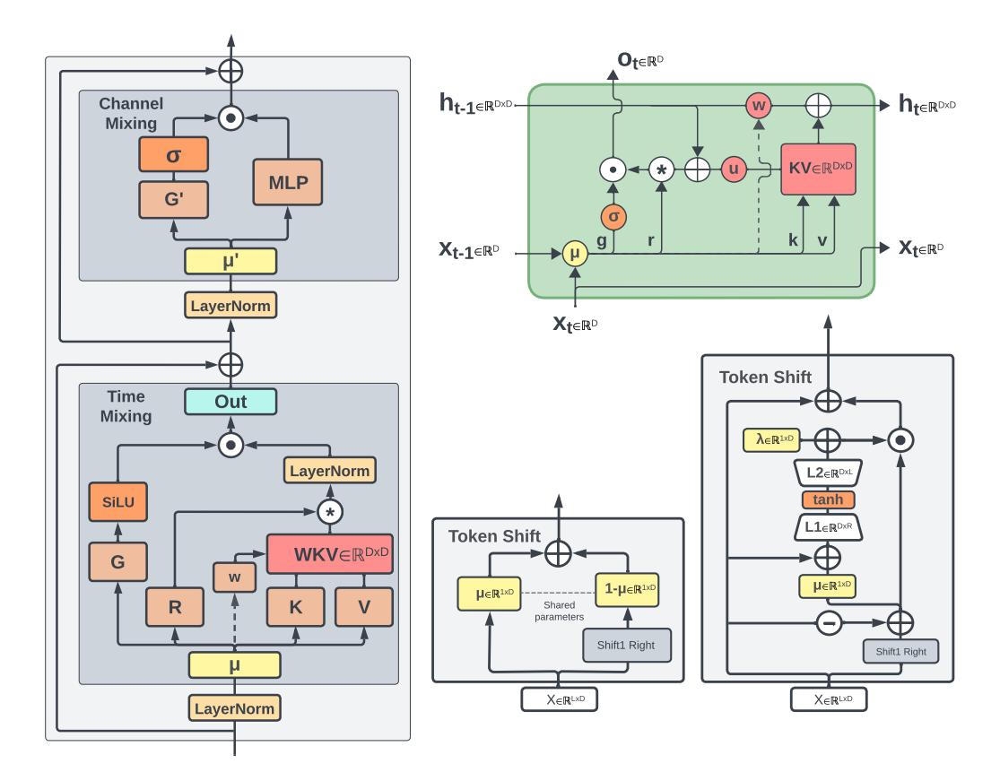

# 3 Eagle/Finch Architecture

We refine the RWKV architecture in two steps, and observe significant modeling improvements with each. Compared to the baseline RWKV-4, Eagle adds matrix-valued attention states, LayerNorm over the attention heads, SiLU attention gating, and improved initialization. It also removes the Sigmoid activation of receptance. Finch further applies data-dependence to the decay schedule and token-shift.

The core architecture remains similar to that of RWKV-4, consisting of a series of stacked residual blocks shaped like a traditional Transformer. Following notation from (Tolstikhin et al., 2021), each block contains one Pre-LayerNorm Time-Mixing sub-layer followed by one Pre-LayerNorm Channel-Mixing sub-layer, as depicted in Figure 1, left. These correspond to the traditional Attention and Feed Forward Network sub-layers of the Transformer. See Appendix B for more details on our training implementation and the differences from RWKV-4, and Section 9 for speed and memory benchmarks.

Figure 1: RWKV architecture overview. **Left:** time-mixing and channel-mixing blocks; **top-right:** RWKV time-mixing block as RNN cell; **center-bottom:** token-shift module in FeedForward module and Eagle time-mixing; **bottom-right:** token-shift module in Finch time-mixing. All shape annotations assume a single head for simplicity. Dashed arrows (left, top-right) indicate a connection in Finch, but not in Eagle.

#### 4 Method

In this section, we use D to denote the model dimension, and unless explicitly stated, all vectors appearing in this section are dimension D/h, where h denotes the number of heads, belonging to  $\mathbb{R}^{(D/h)}$ . For compactness and simplicity we show calculations per-head, eliding the head index. We use the convention that all vectors are row vectors unless explicitly transposed, so all matrices operate on the right side. We use the square subscript to denote a variable.

#### 4.1 Eagle

