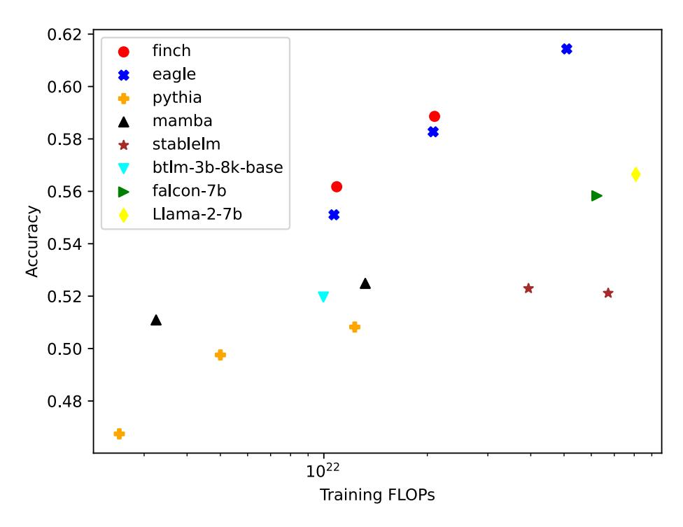
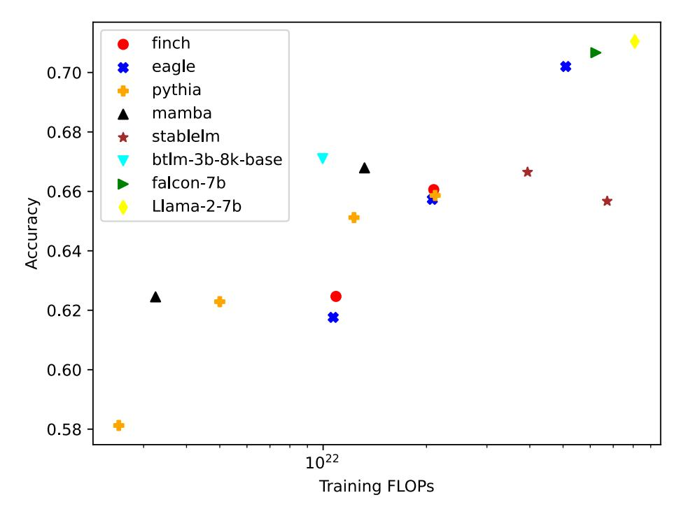
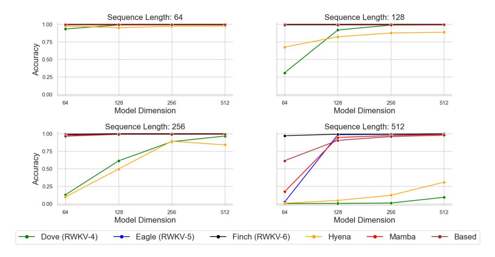
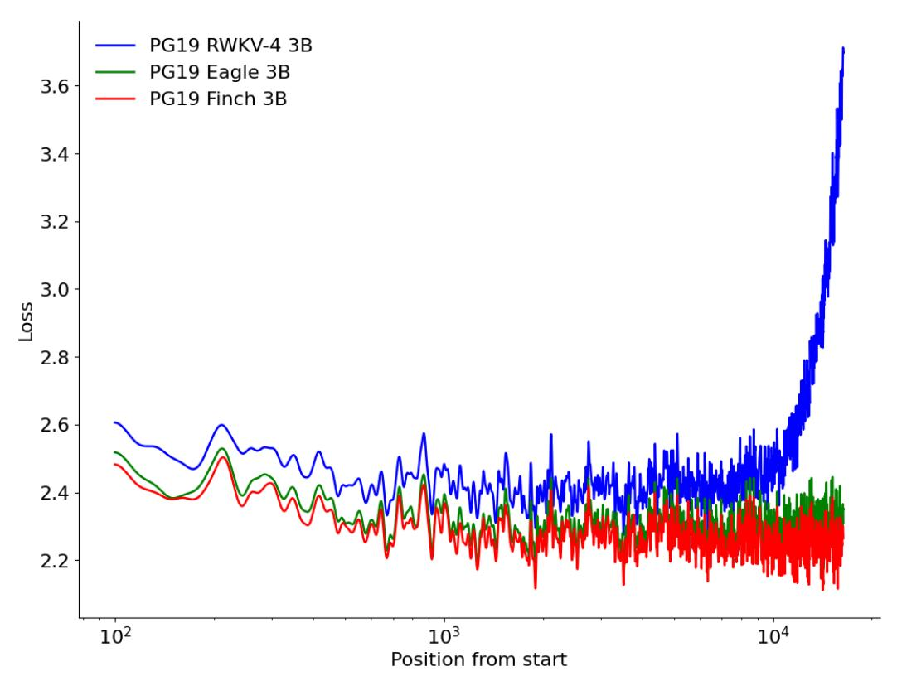
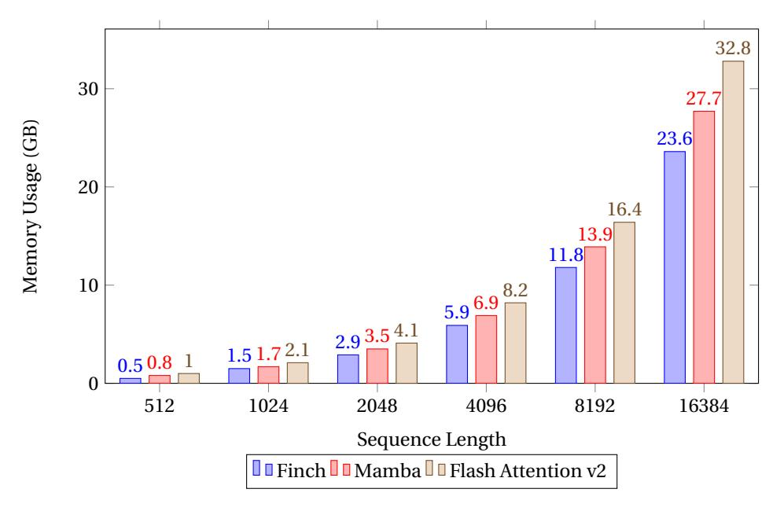
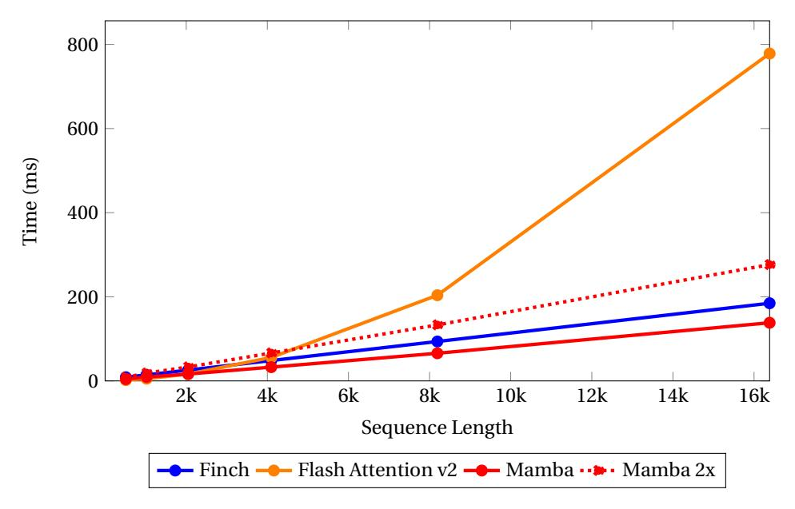

# **8.1 LM Evaluation Harness Benchmarks**

To assess the performance of Eagle and Finch models, we evaluate on a series of common multilingual and English-focused benchmarks using lm\_evaluation\_harness [\(Gao et al.,](#page-18-3) [2023\)](#page-18-3) as shown in Tables [3](#page-10-1) and [4.](#page-10-2) We find that Eagle and Finch demonstrate exceptionally high capabilities on multi-lingual benchmarks, with nearly all results significantly outperforming the other similarly sized models we tested.

In figures [2](#page-9-0) and [3](#page-9-1) we plot the accuracy versus FLOPs used to train various open models across a similar set of common benchmarks. For multilingual benchmarks, Eagle and Finch represent a substantial improvement to the Pareto frontier, achieving far higher scores than other models trained for a similar number of FLOPs. The two models additionally obtain competitive performance across these English benchmarks.

Figure 2: Multilingual average benchmark accuracy versus training FLOPs. Average of LAMBADA Multilingual, xStoryCloze, xWinoGrande, and xCOPA

Figure 3: English average benchmark accuracy versus training FLOPs. Average of LAMBADA (OpenAI), PIQA, StoryCloze16, HellaSwag, WinoGrande, Arc (challenge), Arc (easy), HeadQA (English), OpenBookQA, SciQ, ReCoRD and COPA

| Model           | lmb.m ppl ↓ | lmb.m acc ↑ | pawsx acc ↑ | xcopa acc ↑ | xnli acc ↑ | xsClz acc ↑ | xwin acc ↑ | avg acc ↑ |
|-----------------|----------------|----------------|----------------|----------------|---------------|----------------|---------------|--------------|
| Pythia-1.4b     | 115.9          | 35.5           | 50.9           | 52.7           | 38.9          | 51.8           | 68.3          | 49.7         |
| Mamba-1.4b      | 73.1           | 40.4           | 48.0           | 54.4           | 41.6          | 54.2           | 72.4          | 51.8         |
| RWKV-4-1.5b     | 72.5           | 38.5           | 53.7           | 55.4           | 39.3          | 56.0           | 67.7          | 51.8         |
| Eagle-1.5b      | 43.2           | 44.8           | 51.9           | 57.9           | 40.4          | 57.9           | 73.0          | 54.3         |
| Finch-1.6b      | 37.5           | 46.9           | 50.9           | 58.0           | 41.4          | 57.9           | 74.9          | 55.0         |
| Pythia-2.8b     | 81.3           | 38.8           | 49.4           | 53.7           | 40.0          | 53.5           | 71.5          | 51.1         |
| Mamba-2.8b      | 53.7           | 43.5           | 43.6           | 55.3           | 42.1          | 56.3           | 75.6          | 52.7         |
| RWKV-4-3b       | 48.1           | 43.4           | 50.9           | 57.5           | 40.9          | 58.1           | 72.3          | 53.9         |
| Eagle-3b        | 30.8           | 49.1           | 51.6           | 59.0           | 42.3          | 59.8           | 76.9          | 56.5         |
| Finch-3b        | 28.1           | 50.5           | 49.7           | 59.5           | 44.2          | 60.7           | 77.8          | 57.1         |
| Pythia-6.9b     | 85.6           | 36.7           | 48.4           | 54.1           | 40.0          | 54.2           | 70.9          | 50.7         |
| MPT-7b          | 49.8           | 44.4           | 43.5           | 53.6           | 39.8          | 56.3           | 76.9          | 52.4         |
| Llama-2-7b      | 30.4           | 50.8           | 41.2           | 56.7           | 39.9          | 57.5           | 79.5          | 54.3         |
| Falcon-7b       | 28.7           | 51.3           | 48.2           | 56.0           | 39.0          | 56.0           | 77.7          | 54.7         |
| Mistral-7B-v0.1 | 27.1           | 51.9           | 41.5           | 55.9           | 43.1          | 59.2           | 81.2          | 55.5         |
| RWKV-4-7b       | 33.1           | 47.4           | 52.1           | 60.1           | 41.2          | 60.9           | 76.5          | 56.4         |
| Eagle-7B        | 21.0           | 53.7           | 45.6           | 62.2           | 44.0          | 63.3           | 80.4          | 58.2         |

Table 3: Multilingual Benchmarks, including LAMBADA Multilingual (**lmb.m**) [\(Gao et al.,](#page-18-3) [2023\)](#page-18-3), XCOPA [\(Ponti et al.,](#page-21-5) [2020\)](#page-21-5), XNLI [\(Conneau et al.,](#page-18-4) [2018\)](#page-18-4), PAWS-X [\(Yang et al.,](#page-25-4) [2019\)](#page-25-4), XStoryCloze (**xsClz**) [\(Lin et al.,](#page-20-1) [2022\)](#page-20-1), xWinogrande (**xwin**) [\(Tikhonov & Ryabinin,](#page-23-6) [2021\)](#page-23-6).

| Model           | lmb.o acc ↑ | hella acc_n ↑ | piqa acc ↑ | arcE acc ↑ | arcC acc ↑ | glue acc ↑ | winG acc ↑ | sciq acc ↑ | copa acc ↑ | avg acc ↑ |
|-----------------|----------------|------------------|---------------|---------------|---------------|---------------|---------------|---------------|---------------|--------------|
| Pythia-1.4b     | 61.0           | 52.0             | 70.8          | 61.4          | 26.2          | 47.1          | 57.3          | 86.5          | 71.0          | 59.2         |
| RWKV-4-1.5b     | 60.1           | 51.6             | 71.5          | 58.4          | 27.1          | 46.1          | 55.2          | 84.7          | 78.0          | 59.2         |
| Eagle-1.5b      | 65.7           | 55.0             | 71.1          | 62.2          | 28.7          | 54.1          | 59.1          | 89.7          | 76.0          | 62.4         |
| Finch-1.6b      | 66.8           | 57.3             | 72.6          | 62.7          | 29.8          | 49.8          | 59.4          | 89.6          | 78.0          | 62.9         |
| Mamba-1.4b      | 64.5           | 59.0             | 74.2          | 65.0          | 30.1          | 47.0          | 61.3          | 87.1          | 80.0          | 63.1         |
| Pythia-2.8b     | 63.8           | 59.1             | 73.9          | 63.8          | 29.0          | 47.3          | 58.2          | 88.6          | 79.0          | 62.5         |
| RWKV-4-3b       | 65.7           | 58.8             | 72.4          | 62.9          | 32.4          | 53.6          | 57.5          | 87.6          | 86.0          | 64.1         |
| Eagle-3b        | 68.7           | 62.6             | 74.3          | 68.6          | 33.8          | 46.3          | 62.0          | 92.6          | 85.0          | 66.0         |
| Mamba-2.8b      | 68.1           | 65.9             | 75.2          | 69.7          | 33.8          | 46.3          | 63.0          | 90.2          | 84.0          | 66.2         |
| Finch-3b        | 70.8           | 64.8             | 74.2          | 66.5          | 34.6          | 58.2          | 63.6          | 92.5          | 82.0          | 67.5         |
| Pythia-6.9b     | 60.9           | 63.2             | 74.8          | 66.5          | 32.0          | 47.7          | 61.5          | 88.9          | 79.0          | 63.8         |
| RWKV-4-7b       | 69.8           | 65.3             | 75.0          | 67.4          | 34.0          | 56.4          | 62.4          | 90.8          | 85.0          | 67.3         |
| MPT-7b          | 68.7           | 76.3             | 79.3          | 74.9          | 39.7          | 48.7          | 68.1          | 93.9          | 88.0          | 70.9         |
| Llama-2-7b      | 73.5           | 76.0             | 78.1          | 76.4          | 43.1          | 42.9          | 69.1          | 93.9          | 87.0          | 71.1         |
| Falcon-7b       | 74.6           | 76.4             | 79.5          | 74.8          | 40.3          | 45.8          | 67.1          | 94.4          | 88.0          | 71.2         |
| Eagle-7B        | 74.2           | 70.9             | 77.0          | 73.8          | 39.5          | 57.5          | 67.4          | 95.5          | 88.0          | 71.5         |
| Mistral-7B-v0.1 | 75.5           | 81.0             | 80.5          | 80.8          | 50.1          | 51.5          | 73.6          | 95.9          | 93.0          | 75.8         |

Table 4: English Focused Benchmarks, including LAMBADA (**lmb.o**) [\(Paperno et al.,](#page-21-6) [2016\)](#page-21-6), Hellswag (**hella**) [\(Hampel,](#page-19-9) [1974\)](#page-19-9), PIQA [\(Bisk et al.,](#page-17-6) [2020\)](#page-17-6), AI2 ARC (**arcE**, **arcC**) [\(Bhakthavatsalam](#page-17-7) [et al.,](#page-17-7) [2021\)](#page-17-7), GLUE [\(Wang et al.,](#page-23-7) [2018\)](#page-23-7), Winogrande (**winG**) [\(Sakaguchi et al.,](#page-22-6) [2021\)](#page-22-6), SciQ [\(Welbl](#page-24-1) [et al.,](#page-24-1) [2017\)](#page-24-1), COPA [\(Roemmele et al.,](#page-22-7) [2011\)](#page-22-7).

#### **8.2 Associative Recall**

Associative recall (AR) is a synthetic task designed to mimic the way that humans associate and retrieve information. It measures a model's proficiency in recalling information that was previously mentioned in context. Prior research suggests that a model's ability to perform AR is indicative of its effectiveness in in-context learning [\(Elhage et al.,](#page-18-2) [2021;](#page-18-2) [Olsson et al.,](#page-21-7) [2022\)](#page-21-7). As a result, AR has been adopted as a benchmark in developing new language model architectural designs. [\(Fu et al.,](#page-18-0) [2023;](#page-18-0) [Poli et al.,](#page-21-2) [2023;](#page-21-2) [Lutati et al.,](#page-20-2) [2023\)](#page-20-2). [Arora et al.](#page-17-8) [\(2023\)](#page-17-8) benchmarked a range of models for multi-query associative recall (MQAR) and identified a performance gap between various linear transformer architectures and the transformer with attention. In MQAR tasks, prior RWKV models demonstrated a correlation between model dimension and sequence length. To compare architectures, we trained models using RWKV-4, Eagle and Finch on MQAR, using identical criteria with various model dimensions and sequence lengths. Our findings reveal significant improvements in MQAR with Eagle and Finch. Notably, Finch achieves extremely high accuracy in MQAR in our tests, and outperforms all well-known non-transformer architectures previously used to train large language models. Our experiments reveal performance disparities between Mamba [\(Gu & Dao,](#page-19-0) [2023\)](#page-19-0) and Finch, despite their shared architectural features such as matrix-valued state and data-dependent memory modification, suggesting different combinations of these elements result in superior performance.

Figure 4: MQAR tasks. An increase in sequence length correlates with increased task difficulty.

#### **8.3 Long Context Experiments**

We test loss versus sequence position on the PG19 [\(Rae et al.,](#page-22-8) [2019\)](#page-22-8) test set of books from token 2048 onward across RWKV-4, Eagle, and Finch. We find that Eagle improves dramatically over RWKV-4 on this long sequence task, despite having been trained solely on sequence length 4096. Finch further improves on this test beyond Eagle, with loss continuing to drop further into the sequence. See [Figure 5](#page-12-0) for details.

#### **8.4 Bamboo Benchmark**

The Bamboo benchmark [\(Dong et al.,](#page-18-5) [2023\)](#page-18-5) evaluates the overall long-context language modeling capability of LLMs from five aspects: question answering, hallucination detection, text sorting, language modeling, and code completion, comprising a total of ten evaluation tasks. We test models on the 4k version of the benchmark, which includes all ten tasks with a maximum context window length of 4k. We choose not to present results on the code completion task since all tested models failed to generate correct code completions for this task. In Table [5,](#page-12-1) we present the results of nine tasks, with either accuracy or F1 score, along with their average scores. At both the 1.5b and 3b scales, the latest Finch and Eagle models outperform the vanilla Mamba by at least a 7% average score, while remaining comparable with the Mamba trained on Hermes data (*i.e.*, only a 0.7% drop in the average score). Note that, despite being trained on only 1.1T tokens, Eagle-7b consistently outperforms Pythia by an average of 13.5% at the 7b scale, and it also surpasses LLaMA2-Chat-7b on several tasks in the Bamboo benchmark. These results demonstrate the superior capacity of the proposed Finch and Eagle models on a vast range of long-context tasks.

Figure 5: Loss along sequence offset for 3B RWKV-4 World, Eagle and Finch on PG19 dataset. All models were pretrained with context length 4096.

| Model               | meetingqa Acc.↑ | paperqa Acc.↑ | meetingpred Acc.↑ | showspred Acc.↑ | reportsumsort Acc.↑ | showssort Acc.↑ | senhallu F1↑ | abshallu F1↑ | altqa Acc.↑ | Avg.↑       |
|---------------------|--------------------|------------------|----------------------|--------------------|------------------------|--------------------|-----------------|-----------------|----------------|-------------|
| Pythia-1.4b         | 15.0%              | 4.0%             | 0.0%                 | 0.0%               | 0.0%                   | 0.0%               | 0.0%            | 0.0%            | 0.0%           | 2.1%        |
| Mamba-1.4b          | 15.0%              | 2.0%             | 0.0%                 | 0.0%               | 0.0%                   | 0.0%               | 0.0%            | 2.0%            | 0.0%           | 2.1%        |
| Eagle-1.5b          | 21.0%              | 19.0%            | 1.0%                 | 0.0%               | 0.0%                   | 0.0%               | 13.2%           | 23.5%           | 5.5%           | 9.2%        |
| Finch-1.6b          | 19.0%              | 22.0%            | 1.0%                 | 8.0%               | 0.0%                   | 0.0%               | 10.7%           | 17.3%           | 2.5%           | 8.9%        |
| Pythia-2.8b         | 16.0%              | 4.0%             | 0.0%                 | 0.0%               | 0.0%                   | 0.0%               | 0.0%            | 0.0%            | 0.0%           | 2.2%        |
| Mamba-2.8b          | 11.0%              | 4.0%             | 0.0%                 | 3.0%               | 0.0%                   | 0.0%               | 0.0%            | 3.9%            | 0.0%           | 2.4%        |
| Mamba-2.8b-Hermes   | 27.0%              | 25.0%            | 0.0%                 | 9.0%               | 0.0%                   | 0.0%               | 19.7%           | 26.4%           | 0.0            | 11.9%       |
| Eagle-3b            | 16.0%              | 14.0%            | 0.0%                 | 4.0%               | 0.0%                   | 0.0%               | 25.0%           | 29.2%           | 1.0%           | 9.9%        |
| Finch-3b            | 20.0%              | 26.0%            | 4.0%                 | 7.0%               | 0.0%                   | 0.0%               | 14.4%           | 23.6%           |                | 6.5% 11.3%  |
| Pythia-6.9b         | 19.0%              | 7.0%             | 0.0%                 | 0.0%               | 0.0%                   | 0.0%               | 0.0%            | 0.0%            | 0.0%           | 3.3%        |
| Eagle-7b-Hermes     | 31.0%              | 23.0%            | 0.0%                 | 0.0%               | 0.0%                   | 0.0%               | 50.3%           | 46.9%           |                | 0.0% 16.8%  |
| LLaMA2-Chat-7b      | 6.0%               | 17.0%            | 4.0%                 | 12.0%              | 0.0%                   | 0.0%               | 64.7%           | 63.4%           |                | 46.0% 24.1% |
| Mistral-Instruct-7b | 65.0%              | 73.0%            | 17.0%                | 32.0%              | 0.0%                   | 0.0%               | 80.5%           | 72.8%           |                | 13.5% 39.3% |

Table 5: Results on the long context reasoning benchmark: Bamboo. We compare both transformer and linear attention language models on three different scales: 1.5b, 3b, and 7b.

Figure 6: Memory Usage vs. Sequence Length (A100 80GB)

Figure 7: Time vs. Sequence Length (A100 80GB)

