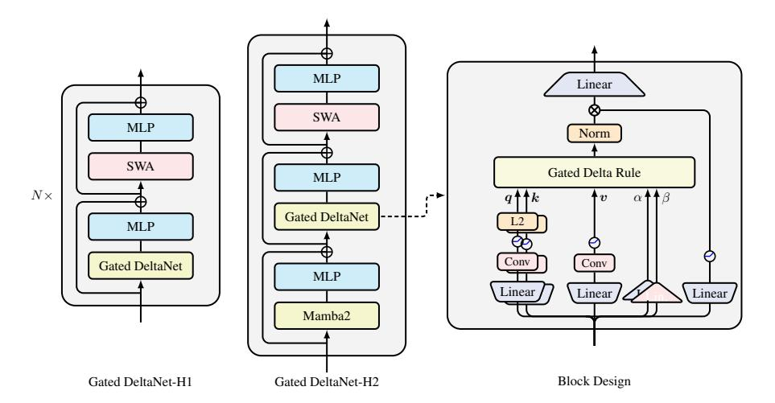
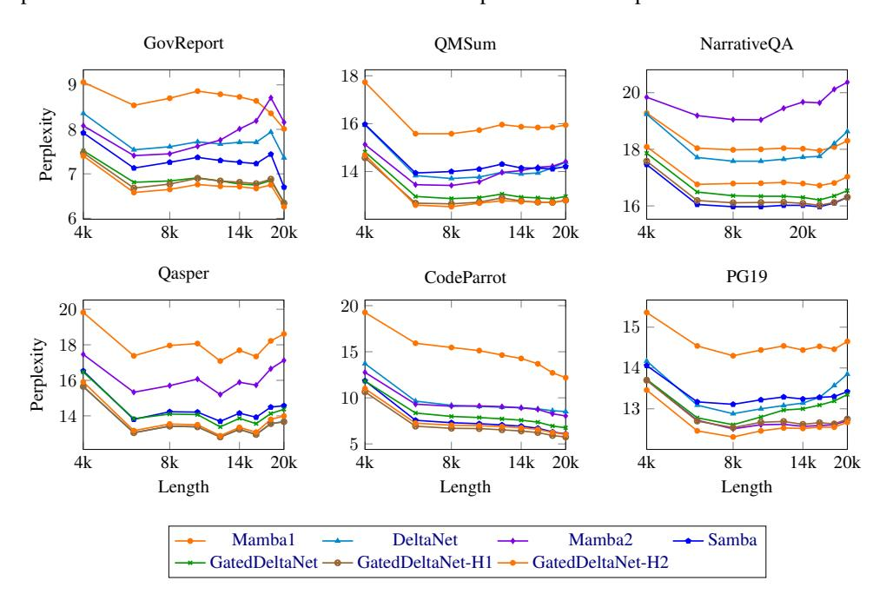
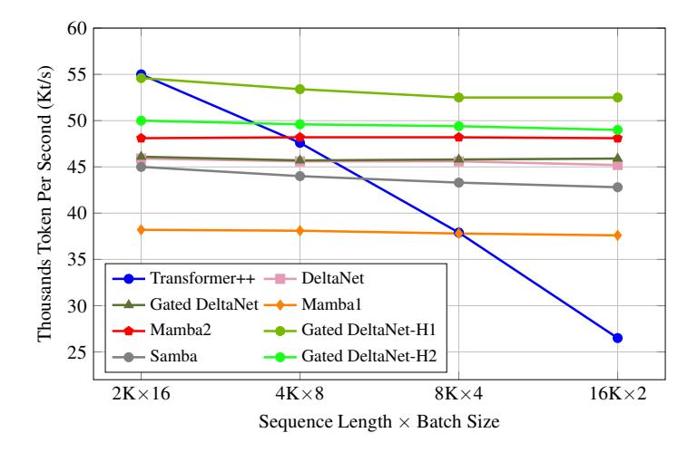

# 3 GATED DELTA NETWORKS

#### 3.1 FORMULATION: GATED DELTA RULE

The proposed gated delta rule is simple yet effective:

$$\mathbf{S}_{t} = \mathbf{S}_{t-1} \left( \alpha_{t} (\mathbf{I} - \beta_{t} \mathbf{k}_{t} \mathbf{k}_{t}^{\mathsf{T}}) \right) + \beta_{t} \mathbf{v}_{t} \mathbf{k}_{t}^{\mathsf{T}}$$

$$\tag{10}$$

where the data-dependent gating term  $\alpha_t \in (0,1)$  controls state decay. This formulation unifies the advantages of both gating mechanisms and the delta rule: the gating term enables adaptive memory management, while the delta update structure facilitates effective key-value association learning.

We present a formal analysis of the gated delta rule through the lens of the online learning framework introduced by Liu et al. (2024). In this framework, recurrent state updates emerge as *closed-form* solutions to an online learning problem, as shown in Table 1. Recent linear RNN architectures typically incorporate a regularization term in their online learning objective to prevent state divergence from previous values, thereby enabling memory retention. However, this retention mechanism becomes problematic when the state becomes saturated with information. In such cases, each state would encode a superposition of multiple information pieces, making precise retrieval challenging. To address this limitation, Mamba2 and Gated DeltaNet introduce an adaptive scaling factor  $\alpha_t$  that relaxes the regularization term, allowing controlled deviations between  $S_t$  and  $S_{t-1}$ . This modification enables dynamic memory management through selective forgetting, which could be useful in filtering out irrelevant information (see §3.2).

**Table 1:** Comparison of different linear RNN models and their corresponding online learning objectives using the framework from Liu et al. (2024). For convenience, we simplify Longhorn's vector-valued  $\beta$  to scalar  $\beta$ .

| Method         | Online Learning Objective                                                                                                                                                                                            | Online Update                                                                                                                                                                                                               |
|----------------|----------------------------------------------------------------------------------------------------------------------------------------------------------------------------------------------------------------------|-----------------------------------------------------------------------------------------------------------------------------------------------------------------------------------------------------------------------------|
| LA             | $\ \mathbf{S}_t - \mathbf{S}_{t-1}\ _F^2 - 2\langle \mathbf{S}_t \boldsymbol{k}_t, \boldsymbol{v}_t \rangle$                                                                                                         | $\mathbf{S}_t = \mathbf{S}_{t-1} + \boldsymbol{v}_t \boldsymbol{k}_t^T$                                                                                                                                                     |
| Mamba2         | $\ \mathbf{S}_t - \alpha_t \mathbf{S}_{t-1}\ _F^2 - 2\langle \mathbf{S}_t \boldsymbol{k}_t, \boldsymbol{v}_t \rangle$                                                                                                | $\mathbf{S}_t = \alpha_t \mathbf{S}_{t-1} + \boldsymbol{v}_t \boldsymbol{k}_t^T$                                                                                                                                            |
| Longhorn       | $\ \mathbf{S}_{t} - \mathbf{S}_{t-1}\ _{F}^{2} - \beta_{t} \ \mathbf{S}_{t} \boldsymbol{k}_{t} - \boldsymbol{v}_{t}\ ^{2}$                                                                                           | $\mathbf{S}_t = \mathbf{S}_{t-1}(\mathbf{I} - \epsilon \boldsymbol{k}_t \boldsymbol{k}_t^T) + \epsilon_t \boldsymbol{v}_t \boldsymbol{k}_t^T, \epsilon_t = \frac{\beta_t}{1 + \beta_t \boldsymbol{k}_t^T \boldsymbol{k}_t}$ |
| DeltaNet       | $\ \mathbf{S}_{t} - \mathbf{S}_{t-1}\ _{F}^{2} - 2\langle \mathbf{S}_{t} \boldsymbol{k}_{t}, \beta_{t} \left( \boldsymbol{v}_{t} - \mathbf{S}_{t-1} \boldsymbol{k}_{t} \right) \rangle$                              | $\mathbf{S}_t = \mathbf{S}_{t-1}(\mathbf{I} - \beta_t \boldsymbol{k}_t \boldsymbol{k}_t^T) + \beta_t \boldsymbol{v}_t \boldsymbol{k}_t^T$                                                                                   |
| Gated DeltaNet | $\left\ \mathbf{S}_{t}-\alpha_{t}\mathbf{S}_{t-1}\right\ _{F}^{2}-2\left\langle \mathbf{S}_{t}\boldsymbol{k}_{t},\beta_{t}\left(\boldsymbol{v}_{t}-\alpha_{t}\mathbf{S}_{t-1}\boldsymbol{k}_{t}\right)\right\rangle$ | $\mathbf{S}_t = \mathbf{S}_{t-1} \left( \alpha_t (\mathbf{I} - \beta_t \boldsymbol{k}_t \boldsymbol{k}_t^T) \right) + \beta_t \boldsymbol{v}_t \boldsymbol{k}_t^T$                                                          |

Table 2: Zero-shot performance comparison on S-NIAH benchmark suite for 1.3B models (see §4 for setups)

|                                      | (p                          | S-NI. ass-key            |                       | al)                         | (nui                         | S-NI/ mber in            | AH-2 haystad             | S-NIAH-3 (uuid in haystack) |                             |                             |                            |
|--------------------------------------|-----------------------------|-----------------------------|-----------------------|-----------------------------|------------------------------|-----------------------------|-----------------------------|--------------------------------|-----------------------------|-----------------------------|----------------------------|
| Model                                | 1K                          | 2K                          | 4K                    | 8K                          | 1K                           | 2K                          | 4K                          | 8K                             | 1K                          | 2K                          | 4K                         |
| DeltaNet Mamba2 Gated DeltaNet | 97.4 <b>99.2</b> 98.4 | 96.8 <b>98.8</b> 88.4 | <b>99.0</b> 65.4 91.4 | <b>98.8</b> 30.4 91.8 | 98.4 99.4 <b>100.0</b> | 45.6 98.8 <b>99.8</b> | 18.6 56.2 <b>92.2</b> | 17.0                           | 85.2 64.4 <b>86.6</b> | 47.0 47.6 <b>84.2</b> | 22.4 4.6 <b>27.6</b> |

On the other hand, Linear Attention (LA) and Mamba2 use a simple negative inner-product loss  $-\langle \mathbf{S}_t \mathbf{k}_t, \mathbf{v}_t \rangle$ , while Longhorn (Liu et al., 2024) uses a more expressive online regression objective  $\|\mathbf{S}_t \mathbf{k}_t - \mathbf{v}_t\|^2$  for better modeling of key-value associations. The resulting Longhorn's update rule closely resembles the delta update rule, 3 suggesting the superiority of the (gated) delta rule over Mamba2 in in-context associative recall.

From the perspective of fast weight programming (Irie et al., 2022a) and test-time training (Sun et al., 2024a) and regression (Wang et al., 2025), the hidden state S can be interpreted as a (fast) weight matrix, with the delta rule optimizing the online regression objective  $\mathcal{L}(S_t) = \frac{1}{2} ||S_t k_t - v_t||^2$  via test-time stochastic gradient descent (SGD):

$$\mathbf{S}_{t+1} = \mathbf{S}_t - \beta_t \nabla \mathcal{L}(\mathbf{S}_t) = \mathbf{S}_t - \beta_t (\mathbf{S}_t \mathbf{k}_t - \mathbf{v}_t) \mathbf{k}_t^{\mathsf{T}} = \mathbf{S}_t (\mathbf{I} - \beta_t \mathbf{k}_t \mathbf{k}_t^{\mathsf{T}}) + \beta_t \mathbf{v}_t \mathbf{k}_t^{\mathsf{T}}$$

where  $\beta_t$  represents the (adaptive) learning rate. From this perspective, the gated delta rule can be viewed as incorporating an adaptive weight decay term  $\alpha_t$  into the SGD update, a technique widely used in deep learning (Krogh & Hertz, 1991; Andriushchenko et al., 2023). Concurrently, Titans (Behrouz et al., 2024) demonstrated the effectiveness of incorporating weight decay mechanisms in RNN test-time SGD updates.

#### 3.2 CASE STUDY: SINGLE NEEDLE IN A HAYSTACK (S-NIAH)

To better understand the complementary strength between the delta rule and the gated rule, we present a case study on the Single Needle-In-A-Haystack (S-NIAH) benchmark suite from RULER (Hsieh et al., 2024), where a key-value pair acts as a needle in the haystack (context) and the model must recall the value when given the key. Table 2 presents the results and we draw three main observations:

**Decay hurts memory retention.** In the simplest S-NIAH-1 setting with repeated synthetic context, models memorize minimal information, testing long-term retention. DeltaNet achieves near-perfect performance across all sequence lengths. Mamba2 degrades significantly beyond 2K sequences since it decays historical information too quickly, while Gated DeltaNet's degradation is less severe thanks to the use of delta rule.

Gating facilitates filtering. In S-NIAH-2/3 with real-world-essay context, models store all potentially relevant information, testing efficient memory management. With fixed state size, lack of clearance causes memory collision—information becomes superimposed and indistinguishable. DeltaNet's performance drops significantly at longer sequences due to poor memory clearance. Mamba2 and Gated DeltaNet maintain better performance through gating mechanisms that filter irrelevant information.

&lt;sup>3The theoretical distinction lies in the optimization approach: Longhorn uses implicit online learning (Kulis & Bartlett, 2010) to derive closed-form globally optimal updates, while DeltaNet optimizes the same objective through one-step explicit gradient descent, as noted by Liu et al. (2024).

**Delta rule helps memorization.** In S-NIAH-3, values change from numbers to UUIDs, testing complex pattern memorization. Mamba2's performance drops quickly, while Gated DeltaNet performs better, verifying that the delta rule indeed has better memorization ability.

#### 3.3 ALGORITHM: HARDWARE-EFFICIENT CHUNKWISE TRAINING

In this subsection, we derive a hardware-efficient chunkwise algorithm for training Gated DeltaNet. By partially expanding the recurrence in Eq. 10, we have

$$\mathbf{S}_{[t]}^{r} = \mathbf{S}_{[t]} \underbrace{\left(\prod_{i=1}^{r} \alpha_{[t]}^{i} \left(\mathbf{I} - \beta_{[t]}^{i} \boldsymbol{k}_{[t]}^{i} \boldsymbol{k}_{[t]}^{i\mathsf{T}}\right)\right)}_{:=\mathbf{F}_{[t]}^{r}} + \underbrace{\sum_{i=1}^{r} \left(\beta_{[t]}^{i} \boldsymbol{v}_{[t]}^{i} \boldsymbol{k}_{[t]}^{i\mathsf{T}} \prod_{j=i+1}^{r} \alpha_{[t]}^{j} \left(\mathbf{I} - \beta_{[t]}^{j} \boldsymbol{k}_{[t]}^{j} \boldsymbol{k}_{[t]}^{j\mathsf{T}}\right)\right)}_{:=\mathbf{G}_{[t]}^{r}}$$

It is easy to see that  $\mathbf{F}_{[t]}^r = \gamma_{[t]}^r \mathbf{P}_{[t]}^r = \overleftarrow{\mathbf{P}_{[t]}^r}$ . As for  $\mathbf{G}_{[t]}^r$ , we adapt Eq. 5 as follows,

$$\mathbf{G}^r_{[t]} = \sum_{i=1}^r \frac{\gamma^r_{[t]}}{\gamma^i_{[t]}} \tilde{\mathbf{u}}^i_{[t]} \boldsymbol{k}^{i\intercal}_{[t]} \in \mathbb{R}^{d_v \times d_k} \qquad \tilde{\mathbf{u}}^r_{[t]} = \beta^r_{[t]} \left( \boldsymbol{v}^r_{[t]} - \sum_{i=1}^{r-1} \left( \tilde{\mathbf{u}}^i_{[t]} (\frac{\gamma^r_{[t]}}{\gamma^i_{[t]}} \boldsymbol{k}^{i\intercal}_{[t]} \boldsymbol{k}^r_{[t]}) \right) \right) \in \mathbb{R}^{d_v}$$

(see §A for a proof). By UT transform, we have the matrix form:

$$\widetilde{\mathbf{U}_{[t]}} = \left[\mathbf{I} + \operatorname{strictLower}\left(\operatorname{diag}\left(\beta_{[t]}\right)\left(\Gamma_{[t]} \odot \mathbf{K}_{[t]} \mathbf{K}_{[t]}^{\mathsf{T}}\right)\right)\right]^{-1} \operatorname{diag}\left(\beta_{[t]}\right) \mathbf{V}_{[t]} \qquad \in \mathbb{R}^{C \times d_{v}}$$

Similar to how Mamba2 extends linear attention (Eq. 1), we can adapt DeltaNet's chunkwise algorithm (Eq. 8-9) for Gated DeltaNet to enable hardware-efficient training as follows:

$$\mathbf{S}_{[t+1]} = \overrightarrow{\mathbf{S}_{[t]}} + \left(\widetilde{\mathbf{U}_{[t]}} - \overleftarrow{\mathbf{W}_{[t]}} \mathbf{S}_{[t]}^{\mathsf{T}}\right)^{\mathsf{T}} \overrightarrow{\mathbf{K}_{[t]}}$$

$$\in \mathbb{R}^{d_v \times d_k}$$

$$\mathbf{O}_{[t]} = \overleftarrow{\mathbf{Q}_{[t]}} \mathbf{S}_{[t]}^{\mathsf{T}} + \left(\mathbf{Q}_{[t]} \mathbf{K}_{[t]}^{\mathsf{T}} \odot \mathbf{M}\right) \left(\widetilde{\mathbf{U}_{[t]}} - \overleftarrow{\mathbf{W}_{[t]}} \mathbf{S}_{[t]}^{\mathsf{T}}\right)$$

$$\in \mathbb{R}^{C \times d_v}$$

where 
$$\overleftarrow{q_{[t]}^r} = \gamma_{[t]}^r q_{[t]}^r, \overleftarrow{\mathbf{w}_{[t]}^r} = \gamma_{[t]}^r \mathbf{w}_{[t]}^r, \overrightarrow{k_{[t]}^r} = \frac{\gamma_{[t]}^C}{\gamma_{[t]}^r} k_{[t]}^r$$
, and  $\overrightarrow{\mathbf{S}_{[t]}} = \gamma_{[t]}^C \mathbf{S}_{[t]}$  like we defined in Eq. 2.

#### 3.4 GATED DELTA NETWORKS AND HYBRID MODELS

**Token mixer block.** The basic Gated DeltaNet follows Llama's macro architecture, stacking token mixer layers with SwiGLU MLP layers, but replaces self-attention with gated delta rule token mixing. Fig. 1 (right) shows its block design. For the gated delta rule (Eq. 10), queries, keys and values  $\{q, k, v\}$  are generated through linear projection, short convolution and SiLU, with L2 normalization applied to q, k for training stability.  $\alpha, \beta$  use linear projection only. Following Sun et al. (2023a), the output is processed through normalization and gating before applying output projection.

**Hybrid models.** Linear transformers have limitations in modeling local shifts and comparisons, and their fixed state size makes it hard for retrieval tasks (Arora et al., 2024a). Following recent hybrid architectures like Griffin (De et al., 2024) and Samba (Ren et al., 2024), we combine linear recurrent layers with sliding window attention (SWA), resulting in GatedDeltaNet-H1. We also stack Mamba2, GatedDeltaNet and SWA, resulting in GatedDeltaNet-H2.

#### 4 EXPERIMENTS

Setup Our experiments encompass a comprehensive comparison of recent state-of-the-art architectures, including pure Transformer models, RNN-based approaches, and hybrid architectures. We evaluate against the following baselines: RetNet (Sun et al., 2023a), HGRN2 (Qin et al., 2024b), Mamba (Gu & Dao, 2023), Mamba2 (Dao & Gu, 2024b), Samba (Ren et al., 2024), and DeltaNet (Yang et al., 2024b). For fair comparison, all models are trained under identical conditions with 1.3B parameters on 100B tokens sampled from the FineWeb-Edu dataset (Penedo et al., 2024). We use the AdamW optimizer with a peak learning rate of 4e-4, weight decay of 0.1, and gradient clipping of 1.0. The learning rate follows a cosine annealing schedule with a 1B token warm-up period

&lt;sup>4We use Mamba2's parameterization for  $\alpha$  but omit it for brevity.

Figure 1: Visualization of the (hybrid) architecture and block design of Gated DeltaNet models. Gated DeltaNet-H1 and H2 use Gated DeltaNet + SWA and Mamba2 + Gated DeltaNet + SWA patterns, respectively. In the block design, query/key paths consist of linear proj., shortconv., SiLU and L2 norm; value path includes linear proj., shortconv. and SiLU; alpha/beta use linear proj.; and output gate applies linear proj. with SiLU.

| Model                      | Wiki. ppl ↓ | LMB. ppl ↓ | LMB. acc ↑ | PIQA acc ↑ | Hella. acc_n ↑ | Wino. acc ↑ | ARC-e acc ↑ | ARC-c acc_n ↑ | SIQA acc ↑ | BoolQ acc ↑ | Avg.  |
|----------------------------|----------------|---------------|---------------|---------------|-------------------|----------------|----------------|------------------|---------------|----------------|-------|
| Recurrent models           |                |               |               |               |                   |                |                |                  |               |                |       |
| RetNet                     | 19.08          | 17.27         | 40.52         | 70.07         | 49.16             | 54.14          | 67.34          | 33.78            | 40.78         | 60.39          | 52.02 |
| HGRN2                      | 19.10          | 17.69         | 39.54         | 70.45         | 49.53             | 52.80          | 69.40          | 35.32            | 40.63         | 56.66          | 51.79 |
| Mamba                      | 17.92          | 15.06         | 43.98         | 71.32         | 52.91             | 52.95          | 69.52          | 35.40            | 37.76         | 61.13          | 53.12 |
| Mamba2                     | 16.56          | 12.56         | 45.66         | 71.87         | 55.67             | 55.24          | 72.47          | 37.88            | 40.20         | 60.13          | 54.89 |
| DeltaNet                   | 17.71          | 16.88         | 42.46         | 70.72         | 50.93             | 53.35          | 68.47          | 35.66            | 40.22         | 55.29          | 52.14 |
| Gated DeltaNet             | 16.42          | 12.17         | 46.65         | 72.25         | 55.76             | 57.45          | 71.21          | 38.39            | 40.63         | 60.24          | 55.32 |
| Attention or hybrid models |                |               |               |               |                   |                |                |                  |               |                |       |
| Transformer++              | 18.53          | 18.32         | 42.60         | 70.02         | 50.23             | 53.51          | 68.83          | 35.10            | 40.66         | 57.09          | 52.25 |
| Samba                      | 16.13          | 13.29         | 44.94         | 70.94         | 53.42             | 55.56          | 68.81          | 36.17            | 39.96         | 62.11          | 54.00 |
| Gated DeltaNet-H1          | 16.07          | 12.12         | 47.73         | 72.57         | 56.53             | 58.40          | 71.75          | 40.10            | 41.40         | 63.21          | 56.40 |
| Gated DeltaNet-H2          | 15.91          | 12.55         | 48.76         | 72.19         | 56.88             | 57.77          | 71.33          | 39.07            | 41.91         | 61.55          | 56.18 |

Table 3: Performance comparison on language modeling and zero-shot common-sense reasoning.

and batch size of 0.5M tokens. All models employ the Llama2 tokenizer with a vocabulary size of 32,000. For sequence modeling, we set the training length to 4K tokens, with Samba and our hybrid models using a sliding window size of 2K. See § [B.1](#page-20-1) for evaluation settings and § [B.2](#page-21-0) for ablation studies.

Common-sense reasoning In Table [3,](#page-6-1) we present the language modeling perplexity and zero-shot accuracy on commonsense reasoning benchmarks for models with 400M and 1.3B parameters. Gated DeltaNet consistently outperforms other linear models, including RetNet, HGRN2, Mamba, Mamba2, and DeltaNet, at both scales. As expected, the hybrid variant further enhances performance.

In-context retrieval on real-world data Table [4](#page-6-2) presents results on real-world recall-intensive tasks used by [Arora et al.](#page-10-8) [\(2024b](#page-10-8)). As expected, linear recurrent models show a significant performance

| Models                     | SWDE SQD FDA TQA NQ Drop Avg |  |  |                               |  |
|----------------------------|------------------------------|--|--|-------------------------------|--|
| Recurrent models           |                              |  |  |                               |  |
| RetNet                     | 14.0                         |  |  | 28.5 7.0 54.4 16.2 17.3 22.9  |  |
| HGRN2                      | 8.3                          |  |  | 25.3 4.8 51.2 14.2 16.9 20.1  |  |
| Mamba                      | 9.8                          |  |  | 25.8 3.7 54.3 14.9 17.4 21.0  |  |
| Mamba2                     | 19.1                         |  |  | 33.6 25.3 61.0 20.8 19.2 29.8 |  |
| DeltaNet                   | 17.9                         |  |  | 30.9 18.4 53.9 17.3 18.6 26.2 |  |
| Gated DeltaNet             | 25.4                         |  |  | 34.8 23.7 60.0 20.0 19.8 30.6 |  |
| Attention or hybrid models |                              |  |  |                               |  |
| Transformer++              | 29.5                         |  |  | 38.0 52.2 58.3 22.5 21.6 37.0 |  |
| Samba                      | 33.0                         |  |  | 39.2 50.5 57.7 23.5 20.2 37.3 |  |
| Gated DeltaNet-H1          | 35.6                         |  |  | 39.7 52.0 60.1 24.6 22.2 39.0 |  |
| Gated DeltaNet-H2          | 38.2                         |  |  | 40.4 50.7 63.3 24.8 23.3 40.1 |  |

Table 4: Accuracy on recall-world retrieval tasks with input truncated to 2K tokens. SQD: SQUADE. TQA: Trivial QA.

gap compared to Transformers, while hybrid models combining linear recurrence and attention outperform pure attention models in retrieval tasks.

For pure recurrent models, despite DeltaNet's superior performance on synthetic in-context retrieval tasks [\(Yang et al.](#page-18-3), [2024b\)](#page-18-3), its real-world retrieval performance lags behind Mamba2, consistent with our observations in S-NIAH-2 and S-NIAH-3 (Table [2\)](#page-4-3). Gated DeltaNet outperforms both DeltaNet and Mamba2 thanks to its gated delta rule, though the improvement margin is smaller than in Table [2.](#page-4-3) We attribute this reduced performance gap to instruction-unaligned small language models being prone to repetition errors, which are the primary source of errors in these tasks (cf. [Arora et al.](#page-10-8) [\(2024b](#page-10-8), Appendix E)). Since this issue is largely independent of the update rule choice, the performance differences between models are less pronounced compared to Table [2.](#page-4-3)

Figure 2: Length extrapolation on six long benchmarks.

Length extrapolation on long sequences. As shown in Fig[.2,](#page-7-1) we evaluate the models' capacity to extrapolate to sequences of up to 20K tokens across six long-context benchmarks. Gated DeltaNet achieves the lowest overall perplexity across tasks among RNN models. While we observe mixed results in length extrapolation, Gated DeltaNet exhibits relatively more robust performance, suggesting better memory management. The hybrid models further improve upon this by leveraging attention for local context modeling, which reduces the memory management burden on their recurrent components. Future work will explore these models' capabilities on even longer sequences.

Long context understanding As demonstrated in Table [5,](#page-8-0) we evaluated the models' performance on LongBench [\(Bai et al.](#page-10-9), [2023](#page-10-9)). In recurrent models, Gated DeltaNet shows consistent advantages, especially in single-doc QA, few-shot in-context learning, and Code tasks, demonstrating its superior capabilities in retrieval, in-context learning, and state tracking, respectively.

Throughput Comparison. The training throughput comparison across different models is presented in Fig. [3.](#page-8-1) As our analysis shows, the proposed gated delta rule introduces only marginal overhead compared to the original delta rule, with Gated DeltaNet achieving essentially the same throughput as DeltaNet. Both are slightly slower than Mamba2 (2-3K tokens/sec) due to their more expressive transition matrices.

The Transformer++ achieves the best performance in the 2K context window domain, thanks to the highly optimized Flash-Attention-2 kernel [\(Dao,](#page-11-3) [2023](#page-11-3)). Consequently, hybrid approaches combining 2K window-size SWA attention with other token mixers demonstrate higher throughput than

|                            | Single-Doc QA |      |      | Multi-Doc QA |      | Summarization |      |      | Few-shot |      |      | Code |      | Avg  |      |
|----------------------------|---------------|------|------|--------------|------|---------------|------|------|----------|------|------|------|------|------|------|
| Model                      | NQA           | QQA  | MFQ  | HQA          | 2WM  | Mus           | GvR  | QMS  | MNs      | TRC  | TQA  | SSM  | LCC  | RBP  |      |
| Recurrent models           |               |      |      |              |      |               |      |      |          |      |      |      |      |      |      |
| RetNet                     | 12.1          | 10.7 | 19.1 | 10.7         | 18.0 | 5.8           | 4.8  | 15.8 | 7.9      | 19.0 | 18.0 | 12.8 | 14.1 | 17.9 | 13.2 |
| HGRN2                      | 10.7          | 12.1 | 19.1 | 11.3         | 15.7 | 6.0           | 5.2  | 15.1 | 9.2      | 16.0 | 15.8 | 10.3 | 18.6 | 20.8 | 13.5 |
| Mamba                      | 13.0          | 10.1 | 20.4 | 10.1         | 16.7 | 6.0           | 7.2  | 15.9 | 8.4      | 23.1 | 21.9 | 11.2 | 17.9 | 19.0 | 14.6 |
| DeltaNet                   | 12.9          | 10.8 | 21.5 | 10.9         | 13.2 | 5.1           | 6.5  | 13.5 | 7.2      | 15.5 | 23.3 | 11.6 | 17.6 | 20.3 | 13.6 |
| Mamba2                     | 11.1          | 11.3 | 18.6 | 11.8         | 15.1 | 6.7           | 6.7  | 14.5 | 7.4      | 13.0 | 23.6 | 8.4  | 17.9 | 20.6 | 13.5 |
| Gated DeltaNet             | 14.1          | 14.0 | 23.3 | 13.7         | 14.4 | 5.8           | 7.5  | 16.4 | 7.9      | 30.0 | 22.4 | 23.0 | 18.7 | 22.1 | 16.6 |
| Attention or hyrbid models |               |      |      |              |      |               |      |      |          |      |      |      |      |      |      |
| Transformer++              | 11.8          | 9.3  | 10.0 | 10.9         | 4.2  | 6.1           | 7.4  | 15.8 | 6.6      | 16.9 | 13.5 | 3.9  | 17.2 | 18.7 | 11.0 |
| Samba                      | 12.5          | 12.9 | 25.4 | 11.2         | 19.7 | 6.8           | 9.1  | 15.7 | 11.0     | 20.0 | 22.7 | 22.8 | 18.1 | 21.1 | 15.9 |
| Gated DeltaNet-H1          | 14.5          | 12.3 | 26.6 | 12.6         | 23.6 | 6.1           | 9.1  | 16.1 | 12.8     | 33.5 | 23.9 | 26.8 | 15.5 | 19.2 | 17.8 |
| Gated DeltaNet-H2          | 12.7          | 13.0 | 27.1 | 12.7         | 20.6 | 7.5           | 10.4 | 16.2 | 13.0     | 40.5 | 22.7 | 27.9 | 19.9 | 22.1 | 18.4 |

Table 5: Accuracy on 14 tasks from LongBench [\(Bai et al.](#page-10-9), [2023\)](#page-10-9): Narrative QA, QasperQA, MultiField QA, HotpotQA, 2WikiMulti QA, Musique, GovReport, QMSum, MultiNews, TRec, Trivia QA, SamSum, LCC, and RepoBench-P by order.

Figure 3: Training throughput comparison of 1.3B models on a single H100 GPU.

standalone mixers: Samba outperforms Mamba, while Gated DeltaNet-H1 and -H2 outperform Gated DeltaNet. Notably, Gated DeltaNet-H1 maintains compelling training throughput across all sequence lengths, even on short sequences.

