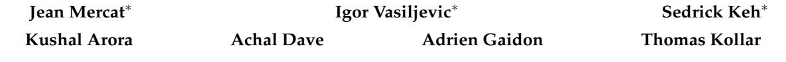
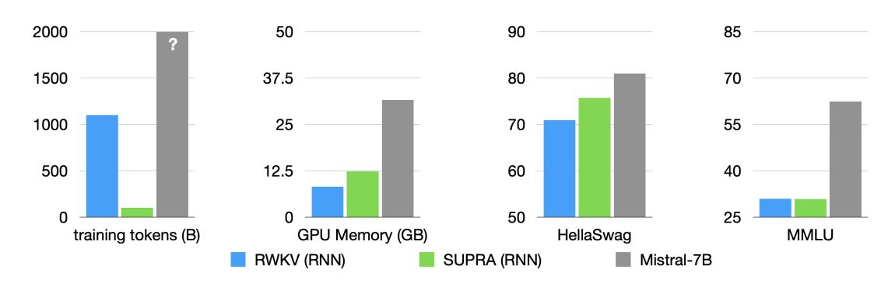

# **Linearizing Large Language Models**

Toyota Research Institute {firstname.lastname}@tri.global

Figure 1: We reuse pre-trained LLMs (gray) and convert them to RNNs with minimal uptraining (SUPRA), outperforming linear attention models (RWKV) on natural language tasks like HellaSwag, attaining the same memory advantages (center), but also inheriting the limitations of RNNs on tasks like MMLU (right).

### **Abstract**

Linear transformers have emerged as a subquadratic-time alternative to softmax attention and have garnered significant interest due to their fixed-size recurrent state that lowers inference cost. However, their original formulation suffers from poor scaling and underperforms compute-matched transformers. Recent linear models such as RWKV and Mamba have attempted to address these shortcomings by proposing novel time-mixing and gating architectures, but pre-training large language models requires significant data and compute investments. Thus, the search for subquadratic architectures is limited by the availability of compute and quality pre-training datasets. As a cost-effective alternative to pre-training linear transformers, we propose Scalable UPtraining for Recurrent Attention (SUPRA).[1](#page-0-0) We present a method to *uptrain* existing large pre-trained transformers into Recurrent Neural Networks (RNNs) with a modest compute budget. This allows us to leverage the strong pre-training data and performance of existing transformer LLMs, while requiring 5% of the training cost. We find that our linearization technique leads to competitive performance on standard benchmarks, but we identify persistent in-context learning and long-context modeling shortfalls for even the largest linear models. Our code and models can be found at [https://github.com/TRI-ML/linear\\_open\\_lm](https://github.com/TRI-ML/linear_open_lm).

∗Equal contribution.

1We borrow the term "uptraining" from [Ainslie et al.](#page-10-0) [\(2023\)](#page-10-0) to refer to continued training with a modified architecture, as opposed to fine-tuning, which usually refers to continued training on a different dataset.

### **1 Introduction**

Over the last few years, Transformers [\(Vaswani et al., 2017\)](#page-13-0) have displaced Recurrent Neural Networks (RNNs) in sequence modeling tasks, owing to their highly parallel training efficiency and unmatched scaling performance [\(Kaplan et al., 2020\)](#page-11-0). However, this training efficiency comes at the cost of inference cost that scales linearly with the number of tokens, compared to the fixed-cost inference of RNNs. The memory-intensive nature of transformers has led to renewed interest in recurrence—the fixed-size hidden state remains an attractive modeling proposition to reduce the cost of inference for language and multimodal models.

Several recent works, starting with *Linear Transformers* [\(Katharopoulos et al., 2020\)](#page-11-1), have observed a relationship between a linearized form of attention and recurrence, leading to a duality between transformers and RNNs: models can be trained with sequence parallelism (i.e. as transformers, avoiding backpropagation through time), but can operate as RNNs at inference time. Although this architecture allows efficient training of RNNs, softmax transformers continue to outperform linear transformers across natural language understanding benchmarks. A number of novel RNN architectures have attempted to bridge this performance gap. These include RWKV [\(Peng et al.,](#page-12-0) [2023a\)](#page-12-0), Retentive Networks [\(Sun et al., 2023\)](#page-12-1), TransNormer [\(Qin et al., 2022a\)](#page-12-2), and more recently, Griffin [\(De et al., 2024\)](#page-10-1) and RecurrentGemma [\(Griffin Team et al., 2024\)](#page-10-2). These models are pretrained on the same pre-training datasets as transformers and show promising results.

State-space models [\(Gu et al., 2021\)](#page-11-2) (SSMs) are another recurrent alternative to softmax transformers, combining RNNs and convolutional networks to efficiently model long sequences. The Mamba [\(Gu](#page-11-3) [& Dao, 2023\)](#page-11-3) architecture is a SSM that shows impressive performance at smaller scales, matching or exceeding the performance of softmax transformers on a number of natural language understanding (NLU) benchmarks. However, a gap remains for long-context NLU tasks, showing a persistent advantage of softmax attention.

Architecture search at the scale of large language models is expensive. Rather than pre-training linear models, another approach is to *convert* an existing transformer into an RNN; [Kasai et al.](#page-11-4) [\(2021\)](#page-11-4) proposed to uptrain encoder-decoder transformers into RNNs by introducing an approximating MLP attention module. [Zhang et al.](#page-13-1) [\(2024\)](#page-13-1) improved on this method by adding a loss to match softmax attention to approximate more closely the base transformer.

While approximating attention is an intriguing approach to re-using pre-trained transformers, it leads to instability and poor performance when uptraining large-scale models. We instead take a different approach: rather than *approximate* softmax attention, we *replace* it with a linear kernel and a normalization strategy to uptrain the most performant LLMs into RNNs (see Figure [2\)](#page-2-0). We take advantage of models trained on high-quality, proprietary datasets for trillions of tokens (e.g. Mistral [\(Jiang et al., 2023\)](#page-11-5) and Llama2 [\(Touvron et al., 2023\)](#page-12-3)). Fine-tuning these models on publicly available data for a small fraction of pre-training tokens (see Figure [1\)](#page-0-1), we obtain linear models that are competitive with the best linear transformers for a fraction of the compute. We call our approach Scalable UPtraining for Recurrent Attention (SUPRA).

Our contributions are as follows:

- We propose Scalable UPtraining for Recurrent Attention (SUPRA), a linearization strategy to uptrain state-of-the-art LLMs into performant RNNs.
- We show that this simple uptraining technique is competitive with the strongest pre-trained recurrent LLMs.
- We investigate the limitations of recurrent LLMs, comparing pre-trained and uptrained RNNs to transformers, revealing a persistent gap for in-context learning and long-context tasks.

Figure 2: Our linearization strategy: we replace the softmax normalization with GroupNorm (GN) and introduce a small MLP to project the queries and keys, converting a pre-trained attention block (left) to a linear attention (right). The model can be be trained in parallel as a transformer and used recurrently at inference time with a mathematically equivalent reformulation.

