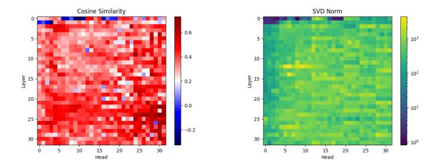
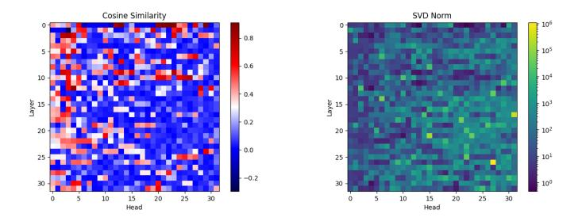

# **A Attention Approximation**

In this section we investigate whether our up-training procedure leads to linear attention that approximates the softmax attention from the base model, as might be expected.

There are many possible ways to compare attention matrices. Moreover, some architecture changes such as attention decay and lack of normalization in the linear attention make a meaningful comparison difficult. We represent non-normalized comparisons in Figure [3.](#page-14-1) It represents the cosine similarities and singular value distances between the attention matrices at every layer and for every head of the Mistral model compared with our Mistral-SUPRA. Each pixel of these images is a scalar similarity measure between two matrices represented by a color scale. In Figure [3,](#page-14-1) we see large differences between the matrices.

Since we removed the attention matrix normalization and replaced it with a LayerNorm [Ba et al.](#page-10-11) [\(2016\)](#page-10-11), we want to compare normalized attention matrices instead. We divide each line of the matrix by the absolute value of the sum of its elements such that the softmax attention matrix is unaffected and the linear attention matrix is normalized. In Figure [4,](#page-14-2) we see significantly higher between most matrices with some exceptions. These observations indicate that the linear attention matrices derived from SUPRA are *not an approximation* of the softmax matrices.

Figure 3: Representation of the cosine similarity and the distance between the singular values of the softmax attention matrices compared to the SUPRA attention matrices.

Figure 4: Representation of the cosine similarity and the distance between the singular values of the *normalized* softmax attention matrices compared to the *normalized* SUPRA attention matrices.