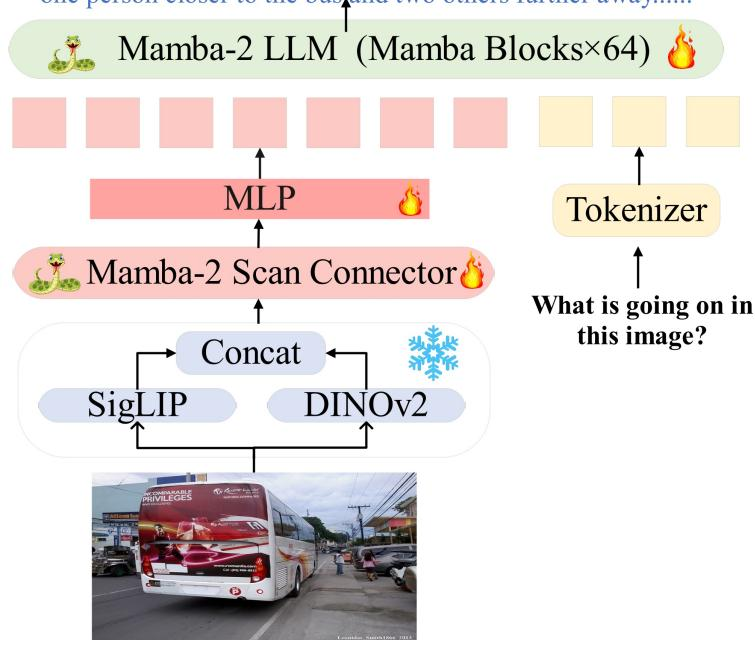
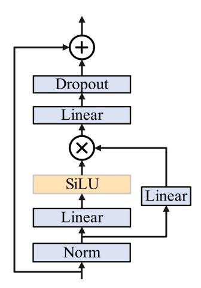

# 2 Related Work

#### 2.1 Large Language Models (LLMs)

In recent years, significant breakthroughs have been made in natural language processing tasks [\[21,](#page-13-3) [24\]](#page-13-4), characterized by large model scales, typically containing billions of parameters, and training using massive datasets. GLM [\[8\]](#page-12-1), LLaMA [\[47\]](#page-14-1), Alpaca [\[45\]](#page-14-2), Vicuna [\[4\]](#page-12-2) and other instruction fine-tuning versions have emerged one after another, with the goal of being comparable to the proprietary InstructGPT model without public access. At the same time, due to the significant computational requirements of large language models, research trends have shifted towards exploring the possibility of smaller scale models, such as Stable LM [\[2\]](#page-12-3), TinyLaMA [\[51\]](#page-14-3), and Phi [\[16,](#page-13-5) [28\]](#page-13-6), which have parameter sizes below 3 billion but can achieve comparable results to large models through high-quality data and feasible training methods.

#### 2.2 State Space Models (SSMs)

State Space Models (SSMs) have demonstrated excellent performance in areas such as long sequence modeling, image generation, and reinforcement learning. A notable feature of SSMs is their ability to perform efficient autoregressive inference like Recurrent Neural Networks (RNNs) while also being able to process entire input sequences in parallel like attention-based Transformers, thus enabling efficient training. Despite their efficiency, SSMs achieve good results in various sequence modeling tasks. Specifically, Albert et al. [\[15\]](#page-12-4) proposed a structured state space sequence model for time series analysis. Goel et al. [\[11\]](#page-12-5) applied SSMs to audio generation and achieved satisfactory performance. Additionally, the H3 model [\[9\]](#page-12-6) was introduced to bridge the gap between SSMs and Transformers in language modeling.

In recent months, a new selective state space model called Mamba [\[14\]](#page-12-7) has been proposed as a strong competitor to the Transformer architecture. Compared to LLMs of the same capacity, language models based on Mamba have shown competitive performance, faster inference speeds, and the ability to scale linearly over time with constant memory usage. In May 2024, the latest Mamba architecture (Mamba-2) [\[7\]](#page-12-8) was introduced, featuring an improved core layer of the Mamba selective SSM, which is 2-8 times faster while continuing to compete with Transformers in language modeling.

#### 2.3 Multimodal Large Language Model (MLLM)

The Multi Modal Large Language Model (MLLM) combines visual and linguistic information and has achieved significant success in various fields [\[48,](#page-14-4) [49,](#page-14-5) [36\]](#page-13-7). However, the basis of these models is usually a known Transformer network, resulting in a square level computational complexity [\[22\]](#page-13-8). In order to improve the efficiency of the base model, ML-Mamba is proposed, which is an MLLM with linear computational complexity. Specifically, ML-Mamba integrates the efficient Mamba-2 language model into visual modalities and explores different modal fusion strategies to create effective multimodal Mamba-2 [\[7\]](#page-12-8). Experiments have shown that ML-Mamba not only competes with current computationally efficient MLLMs such as LLaVA Phi, TinyLaVA, and MobileVLM v2, but also runs faster due to its linear sequence modeling characteristics. Interestingly, the results of the closed set prediction benchmark test show that ML-Mamba performs well in overcoming visual illusions and spatial relationship judgments, even comparable to LLaVA in performance with only 40% of its parameters.

In terms of MLLMs for instruction tuning, recent research [\[23\]](#page-13-9) has questioned the necessity of the pre alignment phase in MLLM training, pointing out that directly fine-tuning the entire LLM backbone and projector may be sufficient. In line with this, ML-Mamba only underwent a small amount of alignment training and then fine-tuned it on a large combination dataset containing visual multi-turn dialogues and visual alignment instructions.

#### 2.4 Mamba in the field of vision

The successful application of Mamba in natural language processing (NLP) has inspired its adoption in visual applications [\[43\]](#page-14-6). Vision Mamba (Vim) [\[56\]](#page-14-7) utilizes Vim blocks composed of pure Mamba layers: each Vim block models bidirectional representations using forward and backward scanning, and alleviates direction sensitivity issues in Mamba. Another approach, VMamba [\[34\]](#page-13-10) utilizes Visual State Space (VSS) blocks that integrate Mamba and 2D convolutional layers, supported by a pyramid architecture similar to Swin Transformer [\[35\]](#page-13-11): each VSS block first models 2D local information through 2D deep convolution as a token mixer, and then processes 2D global information horizontally and vertically through a cross scan module. Mamba ND [\[27\]](#page-13-12) further extends the functionality of Mamba to multidimensional data including images and videos. LocalMamba [\[19\]](#page-13-13) segments the input image into multiple local windows and executes a state space model (SSM) in various directions within these windows to enhance local processing capabilities. EfficientVMamba [\[41\]](#page-14-8) introduced an efficient 2D scanning technique that reduces computational requirements by performing atrous sampling on feature map blocks. In addition to these newly designed Mamba architectures, our work also draws inspiration from VL-Mamba [\[42\]](#page-14-9), a multimodal large language model based on state space models, which has shown great potential for long-sequence modeling with fast inference and

linear scaling in sequence length. Compared with these newly designed Mamba architectures, our architecture closely follows Mamba's design ideas in the field of vision, enhancing the extraction of visual features with the latest Mamba-2 module. Our main goal with the Mamba-2 based architecture is to enhance multimodal representation and inference capabilities.

#### 3 Method

In this section, we first introduce the basic concepts of State Space Models (SSMs) (Sec. 3.1). Subsequently, we provide a detailed description of the proposed ML-Mamba method (Sec. 3.2), which mainly comprises a visual encoder, a multi-modal connector called the Mamba-2 Scan Connector (MSC), an MLP projector, and the Mamba-2 large language model.

#### 3.1 Mamba Preliminaries

The Mamba architecture is derived from state space sequence models [15], which models a 1-D function or sequence  $x(t) \in \mathbb{R} \to y(t) \in \mathbb{R}$  at time t via expanded hidden states  $h_t \in \mathbb{R}^N$ . These hidden states evolve over time according to parameters  $\mathbf{A}, \mathbf{B}, \mathbf{C}$  and are governed by linear ordinary differential equations (ODEs):

$$h'(t) = \mathbf{A}h(t) + \mathbf{B}x(t),$$
  

$$y(t) = \mathbf{C}h(t).$$
(1)

To discretize parameters in this continuous system, a common approach is to introduce a time scale parameter  $\Delta$  to transform continuous  $\mathbf{A}, \mathbf{B}$  into discrete  $\overline{\mathbf{A}}, \overline{\mathbf{B}}$  using the zero-order hold (ZOH) model [39]:

$$\overline{\mathbf{A}} = \exp(\Delta \mathbf{A}), 
\overline{\mathbf{B}} = (\Delta \mathbf{A})^{-1} (\exp(\Delta \mathbf{A}) - \mathbf{I}) \cdot \Delta \mathbf{B}.$$
(2)

Using this transformation, Eq. 1 can be rewritten as:

$$h'(t) = \overline{\mathbf{A}}h_{t-1} + \overline{\mathbf{B}}x_t,$$
  

$$y_t = \mathbf{C}h_t.$$
(3)

We then utilize the matrix  $\overline{\mathbf{K}}$  to enable efficient computation:

$$\overline{\mathbf{K}} = (\mathbf{C}\overline{\mathbf{B}}, \mathbf{C}\overline{\mathbf{A}}\overline{\mathbf{B}}, ..., \mathbf{C}\overline{\mathbf{A}}^k \overline{\mathbf{B}}, ...),$$

$$\mathbf{v} = \mathbf{x} * \overline{\mathbf{K}},$$
(4)

where  $k \in [0, L)$  and L is the input sequence length. We also have  $\mathbf{y} = \{y_1, ..., y_L\}$ ,  $\mathbf{x} = \{x_1, ..., x_L\}$ , while  $\overline{\mathbf{K}} \in \mathbb{R}^L$  can be regarded as the convolutional kernel.

By combining the modified parallel Mamba blocks with using SSD as the inner SSM layer, the Mamba-2 architecture is formed (as shown in Fig. 4(a)). The performance of Mamba-2 models of varying sizes on the Pile dataset shows that it matches or outperforms Mamba and other open-source Transformer models on standard downstream evaluations.

#### 3.2 ML-Mamba Model

## 3.2.1 Overall Architecture

The architecture of Mamba consists of four main components: a pre-trained visual encoder, a randomly initialized multi-modal connector called Mamba-2 Scan Connector (MSC), and a pre-trained large language model (Mamba-2 LLM), as shown in Fig. 1. With an image as input, visual features are first extracted through the visual encoder. The extracted sequence of visual features is then fed into the multi-modal connector (MSC), whose output is mapped to the LLM using a multi-layer perceptron (MLP) projector. The output vector from the visual projector is then combined with tokenized text queries and input into the Mamba-2 LLM. Finally, the Mamba-2 LLM generates the corresponding response.

The image features a city street with a white bus parked on the side of the road. The bus is quite large, occupying a significant portion of the street. There are several people walking around the area, with one person closer to the bus and two others further away......

Figure 1: The architecture of ML-Mamba (right) uses Mamba-2 as the backbone (left). It includes a visual encoder, a multi-modal connector called the Mamba-2 Scan Connector (MSC), an MLP projector, and a language model. We use the pre-trained Mamba-2 large language model (Mamba-2 LLM) as the language model and a pre-trained visual transformer model as the visual encoder.

Figure 2: Three architectures of MultiModal Connector: (a) MLP; (b) MSC-MLP (Basic); (c) MSC-MLP (Advanced).

### 3.2.2 Vision Encoder

We integrate DINOv2 [40] and SigLIP [50] to serve as our vision backbone. The rationale behind this fusion is that combining the low-level spatial features captured by DINOv2 with the semantic features provided by SigLIP enhances performance on downstream tasks [46, 23]. Given an input image  $X_v \in \mathbb{R}^{C \times H \times W}$ , the vision encoder divides the image into  $N_v = HW/P^2$  patches of equal size, where  $P^2$  represents the patch size. Both vision encoders process the patchified image as an input token sequence and concatenate their outputs to form compact visual representations  $V_{img} \in \mathbb{R}^{N_v \times D_v}$ :

$$V_{img} = [\varphi_{\text{SigLIP}}(X_v); \varphi_{\text{DINOv2}}(X_v)], \tag{5}$$

These outputs are then channeled to a dedicated task-specific head, with  $D_v$  representing the dimensionality of the tokens generated as described above.

Figure 3: Illustration of two different Vision Selective Scan (VSS) Mechanisms: Bidirectional-Scan Mechanism (BSM) (top) and Cross-Scan Mechanism (CSM) (bottom).

#### 3.2.3 MultiModal Connector

Multimodal connectors act between visual features and language models to ensure seamless integration of visual and linguistic information. In this study, we explored a novel multimodal connector called Mamba-2 Scan Connector (MSC) architecture aimed at addressing the challenge of unclear causal relationships in computer vision. The traditional state space model (SSM) is typically used to process sequence data with causal relationships, such as language sequences, but this approach is clearly not applicable to non causal visual sequences generated by visual encoders.

The core of the MSC module is a combination of the two-dimensional Mamba-2 visual selective scanning (MVSS) module and the SwiGLU module. We attempted to integrate this module into the multimodal connector of the ML-Mamba multimodal learning framework.

Specifically, we studied three variants of multimodal connectors:

- MLP: a three-layer Multi-Layer Perceptron (MLP) (see Fig. [2\(](#page-4-1)a)) that aligns the features of vision and text.
- MSC-MLP (Basic): It combines the multimodal connector called the Mamba-2 Scan Connector (MSC) module, which does not include the SwiGLU module and is intended to enhance the processing capability of two-dimensional non-causal visual information. Subsequently, the MLP aligns the features of vision and text (see Fig. [2\(](#page-4-1)b))).
- MSC-MLP (Advanced): This variant combines the MSC module and MLP, where the MSC module includes the SwiGLU (see Fig. [5\)](#page-6-1) module for more complex feature extraction and pattern learning (see Fig. [2\(](#page-4-1)c)).

The MSC module bridges the gap between 1D sequential processing capability (typical of SSM) and 2D non causal visual information by introducing two 2D scanning mechanisms. These scanning mechanisms include:

- Bidirectional-Scan Mechanism (BSM): Scanning the complementary features of the image in both forward and backward directions to capture a broader context without increasing computational complexity (shown at the top of Fig. [3\)](#page-5-0).The corresponding model structure is depicted in Fig. [4\(](#page-6-0)b).
- Cross-Scan Mechanism (CSM): unfolds image patch features into sequences along rows and columns and scans them in four directions (diagonally across the image) (shown at the bottom of Fig. [3\)](#page-5-0). The corresponding model structure is depicted in Fig. [4\(](#page-6-0)c).

After scanning, these feature sequences are processed by the Mamba-2 layer and reshaped into the patch order of the original image, and finally merged into a comprehensive representation for subsequent multimodal learning tasks. The goal of this method is to improve the modeling ability of complex visual data, especially when it involves multimodal input and nonlinear relationship modeling, to enhance the performance and robustness of computer vision tasks.

Figure 4: The comparison of block architectures between Mamba-2 block, and Mamba-2 Scan Connector (BSM, With SwiGLU) and Mamba-2 Scan Connector (CSM, With SwiGLU).

Figure 5: SwiGLU structure in MSC-MLP (Advanced).

As shown in Fig. [2\(](#page-4-1)a), the input of the multimodal connector is the sequential image patch features Vimg extracted from the input images via the transformer-based vision encoder. These feature vectors are then passed into a three-layer Mult-Layer (MLP):

$$V_{out} = \mathbf{MLP}(V_{img}). \tag{6}$$

As shown in Fig. [2\(](#page-4-1)b), the input of the multimodal connector is the sequential image patch features Vimg extracted from the input images via the transformer-based vision encoder. These feature vectors are then passed through a Mamba-2 Scan Connector (MSC) module to obtain the visual scanned feature Vscan. After the MSC module, the output vectors Vscan is then passed into a three-layer Mult-Layer (MLP):

$$V_{scan} = \mathbf{MSC_{Basic}}(\mathbf{V_{img}}),$$

$$V_{out} = \mathbf{MLP}(V_{scan}).$$
(7)

As shown in Fig. [2\(](#page-4-1)c), the feed-forward pass progress can be formulated as follows:

$$V_{scan} = \mathbf{MSC_{Basic}}(\mathbf{V_{img}}),$$

$$V_{scan}^{'} = \mathbf{SwiGLU}(\mathbf{V_{scan}}),$$

$$V_{out} = \mathbf{MLP}(V_{scan}^{'}).$$
(8)

#### 3.2.4 Mamba-2 Large Language Model

The Mamba-2 language model [\[7\]](#page-12-8) serves as the primary language processing component responsible for understanding and generating text. The workflow design of the visual encoder and multimodal connector ensures that visual information can be effectively transmitted to the Mamba-2 language model, enabling the model to process and understand complex multimodal data.

$$R = f_L(V_{out}, f_T(Q)). (9)$$

## 3.2.5 Training Process

We first use a 558K subset of the LAION-CC-SBU dataset to align the Mamba-2 Scan Connector (MSC) and the MLP projector. During the fine-tuning stage, we simultaneously optimized the Mamba-2 Scan Connector (MSC), the projector, and the Mamba LLM. This comprehensive training effort was executed on 8 NVIDIA A100 GPUs. The fine-tuning was conducted over two epochs, randomly sampling from the Mixed Dataset Used in LLaVA v1.5, which includes a total of 665K visual multi-round dialogue samples and pure text dialogue data.

