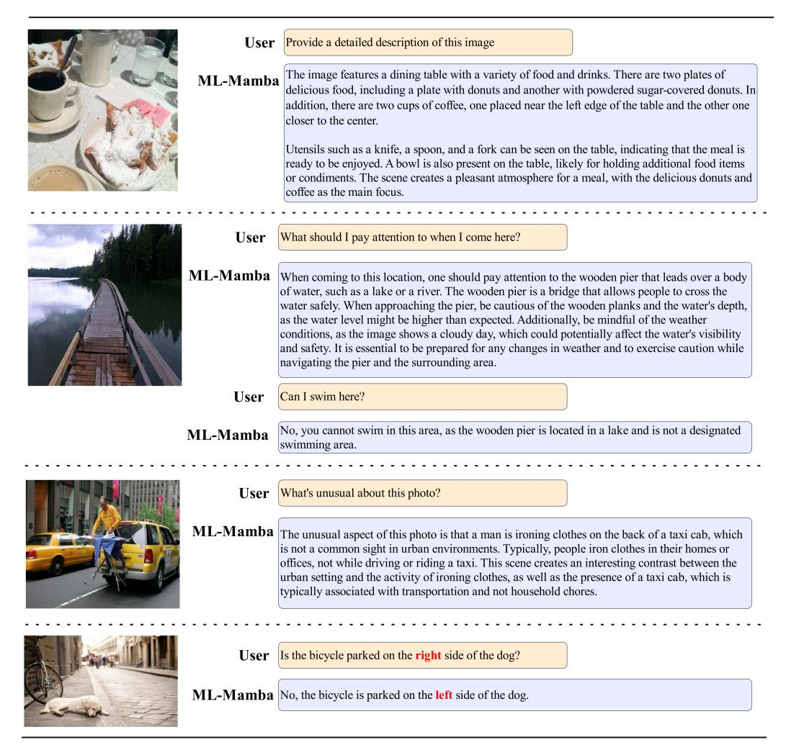

# 4.2 Results

In addition, we further evaluated the model on six carefully designed metrics, particularly VizWiz [\[17\]](#page-13-15) and VQAv2 [\[13\]](#page-12-9), for assessing general visual reasoning ability. VizWiz includes common sense

Table 1: The configuration of the model and hyperparameters for training.

| Configuration                     |                  |
|-----------------------------------|------------------|
| Vision Encoder                    | DINOv2 + SigLIP  |
| LLM init                          | Mamba-2 2.7b     |
| MLP + Mamba-2 Scan Connector init | Random           |
| Image resolution                  | $384 \times 384$ |
| Alignment / Fine-Tuning Samples   | 558K / 665K      |
| Optimizer                         | AdamW            |
| LR schedule                       | Cosine decay     |
| Learning Rate                     | 2e-5             |
| Weight decay                      | 0.1              |
| Warmup ratio                      | 0.03             |
| Alignment and Fine-tuning epochs  | 1 each           |

Table 2: **Comparison with SoTA methods on six benchmarks:** VQA-v2 [12]; GQA [20]; VQAT: TextVQA [44]; POPE [29]; VizWiz [17]; VSR [31]. PT and IT indicate the number of samples in the pretraining and instruction tuning stages, respectively.

| Method           | LLM              | PT    | IT    | VQA v2 | GQA   | $VQA^T$ | POPE | VizWiz | VSR  |
|------------------|------------------|-------|-------|-------------------|-------|---------|------|--------|------|
| BLIP-2 [26]      | Vicuna-13B       | 129M  | -     | 41.0              | 41.0  | 42.5    | 85.3 | 19.6   | 50.9 |
| MiniGPT-4 [55]   | Vicuna-7B        | 5M    | 5K    | 32.2              | 32.2  | -       | -    | -      | -    |
| InstructBLIP [6] | Vicuna-7B        | 129M  | 1.2M  | _                 | 49.2  | 50.1    | _    | 34.5   | 54.3 |
| InstructBLIP [6] | Vicuna-13B       | 129M  | 1.2M  | _                 | 49.5  | 50.7    | 78.9 | 33.4   | 52.1 |
| Shikra [3]       | Vicuna-13B       | 600K  | 5.5M  | 77.4              | _     | _       | _    | _      | _    |
| IDEFICS-9B [25]  | LLaMA-7B         | 353M  | 1M    | 50.9              | 38.4  | 25.9    | _    | 35.5   | -    |
| IDEFICS-80B [25] | LLaMA-65B        | 353M  | 1M    | 60.0              | 45.2  | 30.9    | _    | 36.0   | -    |
| Qwen-VL [1]      | Qwen-7B          | 1.4B  | 50M   | 78.8              | 59.3  | 63.8    | _    | 35.2   | -    |
| Qwen-VL-Chat [1] | Qwen-7B          | 1.4B  | 50M   | 78.2              | 57.5  | 61.5    | _    | _      | _    |
| LLaVA-1.5 [33]   | Vicuna-7B        | 558K  | 665K  | 78.5              | 62.0  | 58.2    | 85.9 | 50.0   | -    |
| LLaVA-1.5 [33]   | Vicuna-13B       | 558K  | 665K  | 80.0              | 63.3  | 61.3    | 85.9 | -      | -    |
| TinyLLaVA [54]   | Phi2-2.7B        | 1804K | 1330K | 79.9              | 62.0  | -       | 86.4 | -      | -    |
| LLaVA-Phi [57]   | Phi-2-2.7B       | 558K  | 665K  | 71.4              | -     | 48.6    | 85.0 | 35.9   | -    |
| MobileVLM-3B [5] | MobileLLaMA-2.7B | 558K  | 665K  | -                 | 59.0  | 47.5    | 84.9 | -      | -    |
| Cobra [52]       | Mamba LLM-2.8B   | 558K  | 665K  | 75.19             | 58.7  | -       | 87.2 | -      | -    |
| VL-Mamba [42]    | Mamba LLM-2.8B   | 558K  | 665K  | 76.6              | 56.2  | 48.9    | 84.4 | -      | -    |
| ML-Mamba (ours)  | Mamba-2 LLM-2.7B | 558K  | 665K  | 75.26             | 60.68 | 52.2    | 88.3 | 45.17  | 51.5 |

questions and unanswerable questions, requiring the model to avoid incorrect answers to evaluate its reliability. GQA evaluates spatial understanding and multi-step reasoning in real-world images. The issues in TextVQA are related to the text in the image, evaluating the model's optical character recognition (OCR) and inference capabilities. POPE provides a benchmark for evaluating object hallucinations and is a binary classification task that prompts the model to answer whether the object exists. We also introduced two closed set prediction benchmarks consisting of VSR [31] and POPE [30]. VSR evaluates the model's ability to understand spatial relationships between different images, while POPE evaluates the VLM's ability to avoid severe illusion problems. VSR and POPE calculate scores based on the probability of providing the correct answer.

We evaluated VizWiz, VQAv2, and TextVQA using validation sets, while using the recommended test dev partition for GQA, zero sample test partition for VSR, and evaluation partition for POPE.

To demonstrate the model's effectiveness, we compared it with a VLM of the same scale with approximately 3B parameters, or with a larger VLM containing twice the number of parameters. As shown in Table 2, despite having only 40% of LLaVA v1.5 7B's parameters, ML-Mamba performs comparably across multiple benchmarks and even surpasses all models on POPE.

As shown in Table 2, compared with VLM with similar parameter numbers, ML-Mamba consistently achieved better performance than LLaVA Phi in VQAv2, GQA, VQAT, POPE and VizWiz. While

Figure 6: Examples of response generated by ML-Mamba.

VL-Mamba performs better on VQAv2, our ML-Mamba outperforms VL-Mamba on GQA, VQAT , and POPE. MobileVLM is another parallel work aimed at producing small-scale LLMs, and is therefore also introduced in experiments. In summary, these results indicate that ML-Mamba matches the performance of state-of-the-art models at the same level (∼3B) on multiple benchmarks and remains competitive when compared to larger scale models (7B and above).

We present some examples to illustrate the qualitative results of ML-Mamba. As shown in Fig. [6,](#page-9-0) ML-Mamba effectively understands the user's questions and responds accurately.

## 4.3 Reasoning speed

In order to evaluate the efficiency advantage of the ML-Mamba model, especially the speed improvement brought by its linear sequence modeling, we conducted a detailed inference speed comparison experiment. In the experiment, we compared ML-Mamba with two baseline models of the same scale parameters, TinyLaVA 3B and MobileVLM v2 3B.

All models were evaluated in the same hardware environment, namely a single Nvidia A100 PCIe 80GB GPU. Each model receives the same example image as input, with a unified image resolution of 336 × 336 pixels, and is processed by a CLIP encoder. For TinyLaVA, the model receives 576 image markers processed by the projector; MobileVLM v2 reduces the number of image labels to 144 through LDP blocks. In contrast, ML-Mamba uses dual encoders to process images with a resolution of 384 × 384, resulting in an increase in the actual number of image labels processed to 729.

Table 3: Latency comparison of small-scale VLMs with ∼3B parameters.

| Model        | LM               | Evalavg(tokens/s) | T otal (s) |  |
|--------------|------------------|-------------------|------------|--|
| TinyLLaVA    | Phi-2 2.7B       | 38                | 6.45       |  |
| MobileVLM v2 | MobileLLaMA 2.7B | 50                | 5.15       |  |
| ML-Mamba     | Mamba-2 2.7B     | 171               | 1.47       |  |

In the experiment, all models received the same question: "Provide a detailed description of the image." and set the number of output labels to 256. The total time is the entire process from image encoding until the complete answer is generated.And we calculated the average number of tokens generated per second by Evalavg = 256/Ttotal.

The results from Table [3](#page-10-0) demonstrated that although the number of image markers processed by ML-Mamba significantly increased, it still exhibited extremely fast inference speed. Compared to MobileVLM v2, although the latter has undergone multiple lightweight optimizations, the time required for ML-Mamba to complete inference is only about 30% of the former. This indicates that ML-Mamba not only maintains high speed while processing larger data, but also, thanks to the characteristics of its RNN like model, its memory usage does not significantly increase with the increase of image marker length, as such models maintain a fixed size hidden state to store historical information during the inference process.

The excellent performance of the ML-Mamba model in inference speed proves its advantage in linear sequence modeling, especially when dealing with a large number of image labels. Compared to Transformer based models, ML-Mamba demonstrates significant speed improvements, providing strong support for multimodal tasks that require rapid response.

#### 4.4 Ablation Study

#### 4.4.1 Effects of Language Model Variants

Table [4](#page-10-1) presents the results of ablation experiments evaluating the effectiveness of different language model variants. We conducted experiments on three different variants, namely Mamba-2 with parameters of 780m, 1.3b, and 2.7b, trained on the Pile dataset (containing 300B tokens). Specifically, we constructed a baseline model using the same variant of DINOv2+SigLIP as the visual encoder, Mamba-2 language model as the backbone of a large language model, and a regular MLP multimodal connector without a 2D visual selection scanning module. We can see that as the model size and number of training tokens increase, Mamba2-2.7B outperforms other variants on all benchmarks. Therefore, we chose Mamba2-2.7B for other experiments.

Table 4: Ablation study of the variants of the language model.

| Method        | VQAv2 | GQA   | VQAT | POPE | VizWiz | VSR  |
|---------------|-------|-------|------|------|--------|------|
| Mamba2 - 780m | 71.7  | 51.92 | 48.1 | 81.6 | 41.5   | 47.7 |
| Mamba2 - 1.3b | 73.6  | 55.41 | 50.8 | 83.7 | 43.7   | 49.3 |
| Mamba2 - 2.7b | 75.26 | 60.68 | 52.2 | 88.3 | 45.17  | 51.5 |

#### 4.4.2 Effects of Different Visual Encoders

Recent research has found that although language image models similar to CLIP can provide rich semantic information, they may lose detailed information about the image itself. Therefore, we further introduce DINOv2 as a supplementary encoder and connect the visual representations of these two encoders for subsequent LLM. As shown in Table [5,](#page-11-0) the introduction of DINOv2 significantly improved the model performance in six benchmark tests. This result suggests a meaningful principle when selecting a visual encoder for downstream tasks. Therefore, we ultimately chose DINOv2+SigLIP as the visual encoder to construct our model and used it for further experiments. Through this combination, we can achieve better performance on multiple benchmarks.

Table 5: Ablation study of the vision encoder.

| Method          | VQAv2 | GQA   | VQAT  | POPE | VizWiz | VSR   |
|-----------------|-------|-------|-------|------|--------|-------|
| DINOv2          | 73.73 | 58.84 | 51.13 | 86.6 | 44.23  | 50.73 |
| SigLIP          | 74.61 | 59.43 | 50.78 | 87.4 | 45.07  | 50.54 |
| DINOv2 + SigLIP | 75.26 | 60.68 | 52.20 | 88.3 | 45.17  | 51.50 |

#### 4.4.3 Ablation on different multimodal connector structures

We also explored the impact of different architectures of multi-mode connectors. We evaluated three different MMC variants: MLP, MSC-MLP (Basic), and MSC-MLP (Advanced). As shown in Table [6,](#page-11-1) by comparing these three architectures, we observed that MSC-MLP (Advanced) performed relatively better on most benchmark tests, especially on VQA, demonstrating the effectiveness of combining MSC modules with swiGLU. Note that these models use DINOv2+SigLIP as the visual encoder, Mamba2-2.7B as the language model, and a bidirectional selective scanning mechanism. Consequently, we ultimately chose MSC-MLP (Advanced) as our model and used it for further experiments.

Table 6: Ablation study of the different architectures of multimodal connector.

| Method            | VQAv2 | GQA   | VQAT  | POPE | VizWiz | VSR   |
|-------------------|-------|-------|-------|------|--------|-------|
| MLP               | 73.42 | 58.87 | 50.31 | 86.1 | 43.87  | 50.13 |
| MSC-MLP(Basic)    | 75.09 | 60.14 | 51.72 | 86.5 | 44.57  | 50.76 |
| MSC-MLP(Advanced) | 75.26 | 60.68 | 52.20 | 88.3 | 45.17  | 51.50 |

#### 4.4.4 Under different scanning mechanisms

We compared the bidirectional scanning mechanism (BSM) and cross scanning mechanism (CSM) in MMC modules. As shown in Table [7,](#page-11-2) although BSM and CSM perform similarly in some benchmark tests, such as scoring 76.6 in one test, BSM shows superior performance in most benchmark tests. This highlights its advantages in handling 2D visual information for multimodal learning tasks.

Table 7: Ablation study of the scan mechanisms.

| Method                             | VQAv2 | GQA   | VQAT  | POPE | VizWiz | VSR   |
|------------------------------------|-------|-------|-------|------|--------|-------|
| Bidirectional-Scan Mechanism (BSM) | 75.26 | 60.68 | 52.20 | 88.3 | 45.17  | 51.50 |
| Cross-Scan Mechanism (CSM)         | 75.14 | 60.13 | 52.31 | 88.5 | 44.89  | 51.14 |

