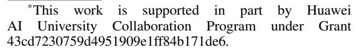
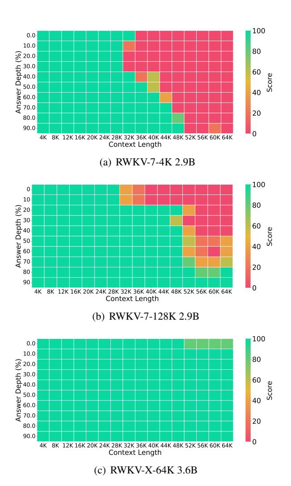

# 1 Introduction

Transformers have become the foundation of modern large language models (LLMs), but their quadratic complexity in sequence length poses significant limitations when scaling to long-context inputs. To address this, a range of alternatives has emerged, including Linear Attention models [\(Katharopoulos et al.,](#page-8-0) [2020\)](#page-8-0), State Space Models (SSMs) such as Mamba [\(Gu and Dao,](#page-8-1) [2023\)](#page-8-1), and Linear RNNs such as DeltaNet [\(Yang et al.,](#page-9-0) [2024b\)](#page-9-0) and RWKV [\(Peng et al.,](#page-8-2) [2023,](#page-8-2) [2025,](#page-8-3) [2024\)](#page-8-4). Linear RNN-based architectures demonstrate com-

†. Contributed Equally

Figure 1: Passkey retrieval performance of RWKV-X models on documents up to 64K tokens. Results are shown for: (a) RWKV-7 pretrained with a 4K context length; (b) RWKV-7 after continual pretraining with a 128K context length; and (c) RWKV-X trained with continual pretraining on a 64K context length.

petitive performance compared to Transformers under similar model sizes and training budgets, while significantly reducing inference costs.

However, despite their efficiency, current linear architectures still struggle with long-context understanding. As shown in Figure [1\(a\),](#page-0-0) RWKV-7 (2.9B) achieves high accuracy on passkey retrieval up to 28K tokens, but performance rapidly degrades beyond that point. While continual pretraining with 128K-length data offers modest improvements (Figure [1\(b\)\)](#page-0-1), long-context limitations remain. This limitation is not unique to RWKV; similar observations have been reported in other architectures such as Mamba [\(Chen et al.,](#page-7-0) [2024\)](#page-7-0), highlighting a broader challenge for this class of models [\(Arora](#page-7-1) [et al.,](#page-7-1) [2023\)](#page-7-1).

A promising approach to mitigating this limitation is the use of hybrid models that combine full attention with linear attention layers, as demonstrated in systems such as Jamba [\(Lieber et al.,](#page-8-5) [2024\)](#page-8-5) and Zamba [\(Glorioso et al.,](#page-8-6) [2024\)](#page-8-6). While these architectures improve long-context performance to some extent, their reliance on full attention layers preserves quadratic complexity, resulting in memory bottlenecks during inference over very long sequences.

In this work, we propose RWKV-X, a novel hybrid model with linear complexity that combines the strengths of RWKV for modeling shortrange dependencies and sparse attention for capturing long-range context. As shown in Figure [1\(c\),](#page-0-2) RWKV-X is continually pretrained on 64K-token sequences and achieves near-perfect accuracy on the 64K passkey retrieval benchmark.

Experimental results demonstrate that RWKV-X substantially improves performance on longcontext benchmarks while maintaining competitive accuracy on short-context tasks. In terms of system efficiency, RWKV-X achieves linear-time complexity (O(N)) during training and constanttime complexity (O(1)) during inference decoding. These results highlight RWKV-X as a highly effective and scalable backbone for general-purpose language modeling across both short and long contexts.

Our main contributions are as follows:

- We propose RWKV-X, a novel hybrid model that achieves linear complexity in both training and inference, while effectively modeling long-range dependencies.
- We develop a sparse attention mechanism with linear complexity, which integrates seamlessly with the RWKV architecture to enhance longcontext modeling.
- RWKV-X outperforms baseline models on

- long-context benchmarks, while maintaining strong performance on short-context tasks.
- RWKV-X enables ultra-long-range decoding with constant inference speed and memory usage up to 1M context length.

