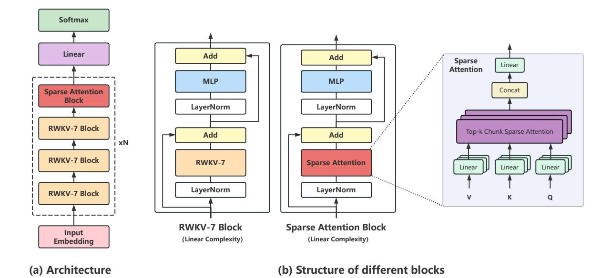
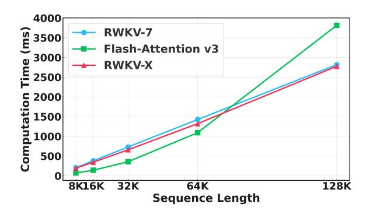

# 3 Method

#### 3.1 Preliminaries

The core of the Transformer [\(Vaswani et al.,](#page-8-11) [2017\)](#page-8-11) architecture is the self-attention mechanism, which enables the model to compare each token with every other token in the input sequence—crucial for modeling long-range dependencies. However, for each query q, attention must be computed against all keys K and values V , resulting in quadratic complexity with respect to sequence length. This makes full attention inefficient for very long sequences. The computation is defined as:

$$\operatorname{Attn}(q, K, V) = \operatorname{softmax}\left(\frac{qK^{\top}}{\sqrt{d_k}}\right)V \qquad (1)$$

Here, dk represents the dimensionality of the query and key vectors, which is used to scale the dot product to prevent extremely large values that could destabilize the softmax operation.

To overcome these limitations, recent work explores architectures that combine linear attention with dynamic state control. RWKV-7 offers an efficient alternative to Transformers for long-sequence tasks by blending the recurrence of RNNs with the parallelism of Transformers. It leverages a generalized Delta Rule [\(Schlag et al.,](#page-8-12) [2021\)](#page-8-12) with vectorvalued gating and context-dependent learning rates to enhance expressivity and efficiency. Inspired by DeltaNet, RWKV-7 further decouples state removal and addition, enabling channel-wise updates of state information.

The core mechanism of RWKV-7 introduces and optimizes the generalized Delta Rule as the foundation for state evolution. The state St evolution and transition matrix Mt are formulated as follows:

$$S_t = S_{t-1}M_t + v_t^{\top} \cdot \tilde{k}_t \tag{2}$$

$$M_t = \operatorname{diag}(w_t) - \hat{\kappa}_t^{\top} (a_t \odot \hat{\kappa}_t)$$
 (3)

where wt is the data-dependent decay vector, at is the context-dependent learning rate, κˆt is the normalized removal key, ˜kt is the replacement key, and vt is the value vector.

In this paper, we explore the integration of Transformer and RWKV-7 architectures to build a hybrid model with linear complexity that combines the strengths of both. This model addresses the limitations of each architecture, offering a more efficient and scalable solution for sequence modeling.

Figure 2: The architecture of RWKV-X, a hybrid model that combines RWKV-7 blocks with Sparse Attention blocks.

#### 3.2 Top-k Chunk Sparse Attention

As shown in Figure 2, we introduce Top-k Chunk Sparse Attention in RWKV-X, which draws inspiration from Mixture of Block Attention (MoBA) (Lu et al., 2025) and incorporates KV cache management to achieve constant-time complexity during inference decoding. Instead of computing attention over the full sequence, Top-k Chunk Sparse Attention enables each query to attend only to a small, relevant subset of the input, significantly reducing computational cost.

First, given an input sequence of length N, it is divided into n equal-sized chunks, where each chunk has a size of B. For each query token q, the model computes a relevance score  $s_i$  for each chunk i using the inner product between q and the mean-pooled key vectors in that chunk:

$$s_i = q \cdot \left(\frac{1}{B} \sum_{j=1}^{B} k_j^{(i)}\right), \quad i = 1, \dots, n$$
 (4)

where  $k_{j}^{\left(i\right)}$  denotes the j-th key vector within the i-th chunk

Next, the indices of the top-k chunks with the highest scores are selected:

$$\mathcal{I} = \text{TopK}\left(\{s_i\}_{i=1}^n, k\right) \tag{5}$$

where  $\mathcal{I} \subseteq \{1, \dots, n\}$  is the set of selected chunk indices.

Finally, attention is computed only over the keyvalue pairs from the selected chunks:

$$\operatorname{Attn}(q, K_{\mathcal{I}}, V_{\mathcal{I}}) = \operatorname{softmax}\left(\frac{qK_{\mathcal{I}}^{\top}}{\sqrt{d_k}}\right) V_{\mathcal{I}} \quad (6)$$

Top-*k* Chunk Sparse Attention reduces the quadratic complexity of standard attention by restricting each query to attend only to a small set of highly relevant chunks. As a result, it preserves the model's ability to capture long-range dependencies while significantly improving efficiency, particularly on long-context sequences.

#### 3.2.1 KV Cache Management

In the decoding stage of inference, without KV cache management, the sequence length continuously increases. Under such conditions, applying Top-k Chunk Sparse Attention alone cannot maintain constant space complexity.

To address this, we propose a KV cache management mechanism inspired by SnapKV (Li et al., 2024), aiming to maintain a constant-size cache during decoding.

We first split the past cache into earlier cached states  $(K_{\rm past}, V_{\rm past})$  and the recent observation window  $(K_{\rm obs}, V_{\rm obs})$ .

We then compute an importance score vector C over  $K_{\mathrm{past}}$  by summing the softmax-normalized attention scores between  $Q_{\mathrm{obs}}$  and  $K_{\mathrm{past}}$ :

$$C = \sum_{i=1} \operatorname{softmax} \left( \frac{Q_{\text{obs}} K_{\text{past}}^{\top}}{\sqrt{d_k}} \right) [i,:]$$
 (7)

The top-m keys and values are selected based on C, where m is a predefined memory budget.

Finally, we reconstruct the compressed past cache by concatenating the selected entries with the observation window, ensuring constant memory usage without loss of critical information. We refer the reader to Appendix D for more details on KV cache management.

#### 3.2.2 Complexity Analysis

Complexity Analysis during Training. The complexity of Top-k Chunk Sparse Attention is O(kBN), where N is the sequence length, B is the chunk size, and k is the number of selected chunks. Since k and B are small constants, the complexity scales linearly with N, approaching O(N).

Complexity Analysis during Decoding. During decoding, the past KV cache is compressed to a fixed size m. Each step computes attention over  $O(kB+L_{\rm obs})$  entries, where  $L_{\rm obs}$  is the observation window size. As k, B, and  $L_{\rm obs}$  are small constants, the total decoding complexity over N tokens remains O(N).

We summarize the computational complexity and memory usage of different LLM architectures in Table 1, covering both training and decoding scenarios.

Table 1: Comparison of computational complexity and memory usage among different LLM architectures, in terms of training complexity per sequence and decoding complexity per token.

| Method         | Training Complexity | Decoding Complexity | Memory Usage |
|----------------|------------------------|------------------------|-----------------|
| Full Attention | $O(N^2)$               | O(N)                   | O(N)            |
| RWKV-7         | O(N)                   | O(1)                   | O(1)            |
| Top-k Chunk    | O(kBN)                 | O(1)                   | O(1)            |
| RWKV-X         | O(kBN+N)               | O(1)                   | O(1)            |

#### 3.3 RWKV-X

As shown in Figure 2, RWKV-X is a hybrid architecture that combines RWKV-7 blocks (Peng et al., 2025) with sparse attention blocks. To enhance the model's capacity for modeling long-range dependencies, sparse attention blocks are periodically inserted between RWKV blocks.

#### 3.3.1 Block Expansion Method

RWKV-X is not trained from scratch. Instead, it draws inspiration from the block expansion method of LLaMA Pro (Wu et al., 2024), adopting interleaved block expansion and a zero-initialization mechanism. This approach minimizes the number of parameters requiring random initialization, ensuring compatibility with the previous RWKV-7 model. Subsequently, RWKV-X undergoes a twostage training process for block expansion. In the first stage, short texts with a context length of 1024 from the MiniPile dataset (Kaddour, 2023) are used to train the model. During this training phase, all parameters except those of the newly added blocks are frozen. This approach brings the parameters to an aligned state, laying a solid foundation for subsequent long-context pretraining. The specific techniques used for long-context continual pretraining are introduced in the following subsection.

## 3.3.2 Long-context Continual Pretraining

In the second stage of long-context continual pretraining, we utilize the ProLong-64K training dataset (Gao et al., 2025a). Training is conducted with a context length of 64K tokens, and the total training volume amounts to 1 billion tokens. During this phase, all model parameters—including those previously frozen—are unfrozen and jointly optimized.

In the long-context continual pretraining stage, we employ the Long-context Cross-Entropy (LongCE) loss (Fang et al., 2025) to emphasize critical tokens. The LongCE loss assigns dynamic weights to each token based on the traditional cross-entropy loss. Critical tokens receive weights greater than 1, while ordinary or out-of-scope tokens receive weights close to 1. This mechanism enables the model to automatically focus on tokens with long-range contextual dependencies, enhancing its performance on long-context data.

#### 4 Experiments

#### 4.1 Experiment Setup

The training process of RWKV-X consists of two stages: alignment pretraining and long-context continual pretraining. In the alignment pretraining stage, the RWKV-7 blocks are frozen, with only the Sparse Attention blocks being updated. During the long context continual pretraining stage, we finetune all parameters. Details of training data and hyper-parameters can be found in Appendix A.

Figure 3: Prefill latency comparison between RWKV-X and a full-attention Transformer.

