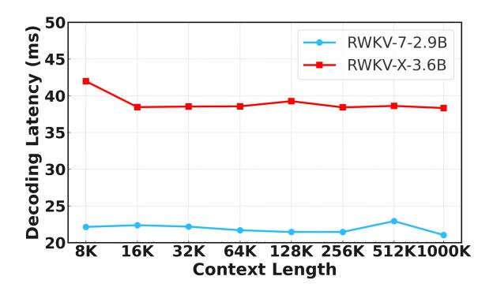

# 4.4 Efficiency Analysis

Figure [3](#page-5-0) presents a comparison of prefill latency across different sequence lengths for RWKV-X, RWKV-7, and a full-attention Transformer using Flash-Attention v3 [\(Shah et al.,](#page-8-20) [2024\)](#page-8-20). While Flash-Attention v3 demonstrates the lowest latency at shorter sequence lengths (8K–16K), its computation time increases steeply for longer inputs due to its quadratic complexity. At 128K, RWKV-X

Figure 4: Decoding latency comparison between RWKV-7-2.9B and RWKV-X-3.6B models. The horizontal axis represents the context length (log scale).

achieves a 1.37× speedup over Flash-Attention v3. Moreover, this speedup is expected to further improve as the input context length increases. RWKV-X exhibits near-linear scaling and consistently outperforms or matches RWKV-7, highlighting its superior efficiency and scalability for long-context inference.

The results in Figure [4](#page-5-1) highlight the efficiency of RWKV-X-3.6B in handling long-context decoding. Despite RWKV-7-2.9B achieving lower absolute latency, RWKV-X-3.6B demonstrates remarkable stability across increasing context lengths, maintaining consistent decoding times even at 1M tokens. RWKV-X-3.6B employs a fixed 64K KV cache, while RWKV-7-2.9B operates without additional caching mechanisms. RWKV-X demonstrates stable decoding latency as the context length increases.

## 4.5 Ablation Study

#### 4.5.1 Ablation on Long context Cross Entropy

We conduct an ablation study to evaluate the impact of the Long-context Cross-Entropy (LongCE) loss on the performance of RWKV-X-3.6B across three tasks in the S-NIAH benchmark. As shown in Table [4,](#page-6-2) incorporating LongCE consistently improves model performance, particularly on tasks that require longer context understanding.

On S-NIAH-1, where the task involves relatively short-context retrieval, both versions of the model— with and without LongCE—achieve perfect accuracy across all context lengths, indicating that LongCE has minimal impact when the contextual challenge is low.

However, for S-NIAH-2 and S-NIAH-3, which demand deeper reasoning over longer input sequences, the benefits of LongCE become evident.

Table 2: Zero-shot Performance Comparison on the S-NIAH Benchmark: S-NIAH-1 (Pass-key Retrieval), S-NIAH-2 (Number in Haystack), and S-NIAH-3 (UUID in Haystack).

| Model               |      |      | S-NIAH-1 |      |       | S-NIAH-2 |      |      |      |      | S-NIAH-3 |      |
|---------------------|------|------|----------|------|-------|----------|------|------|------|------|----------|------|
|                     | 1K   | 2K   | 4K       | 8K   | 1K    | 2K       | 4K   | 8K   | 1K   | 2K   | 4K       | 8K   |
| RWKV-7-0.19B        | 100  | 100  | 100      | 100  | 100   | 98.4     | 5.2  | 3.2  | 98.4 | 96.8 | 27.6     | 6.6  |
| RWKV-X-0.22B        | 100  | 100  | 100      | 100  | 100   | 99.6     | 18.8 | 3.6  | 99.0 | 92.6 | 40.2     | 1.6  |
| DeltaNet-1.3B       | 97.4 | 96.8 | 99.0     | 98.8 | 98.4  | 45.6     | 18.6 | 14.4 | 85.2 | 47.0 | 22.4     | -    |
| Mamba2-1.3B         | 99.2 | 98.8 | 65.4     | 30.4 | 99.4  | 98.8     | 56.2 | 17.0 | 64.4 | 47.6 | 4.6      | -    |
| Gated DeltaNet-1.3B | 98.4 | 88.4 | 91.4     | 91.8 | 100.0 | 99.8     | 92.2 | 29.6 | 86.6 | 84.2 | 27.6     | -    |
| RWKV-6-1.6B         | -    | -    | 98.0     | -    | -     | -        | 53.0 | -    | -    | -    | 55.0     | -    |
| RWKV-6-3B           | -    | -    | 100      | -    | -     | -        | 88.0 | -    | -    | -    | 79.0     | -    |
| RWKV-7-2.9B         | -    | -    | 100      | -    | -     | -        | 88.0 | -    | -    | -    | 79.0     | -    |
| RWKV-X-3.6B         | 100  | 100  | 100      | 100  | 100   | 100      | 100  | 99.8 | 100  | 100  | 99.8     | 95.6 |

Table 3: Evaluation results on short-context benchmarks, including LAMBADA, HellaSwag, PIQA, ARC-Easy (arcE), ARC-Challenge (arcC), Winogrande, SciQ, and MMLU.

| Model        | Tokens | LAMBADA | HellaSwag | PIQA | arcE | arcC | Winogrande | SciQ | MMLU | avg  |
|--------------|--------|---------|-----------|------|------|------|------------|------|------|------|
| (Name)       | (T)    | acc↑    | acc_n↑    | acc↑ | acc↑ | acc↑ | acc↑       | acc↑ | acc↑ | acc↑ |
| RWKV-5-0.19B | 0.6    | 38.4    | 31.9      | 61.4 | 44.2 | 19.9 | 52.9       | 76.3 | 23.1 | 43.5 |
| SmoLLM2-135M | 2.0    | 42.9    | 43.1      | 68.1 | 64.4 | 28.1 | 53.4       | 80.1 | 25.8 | 50.7 |
| RWKV-7-0.19B | 1.6    | 48.1    | 42.1      | 67.3 | 59.3 | 25.5 | 56.0       | 86.3 | 30.1 | 51.8 |
| RWKV-X 0.22B | 1.6    | 47.0    | 42.1      | 67.9 | 56.9 | 29.4 | 52.6       | 86.1 | 26.0 | 51.0 |
| RWKV-6-3B    | 2.5    | 71.7    | 68.4      | 76.4 | 71.2 | 35.6 | 66.3       | 92.2 | 28.3 | 63.8 |
| Llama3.2-3B  | 15.0   | 70.5    | 73.6      | 76.7 | 74.5 | 42.2 | 68.2       | 95.6 | 56.5 | 69.7 |
| Qwen2.5-3B   | 18.0   | 67.1    | 73.5      | 77.4 | 77.1 | 45.0 | 68.8       | 96.2 | 65.7 | 71.4 |
| RWKV-7-2.9B  | 5.6    | 73.4    | 76.4      | 79.7 | 81.0 | 48.7 | 72.8       | 95.0 | 55.0 | 72.8 |
| RWKV-X 3.6B  | 5.6    | 73.1    | 74.5      | 79.4 | 80.0 | 50.6 | 70.6       | 95.0 | 52.3 | 71.9 |

At 8K context length, the model without LongCE shows a steep drop in performance—falling to 67.0 on S-NIAH-2 and 62.6 on S-NIAH-3. In contrast, the full model with LongCE maintains high accuracy at 99.8 and 95.6, respectively. These results demonstrate that LongCE plays a crucial role in helping the model focus on semantically important tokens over extended contexts, thereby preserving performance as sequence length increases.

Overall, LongCE significantly enhances the longcontext generalization ability of RWKV-X, especially in tasks where key information is sparsely distributed across the input.

