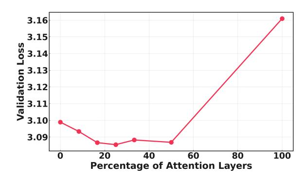

# 4.5.2 Ablation on Percentage of Attention Layers

We begin by investigating how the number of Sparse Attention layers affects model performance in RWKV-X. In this study, we train 126Mparameter hybrid models with 12 total layers, varying the proportion of Sparse Attention layers while distributing them evenly throughout the model. Figure [5](#page-7-2) reports the validation loss as a function of

Table 4: Ablation Study on LongCE Loss using the S-NIAH Benchmark (Higher is Better).

| Model       | Task     | 1K    | 2K    | 4K    | 8K    |
|-------------|----------|-------|-------|-------|-------|
| RWKV-X-3.6B | S-NIAH-1 | 100.0 | 100.0 | 100.0 | 100.0 |
| w/o LongCE  | S-NIAH-1 | 100.0 | 100.0 | 100.0 | 100.0 |
| RWKV-X-3.6B | S-NIAH-2 | 100.0 | 100.0 | 100.0 | 99.8  |
| w/o LongCE  | S-NIAH-2 | 100.0 | 100.0 | 98.4  | 67.0  |
| RWKV-X-3.6B | S-NIAH-3 | 100.0 | 100.0 | 99.8  | 95.6  |
| w/o LongCE  | S-NIAH-3 | 100.0 | 100.0 | 98.4  | 62.6  |

the attention layer ratio, where 0% corresponds to RWKV-7 and 100% corresponds to a fully Sparse-Attention Transformer. Our results show that validation loss is minimized when approximately 25% of the layers are Sparse Attention layers. This suggests that a hybrid architecture offers advantages over both the pure RWKV-7 and the fully attentionbased Transformer in terms of loss.

Figure 5: Validation loss vs. percentage of attention layers for 124M-parameter RWKV-X models (12 layers). 0% = RWKV-7, 100% = Fully Sparse-Attention Transformer.

#### 4.5.3 Ablation on Model Size

Table [5](#page-7-3) presents the validation loss comparison between GPT-2 [1](#page-7-4) and RWKV-X models trained on 10 billion tokens across three model sizes. At each scale—small, medium, and large—RWKV-X consistently achieves lower validation loss than GPT-2. Notably, the performance gap becomes more pronounced as model size increases, with RWKV-X (786M parameters) outperforming GPT-2 (774M parameters) by 0.16 in validation loss at the large scale. These results suggest that RWKV-X exhibits better scaling behavior with model size and more effective utilization of model capacity compared to GPT-2 under the same data budget.

Table 5: Validation loss comparison of GPT-2 and RWKV-X (trained on 10B tokens) across different model sizes. For GPT-2, the small, medium, and large models have 124M, 350M, and 774M parameters. For RWKV-X, the corresponding sizes are 126M, 355M, and 786M.

| Model  | Tokens | Small | Medium | Large |
|--------|--------|-------|--------|-------|
| GPT-2  | 10B    | 3.12  | 2.84   | 2.76  |
| RWKV-X | 10B    | 3.08  | 2.73   | 2.60  |

## 4.5.4 Ablation on Positional Encoding

The results in Table [6](#page-7-5) indicate that the choice of positional encoding has minimal impact on the validation loss of RWKV-X. Surprisingly, the model without any positional encoding ("No Pos") slightly outperforms those using absolute positional embeddings and rotary position encoding (ROPE). This suggests that the RNN-style recurrence mechanism inherent to RWKV-X already provides sufficient

implicit positional information. As a result, the addition of explicit positional encodings does not appear to bring additional benefit in this architecture. In line with recent findings [\(Lieber et al.,](#page-8-5) [2024\)](#page-8-5) and supported by our experimental results, we elect to exclude positional encodings from the RWKV-X models.

Table 6: Validation loss of RWKV-X under different positional encoding schemes. "No Pos" indicates no positional encoding; "Abs Pos" uses absolute positional encoding; "ROPE" applies rotary position encoding.

| Model  | Tokens | No Pos | Abs Pos | ROPE |
|--------|--------|--------|---------|------|
| RWKV-X | 10B    | 3.08   | 3.10    | 3.11 |

