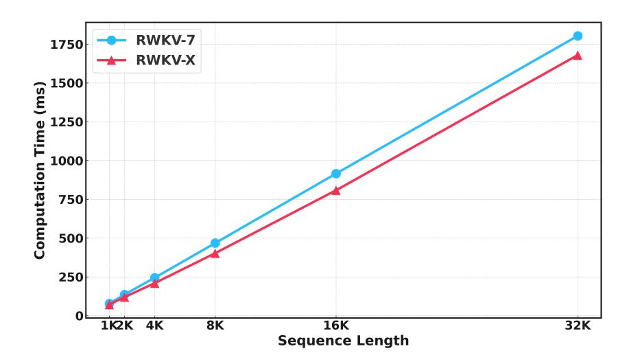

# C More on Efficiency Analysis

#### C.1 Comparison of Sparse and Full Attention

Table [8](#page-11-2) presents a comparison between sparse and full attention used in RWKV-X across varying context lengths in terms of latency and memory consumption. Sparse attention exhibits slightly higher prefill latency at shorter context lengths, but shows a clear advantage in decoding latency at larger scales (e.g., 121.99 ms vs. 170.79 ms at 256k context length). Memory usage is nearly identical between the two methods for smaller contexts, but sparse attention maintains a slight efficiency lead as the sequence length increases. Notably, sparse attention provides more consistent decoding performance as context length scales, making it more suitable for long-context applications where decoding speed is critical.

Figure 6: Training efficiency comparison between RWKV-X and RWKV-7

Table 8: Comparison of Sparse and Full Attention on Latency and Memory Usage

| Context Length | Latency (Prefill) Sparse / Full | Memory (Prefill) Sparse / Full | Latency (Decoding) Sparse / Full | Memory (Decoding) Sparse / Full |
|----------------|------------------------------------|-----------------------------------|-------------------------------------|------------------------------------|
| 4K             | 517.64 / 511.06                    | 8.70 / 8.70                       | 41.73 / 41.82                       | 8.42 / 8.42                        |
| 8K             | 643.26 / 660.30                    | 9.06 / 9.06                       | 39.14 / 34.33                       | 8.77 / 8.72                        |
| 16K            | 1408.31 / 1404.56                  | 9.66 / 9.66                       | 36.04 / 34.31                       | 9.45 / 9.32                        |
| 32K            | 2960.36 / 2955.05                  | 10.96 / 10.96                     | 37.03 / 34.39                       | 10.81 / 10.69                      |
| 64K            | 6107.07 / 6103.40                  | 13.69 / 13.69                     | 38.28 / 41.97                       | 13.54 / 13.42                      |
| 128K           | 12913.58 / 12792.79                | 19.20 / 19.20                     | 58.59 / 68.14                       | 19.06 / 18.93                      |
| 256K           | 31668.96 / 31776.53                | 30.17 / 30.17                     | 121.99 / 170.79                     | 30.02 / 29.90                      |
| 512K           | 95482.76 / 95824.31                | 52.14 / 52.14                     | 289.91 / 323.96                     | 51.99 / 51.87                      |

