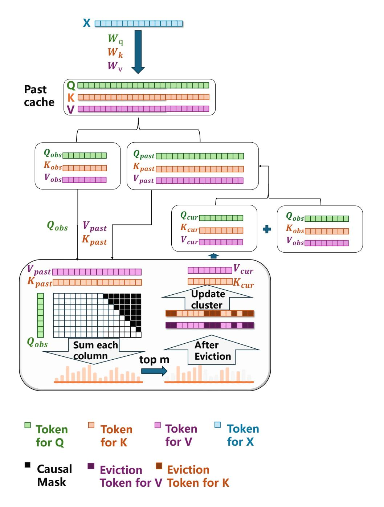

# D KV Cache Management for Top-*k* Chunk Sparse Attention

In Top-k Chunk Sparse Attention, maintaining a manageable KV cache size is crucial for achieving efficient decoding. We adopt a compression strategy to ensure that the past KV cache remains constant in size, regardless of the input sequence length.

Figure [7](#page-12-0) illustrates the KV cache management process. We begin by splitting the past cache into two parts: the *earlier* cached states (Kpast, Vpast) and the *recent* observation window (Kobs, Vobs). The observation window contains the most recent tokens, which are always retained due to their relevance to the current context.

To assess the importance of the earlier cached entries, we calculate a cumulative importance score vector by summing the softmax-normalized attention weights over each key.These scores reflect how much past tokens are attended to by the current observation window. Based on this, we retain the top-m entries with the highest importance, where m is a predefined memory budget. The remaining entries are evicted from the cache.

Following eviction, we update the cache by concatenating the selected top-m keys and values with those from the observation window (Kobs, Vobs), producing a compressed cache that preserves essential information while capping memory usage.

Specifically, we dynamically select the most relevant cached entries based on their cumulative attention scores with respect to the observation window queries, and discard less important entries. This selective compression significantly reduces memory footprint during long-sequence generation while preserving essential contextual information for accurate predictions.

Figure 7: Illustration of KV cache management for Top-k Chunk Sparse Attention.