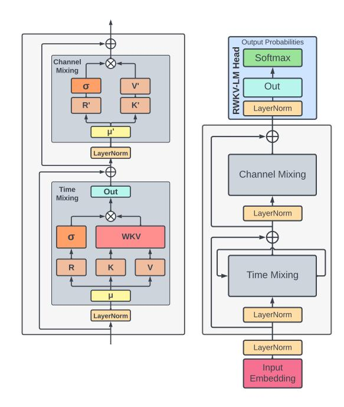
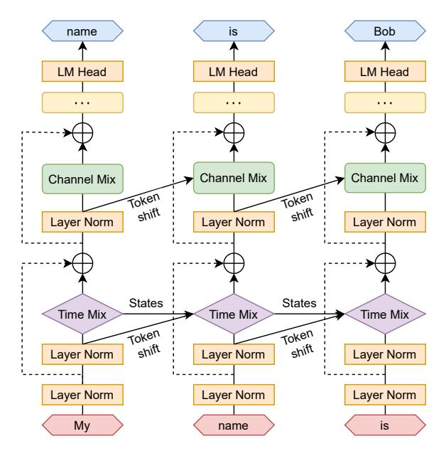
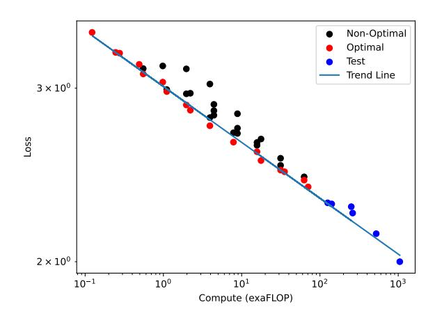
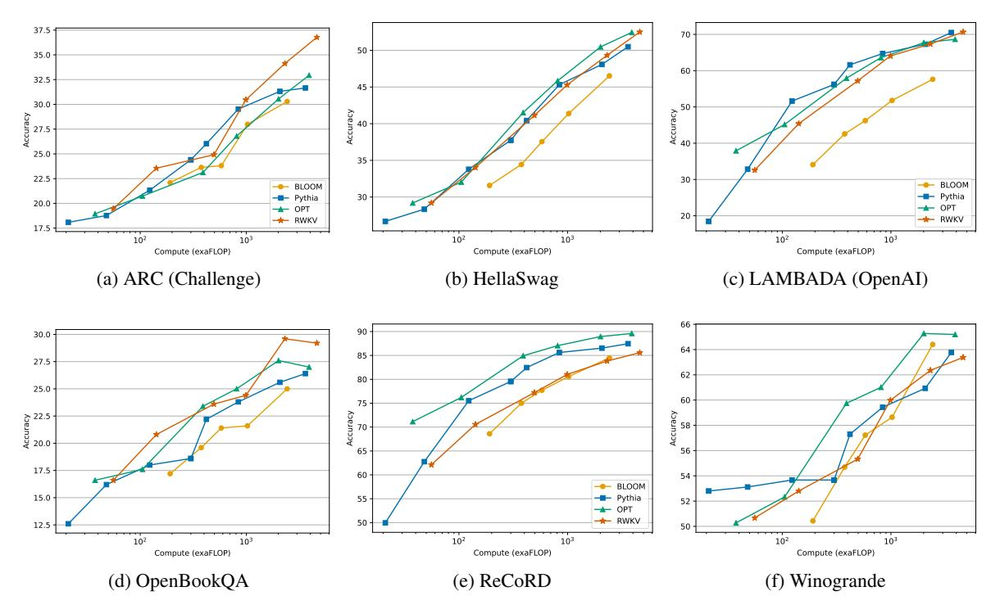
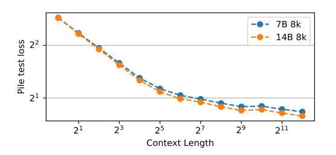

# 2.2 Transformers and AFT

Introduced by [Vaswani et al.](#page-12-1) [\(2017\)](#page-12-1), Transformers are a class of neural networks that have become the dominant architecture for several NLP tasks. Instead of operating on sequences step-by-step like RNNs, Transformers rely on attention mechanisms to capture relationships between all input and all output tokens:

$$Attn(Q, K, V) = softmax(QK^{\top})V, \quad (7)$$

where the multi-headness and scaling factor √ 1 dk is omitted for convenience. The core QK⊤ multiplication is an ensemble of pairwise attention scores

2 <https://huggingface.co/RWKV>

between each token in a sequence, which can be decomposed as vector operations:

$$Attn(Q, K, V)_{t} = \frac{\sum_{i=1}^{T} e^{q_{t}^{\top} k_{i}} \odot v_{i}}{\sum_{i=1}^{T} e^{q_{t}^{\top} k_{i}}}.$$
 (8)

AFT (Zhai et al., 2021), alternately formulates

$$Attn^{+}(W, K, V)_{t} = \frac{\sum_{i=1}^{t} e^{w_{t,i} + k_{i}} \odot v_{i}}{\sum_{i=1}^{t} e^{w_{t,i} + k_{i}}}, \quad (9)$$

where  $\{w_{t,i}\} \in R^{T \times T}$  is the learned pair-wise position biases, and each  $w_{t,i}$  is a scalar.

Inspired by AFT, RWKV takes a similar approach. However, for simplicity, it modifies the interaction weights so that it can be transformed into an RNN. Each  $w_{t,i}$  in RWKV is a channel-wise time decay vector multiplied by the relative position and traced backward from current time as it decays:

$$w_{t,i} = -(t-i)w, (10)$$

where  $w \in (R_{\geq 0})^d$ , with d the number of channels. We require w to be non-negative to ensure that  $e^{w_{t,i}} \leq 1$  and the per-channel weights decay backwards in time.

#### 3 RWKV

The RWKV model architecture is defined by four fundamental elements that are intrinsic to the time-mixing and channel-mixing blocks:

- R: The **Receptance** vector acts as the receiver of past information.
- W: The Weight signifies the positional weight decay vector, a trainable parameter within the model.
- K: The **Key** vector performs a role analogous to K in traditional attention mechanisms.
- V: The Value vector functions similarly to V\nin conventional attention processes.

These core elements interact multiplicatively at each timestep, as depicted in Figure 2.

### 3.1 Architecture

The RWKV model is composed of stacked residual blocks. Each block consists of a time-mixing and a channel-mixing sub-block, embodying recurrent structures to leverage past information.

This model uses a unique attention-like score update process, which includes a time-dependent

Figure 2: Elements within an RWKV block (left) and the complete RWKV residual block, equipped with a final head for language modeling (right).

softmax operation improving numerical stability and mitigating vanishing gradients (for rigorous proof, see Appendix H). It ensures that the gradient is propagated along the most relevant path. Additionally, layer normalization (Ba et al., 2016) incorporated within the architecture aids in stabilizing the gradients, effectively addressing both vanishing and exploding gradient issues. These design elements not only enhance the training dynamics of deep neural networks but also facilitate the stacking of multiple layers, leading to superior performance over conventional RNN models by capturing complex patterns across different levels of abstraction (see also Appendix I).

#### 3.1.1 Token Shift

In this architecture, all linear projection vectors (R, K, V) in time-mixing, and R', K' in channel-mixing) involved in computations are produced by linear interpolation between current and previous timestep inputs, facilitating a token shift.

The vectors for time-mixing computation are linear projections of linear combinations of the current and previous inputs of the block:

$$r_t = W_r \cdot (\mu_r \odot x_t + (1 - \mu_r) \odot x_{t-1}), \quad (11)$$

$$k_t = W_k \cdot (\mu_k \odot x_t + (1 - \mu_k) \odot x_{t-1}), \quad (12)$$

$$v_t = W_v \cdot (\mu_v \odot x_t + (1 - \mu_v) \odot x_{t-1}), \quad (13)$$

Figure 3: RWKV architecture for language modeling.

as are the channel-mixing inputs:

$$r'_t = W'_r \cdot (\mu'_r \odot x_t + (1 - \mu'_r) \odot x_{t-1}), \quad (14)$$

$$k'_t = W'_k \cdot (\mu'_k \odot x_t + (1 - \mu'_k) \odot x_{t-1}).$$
 (15)

The token shift is implemented as a simple offset in the temporal dimension at each block using the PyTorch (Paszke et al., 2019) library as nn.ZeroPad2d((0,0,1,-1)).

### 3.1.2 WKV Operator

The computation of the WKV operator in our model parallels the method used in Attention Free Transformer (AFT) (Zhai et al., 2021). However, unlike AFT where W is a pairwise matrix, our model treats W as a channel-wise vector that is modified by relative position. In our model, this recurrent behavior is defined by the time-dependent update of the WKV vectors, formalized in the following equation:

$$wkv_{t} = \frac{\sum_{i=1}^{t-1} e^{-(t-1-i)w+k_{i}} \odot v_{i} + e^{u+k_{t}} \odot v_{t}}{\sum_{i=1}^{t-1} e^{-(t-1-i)w+k_{i}} + e^{u+k_{t}}}.$$
(16)

To circumvent any potential degradation of W, we introduce a vector U that separately attends to the current token. More information about this can be found in Appendix I.

### 3.1.3 Output Gating

Output gating is implemented in both time-mixing and channel-mixing blocks using the sigmoid of the receptance,  $\sigma(r)$ . The output vector  $o_t$  post the WKV operator is given by:

$$o_t = W_o \cdot (\sigma(r_t) \odot wkv_t).$$
 (17)

In the channel-mixing block, a similar operation is performed:

$$o_t' = \sigma(r_t') \odot (W_v' \cdot \max(k_t', 0)^2), \quad (18)$$

where we adopt the squared ReLU activation function (So et al., 2021).

### 3.2 Transformer-like Training

RWKV can be efficiently parallelized using a technique called *time-parallel mode*, reminiscent of Transformers. The time complexity of processing a batch of sequences in a single layer is  $O(BTd^2)$ , primarily consisting of matrix multiplications  $W_{\lambda}$ , where  $\lambda \in \{r, k, v, o\}$  (assuming B sequences, T maximum tokens, and d channels). In contrast, updating attention scores  $wkv_t$  involves a serial scan (see Appendix D for more detail) and has complexity O(BTd).

The matrix multiplications can be parallelized similarly to  $W_{\lambda}$ , where  $\lambda \in \{Q, K, V, O\}$  in conventional Transformers. The element-wise WKV computation is time-dependent but can be readily parallelized along the other two dimensions (Lei et al., 2018)3.

### 3.3 RNN-like Inference

Recurrent networks commonly utilize the output at state t as input at state t+1. This usage is also observed in the autoregressive decoding inference of language models, where each token must be computed before being passed to the next step. RWKV takes advantage of this RNN-like structure, known as time-sequential mode. In this context, RWKV can be conveniently formulated recursively for decoding during inference, as demonstrated in Appendix D.

### 3.4 Additional Optimizations

**Custom Kernels** To address inefficiencies in the WKV computation arising from the sequential nature of the task when using standard deep learning frameworks, we have developed a custom CUDA

&lt;sup>3For extremely long sequences, more sophisticated methods such as Martin and Cundy (2017) that parallelize over sequence length could be used.

kernel. This kernel enables the execution of a single compute kernel on training accelerators, while all other parts of the model, such as matrix multiplications and point-wise operations, are already inherently parallelizable and efficient.

**Small Init Embedding** During the initial stage of training a transformer model (Vaswani et al., 2017), we observe that the embedding matrix undergoes slow changes, presenting a challenge for the model to move away from its initial noisy embedding state. To address this issue, we propose an approach that involves initializing the embedding matrix with small values and subsequently applying an additional LayerNorm operation. This accelerates and stabilizes the training process, allowing for the training of deep architectures with post-LN components. The effectiveness of this approach is demonstrated in Figure 9, illustrating improved convergence by enabling the model to quickly transition away from the initially small embedding. This is achieved through small changes occurring in a single step, which subsequently lead to substantial alterations in directions and further notable changes after the LayerNorm operation.

Custom Initialization Building on principles from previous works (He et al., 2016; Jumper et al., 2021), we adopt an initialization strategy where parameters are set to values resembling an identity mapping while breaking symmetry to establish a clear information flow. The majority of weights are initialized to zero, and linear layers do not employ biases. Detailed formulas are given in Appendix E. We observe that the choice of initialization plays a crucial role in both the speed and quality of convergence (refer to Appendix F for further details).

#### 3.5 Implementation

RWKV is implemented using the PyTorch Deep Learning Library (Paszke et al., 2019). We integrate additional optimization strategies inspired by DeepSpeed (Rasley et al., 2020) into the system, improving its efficiency and scalability.

The model begins with an embedding layer, as detailed in Section 3.4. Following this are several identical residual blocks arranged sequentially. These are depicted in Figures 2 and 3 and adheres to the principles outlined in Section 3.1.1. After the last block, a simple output projection head, consisting of a LayerNorm (Ba et al., 2016) and a linear projection, is employed for logits generation

for next-token prediction and computation of the cross-entropy loss during training.

## **4 Trained Models and Computing Costs**

To demonstrate the scalability of RWKV, we train six models ranging from 169 million to 14 billion parameters as shown in Table 2. All models are trained for one epoch (330 billion tokens) on the Pile (Gao et al., 2020; Biderman et al., 2022).

| Name            | Layers | Model Dimension | Parameters             | FLOP per token         |
|-----------------|--------|-----------------|------------------------|------------------------|
| 169 M           | 12     | 768             | $1.693 \times 10^{8}$  | $2.613 \times 10^{8}$  |
| $430\mathrm{M}$ | 24     | 1024            | $4.304 \times 10^{8}$  | $7.573 \times 10^{8}$  |
| $1.5\mathrm{B}$ | 24     | 2048            | $1.515 \times 10^{9}$  | $2.823 \times 10^{9}$  |
| $3\mathrm{B}$   | 32     | 2560            | $2.985 \times 10^{9}$  | $5.710 \times 10^{9}$  |
| $7\mathrm{B}$   | 32     | 4096            | $7.393 \times 10^{9}$  | $1.437 \times 10^{10}$ |
| 14 B            | 40     | 5120            | $1.415 \times 10^{10}$ | $2.778 \times 10^{10}$ |

Table 2: RWKV model architectures and FLOP counts. Further details of these hyperparameters are elaborated upon in Appendix G.

The number of parameters for each model is computed using the formula: # parameters =  $2VD + 13D^2L + D(11L + 4)$  where V = 50277 is the vocabulary size, D represents the Model Dimension and L corresponds to the number of layers. FLOPs is for a forward pass for one token. It was calculated as  $2(2VD + 13D^2L)$ , which is the twice (add and multiply) the number of parameters in linear layers. The backwards pass FLOPs can be approximated as twice that of the forward pass, giving a total of  $6(2VD + 13D^2L)$  FLOP per token. Notably, this matches the standard formula for FLOP calculations in transformers Kaplan et al. (2020): FLOP =  $6 \cdot [\# \text{ tokens}] \cdot [\# \text{ parameters}]$ .

#### 4.1 Additional Training Details

For training, we use the standard Adam optimizer without weight decay, use bfloat16 precision, and train with a context length of 1024 tokens. Further details on hyperparameters are in Appendix G. Diverting from standard practice for transformers, we apply exponential decay to our learning rate. We also incorporate the auxiliary loss introduced by PaLM (Chowdhery et al., 2022), supplementing the standard cross-entropy loss function. This auxiliary loss encourages the softmax normalizer to approximate zero closely. As for the learning rate schedule, it remains constant for the initial iterations, and subsequently decays exponentially.

#### 4.2 Scaling Laws

Scaling laws (Kaplan et al., 2020; Henighan et al., 2020; Hoffmann et al., 2022; Muennighoff et al., 2023) in language models refer to the mathematical relationships that describe how the performance of a language model changes with respect to various factors. These factors can include the model size (N), dataset size (D), or the optimally allocated compute budget ( $C_{\min}$ ). Scaling laws are important for two primary reasons: they allow us to make predictions and plans regarding the costs and performance of large models before they are trained via interpolation and extrapolation (Black et al., 2022; Le Scao et al., 2022) and the contexts in which they fail provides rich feedback on important areas for future research (Wei et al., 2022a; Biderman et al., 2023a).

Previous work on scaling laws for RNNs has claimed that LSTMs do not strictly follow the same log-log linear scaling that transformers do (Kaplan et al., 2020). We train 45 RWKV models for a variety of pairs (dataset, parameters) and find that RWKV does follow the same general form of the scaling law that is well established for transformers. Figure 4 shows our results for loss as a function of compute, with the linear fit to the Pareto optimal points holding an  $r^2$  value of 0.994. Even when we extrapolate our curve an additional order of magnitude (blue), we find an extremely good fit with an  $r^2$  of 0.875.

Figure 4: Scaling laws curves for RWKV models

### 5 Evaluations

Having demonstrated the scalability of RWKV models in the previous section, we now turn our attention to their competitiveness with traditional transformers. We focus on two questions:

**Competitiveness** Is RWKV competitive against quadratic transformer architectures with the same amount of compute?

**Long Context** Does increasing the context length of RWKV yield better language modeling loss when RWKV models are trained for context lengths that most open-sourced quadratic transformers *cannot* efficiently process?

#### 5.1 NLP Evaluations

To demonstrate that RWKV is competitive with traditional transformers at NLP tasks, we compare with similarly sized models trained for a similar number of tokens (Pythia (Biderman et al., 2023b), OPT (Zhang et al., 2022) and BLOOM (Scao et al., 2022)). All RWKV models were trained for one epoch on the Pile (330B tokens), which is close but not identical to the amount of tokens the Pythia, OPT, and BLOOM models were trained for. Consequently, we compare our models on a *FLOP-matched basis*. We avoid comparing with model trained in the Chinchilla-optimal regime (Hoffmann et al., 2022) or the overtrained regime (Touvron et al., 2023) to ensure the most equitable comparison.

We report results on ARC (both Easy and Challenge) (Clark et al., 2018), BoolQ (Clark et al., 2019), COPA (Roemmele et al., 2018), HeadQA (Vilares and Gómez-Rodríguez, 2019), HellaSwag (Zellers et al., 2019), LAMBADA (Paperno et al., 2016), OpenBookQA (Mihaylov et al., 2018), PIQA (Bisk et al., 2020), ReCoRD (Zhang et al., 2018), SciQ (Johannes Welbl Nelson F. Liu, 2017), and Winogrande (Zellers et al., 2020). Figure 1 shows the average results across all benchmarks. Some individual benchmarks are shown in Fig 5, with the rest in Appendix J.

Additionally, we carried out comparative studies on RWKV and ChatGPT / GPT-4, see Appendix L. They revealed that RWKV is very sensitive to prompt engineering. When the prompts were adjusted (re-ordered) from the ones used for GPT to more suitable for RWKV, the performance (F1) increased even from 44.2% to 74.8%. For sarcasm detection, RWKV outperformed ChatGPT, but was still slightly worse than the SOTA solution.

## 5.2 Extended Context Finetuning

Unlike transformers, RNNs do not have a predefined sequences length when they are created. However in order to efficient make use of compute

Figure 5: Zero-Shot Performance of RWKV on common language modeling evaluation benchmarks. Additional plots can be found in Appendix J.

we nevertheless need to preprocess the training data into contexts of the same length. We find that we are able to teach the model how to efficiently handle substantially larger batch sizes by finetuning with progressively increasing sequence length. Specifically, we first double the sequence length from 1024 to 2048 and finetune for 10B tokens from the original pretraining corpus, then we double again to 4096 for 100B tokens from the same corpus, and finally double to 8192 tokens for another 100B tokens from the same corpus. In Fig. 6 we show that increasing context length leads to lower test loss on the Pile, an indication that RWKV can make effective use of long contextual information.

Figure 6: RWKV shows decreasing mean test loss as a function of context length on the Pile (Gao et al., 2020)

### 5.3 Long Context Benchmarks

Additionally, we evaluate our model's ability to handle very long sequences by comparing to state-of-the-art long sequence models on the Long-Range Arena (LRA) benchmark (Tay et al., 2021). LRA is designed to assess the performance of models in handling lengthy context situations. It includes a collection of tasks with sequences ranging from 1,000 to 16,000 tokens, covering various types of data like text, natural language, synthetic images, and mathematical expressions. We apply RWKV on the LRA benchmark and the results are in Appendix J.2. The results show that RWKV performs second only to the S4 model in five datasets.

